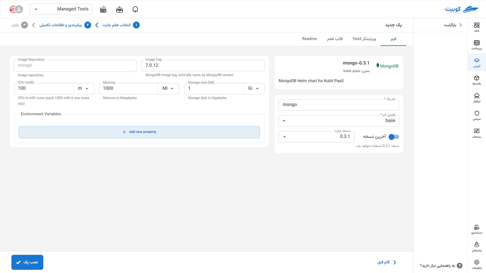

# پایگاه داده MongoDB

MongoDB یک پایگاه داده NoSQL متن‌باز و مبتنی بر مدل اسناد (Document-Oriented) است که داده‌ها را در قالب JSON (یا BSON) ذخیره می‌کند. این ساختار انعطاف‌پذیر به MongoDB اجازه می‌دهد تا به‌راحتی با داده‌های نیمه‌ساخت‌یافته یا ساخت‌نیافته کار کند و برای توسعه سریع اپلیکیشن‌ها، مخصوصاً در معماری‌های مبتنی بر میکروسرویس، بسیار مناسب است. MongoDB از ویژگی‌هایی مانند مقیاس‌پذیری افقی، replication، indexing پیشرفته، و query‌های غنی پشتیبانی می‌کند و در پروژه‌هایی با تغییرات سریع در ساختار داده یا حجم بالای خواندن/نوشتن، عملکرد بسیار خوبی ارائه می‌دهد.

## شیوه نصب و گزینه‌های پک

پس از انتخاب [`کوبچی > پک‌‌ها > نصب پک`](../../kubchi/getting-started) پک MongoDB را انتخاب می‌کنیم.

فرم نصب عمومی MongoDB همانند [دیگر پک‌‌ها](../../kubchi/getting-started) می‌باشد.

### گزینه‌های اختصاصی پک

**پیکربندی‌‌‌‌‌‌‌‌ شامل:**

- Environment: با کلیک روی بخش add new property می‌توان متغییرهای محیطی مورد نیاز برنامه را تنظیم کنید.
  
