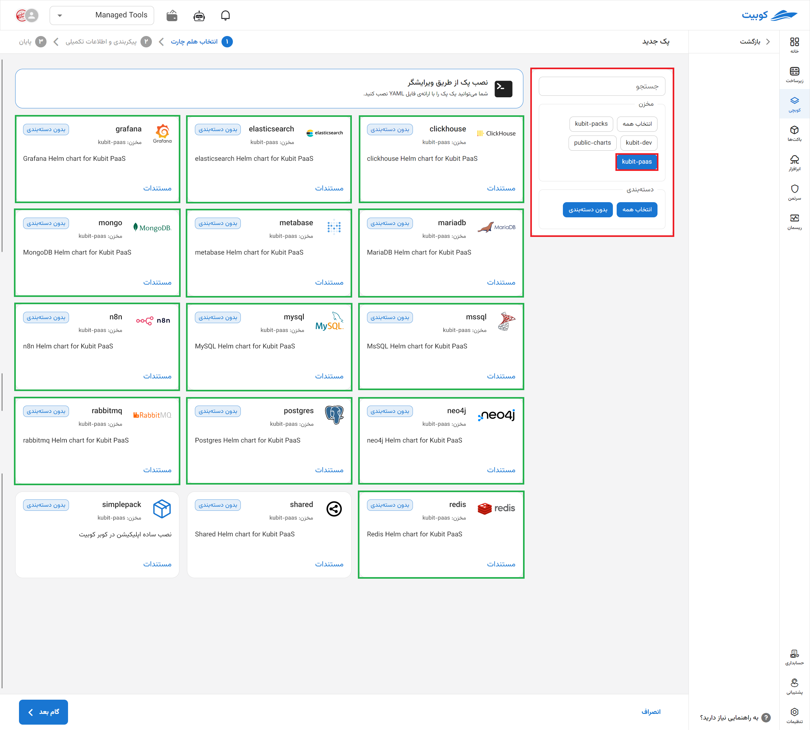

# پایگاه داده MSSQL

Microsoft SQL Server (MSSQL) یک سیستم مدیریت پایگاه داده رابطه‌ای قدرتمند و تجاری است که توسط مایکروسافت توسعه یافته و به‌طور گسترده در سازمان‌ها و زیرساخت‌های سازمانی مورد استفاده قرار می‌گیرد. این پلتفرم قابلیت‌هایی مانند تراکنش‌های ACID، امنیت سطح بالا، پشتیبانی از Stored Procedureها، ابزارهای مدیریت داده (SSMS) و یکپارچگی با اکوسیستم ویندوز را فراهم می‌کند. MSSQL به‌ویژه در محیط‌هایی با نیازهای تحلیلی، گزارش‌گیری (از طریق SSRS)، و پردازش انبوه داده (ETL با SSIS) کاربرد دارد و برای پروژه‌های حیاتی با الزامات بالا در مقیاس‌پذیری و در دسترس‌پذیری انتخاب مناسبی است.

## شیوه نصب و گزینه‌های پک

پس از انتخاب [`کوبچی > پک‌‌ها > نصب پک`](../../kubchi/getting-started) پک MSSQL را انتخاب می‌کنیم.

فرم نصب عمومی MSSQL همانند [دیگر پک‌‌ها](../../kubchi/getting-started) می‌باشد.

### گزینه‌های اختصاصی پک

**پیکربندی‌‌‌‌‌‌‌‌ شامل:**

- Environment: با کلیک روی بخش add new property می‌توان متغییرهای محیطی مورد نیاز برنامه را تنظیم کنید.
  
