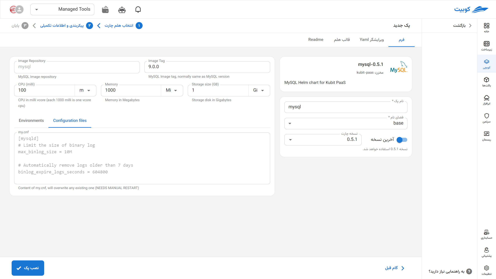

# پایگاه داده MySQL

MySQL یک سیستم مدیریت پایگاه داده رابطه‌ای (RDBMS) متن‌باز و پرکاربرد است که به‌ویژه در توسعه وب‌اپلیکیشن‌ها و سرویس‌های مبتنی بر LAMP stack (Linux, Apache, MySQL, PHP/Python) شهرت دارد. این سیستم با پشتیبانی از تراکنش‌ها، کلیدهای خارجی، replication، و ساختار داده‌های بهینه، عملکرد قابل اعتمادی برای برنامه‌های با حجم متوسط تا بالا ارائه می‌دهد. MySQL به‌دلیل سادگی در نصب، جامعه کاربری گسترده، و ابزارهای مدیریتی متنوع، یکی از گزینه‌های اصلی برای توسعه‌دهندگان و تیم‌های DevOps در پیاده‌سازی سریع و پایدار اپلیکیشن‌های داده‌محور محسوب می‌شود.

## شیوه نصب و گزینه‌های پک

پس از انتخاب [`کوبچی > پک‌‌ها > نصب پک`](../../kubchi/getting-started) پک MySQL را انتخاب می‌کنیم.

فرم نصب عمومی MySQL همانند [دیگر پک‌‌ها](../../kubchi/getting-started) می‌باشد.

### گزینه‌های اختصاصی پک

**پیکربندی‌‌‌‌‌‌‌‌ها شامل:**

- Configuration File: فایل پیکربندی مخصوص پک خود را در این بخش وارد کنید. نمونه فایل در این بخش آمده است.

- Environments: با کلیک روی بخش add new property می‌توان متغییرهای محیطی مورد نیاز برنامه را تنظیم کنید.

