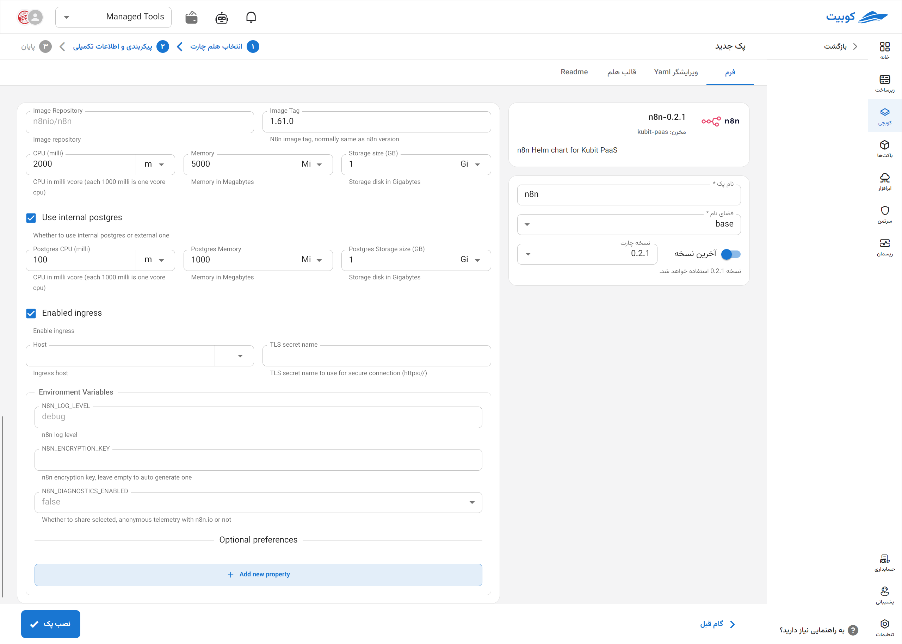

# ابزار n8n

n8n یک ابزار متن‌باز برای اتوماسیون گردش‌کار (workflow automation) و یکپارچه‌سازی سرویس‌هاست که به کاربران اجازه می‌دهد فرآیندهای پیچیده را بدون نیاز به کدنویسی یا با حداقل کد، طراحی و اجرا کنند. این پلتفرم با بیش از ۲۰۰ یکپارچه‌سازی آماده (integration) برای APIهای مختلف مانند GitHub، Slack، Google Sheets، MySQL و غیره، امکان اتصال آسان سرویس‌ها و انجام عملیات خودکار مانند انتقال داده، ارسال نوتیفیکیشن، هماهنگی رویدادها و اجرای شرطی وظایف را فراهم می‌کند. n8n همچنین از گردش‌کارهای پویا، اجراهای شرطی، و ذخیره داده‌های میانی پشتیبانی می‌کند و گزینه مناسبی برای تیم‌های DevOps، مارکتینگ و تحلیل داده است که به دنبال ابزار انعطاف‌پذیر و قابل توسعه برای اتوماسیون هستند.

## شیوه نصب و گزینه‌های پک

پس از انتخاب [`کوبچی > پک‌‌ها > نصب پک`](../../kubchi/getting-started) پک n8n را انتخاب می‌کنیم.

فرم نصب عمومی n8n همانند [دیگر پک‌‌ها](../../kubchi/getting-started) می‌باشد.

### گزینه‌های اختصاصی پک

می‌توانید برای این پک، تنظیمات ingress را فعال کنید تا از طریق دامنه‌هایی که [ثبت کردید](../../kubchi/domains) به پک خود دسترسی داشته باشید.

- در بخش host از بین دامنه‌های ثبت شده خود (می‌توان از دامنه‌ی خارج کوبیت هم استفاده کرد) انتخاب کنید
- در بخش tls، از بین گواهی‌های ثبت شده خود (می‌توان از گواهی خارج کوبیت هم استفاده کرد) یک TLS/SSL معتبر انتخاب کنید

**پیکربندی‌‌‌‌‌‌‌‌ دیگر:**

- Environments: با کلیک روی بخش add new property می‌توان متغییرهای محیطی مورد نیاز برنامه را تنظیم کنید.
  
