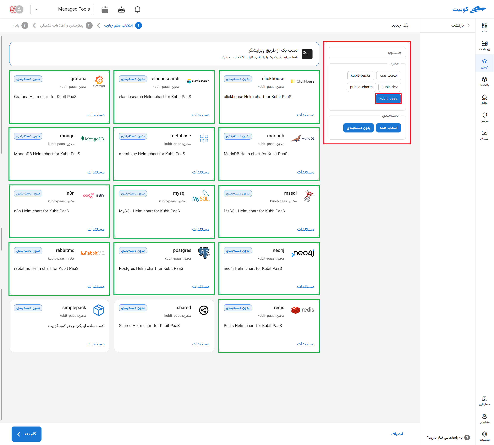
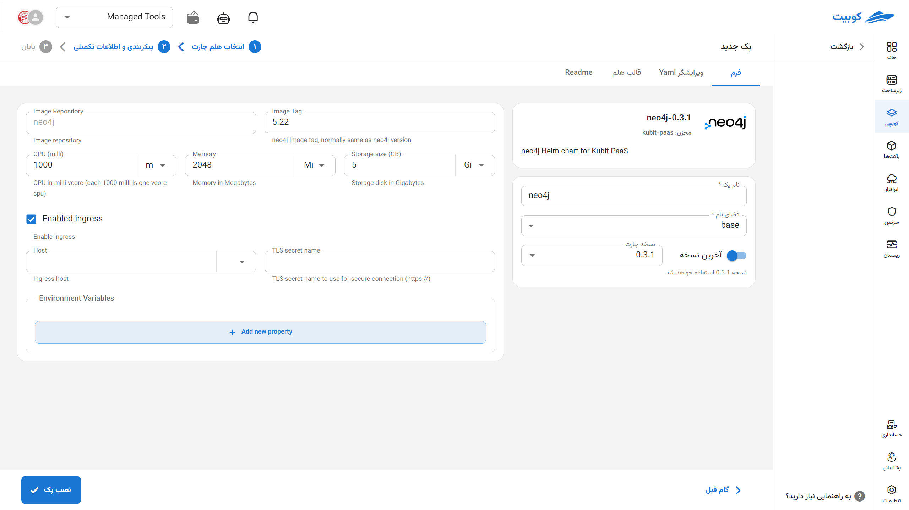
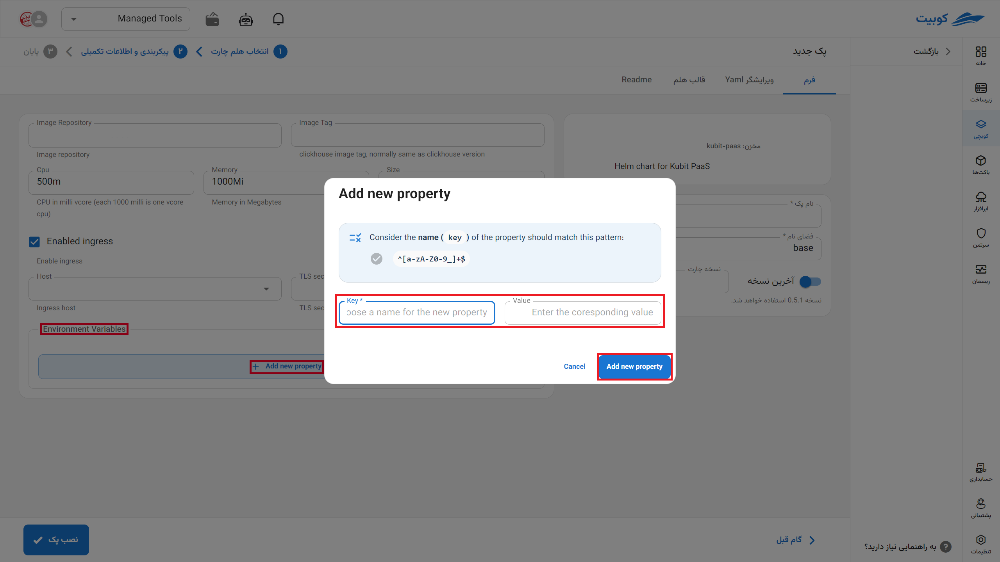

# پایگاه داده Neo4j

Neo4j یک پایگاه داده گرافی (Graph Database) متن‌باز است که برای ذخیره و مدیریت داده‌های پیچیده و رابطه‌ای طراحی شده است. این پایگاه داده با مدل‌سازی داده‌ها به صورت گره‌ها، یال‌ها و خصوصیات، امکان اجرای کوئری‌های پیچیده روی شبکه‌های اجتماعی، سیستم‌های توصیه‌گر، تحلیل شبکه و داده‌های وابسته به هم را فراهم می‌کند. Neo4j با بهره‌گیری از زبان کوئری Cypher و قابلیت مقیاس‌پذیری بالا، به‌ویژه در کاربردهای نیازمند کشف الگوهای پنهان و تحلیل ساختارهای پیچیده، یک ابزار کلیدی برای توسعه‌دهندگان و مهندسان داده محسوب می‌شود.

## شیوه نصب و گزینه‌های پک

پس از انتخاب [`کوبچی > پک‌‌ها > نصب پک`](../../kubchi/getting-started) پک Neo4j را انتخاب می‌کنیم.

فرم نصب عمومی Neo4j همانند [دیگر پک‌‌ها](../../kubchi/getting-started) می‌باشد.

### گزینه‌های اختصاصی پک

می‌توانید برای این پک، تنظیمات ingress را فعال کنید تا از طریق دامنه‌هایی که [ثبت کردید](../../kubchi/domains) به پک خود دسترسی داشته باشید.

- در بخش host از بین دامنه‌های ثبت شده خود (می‌توان از دامنه‌ی خارج کوبیت هم استفاده کرد) انتخاب کنید
- در بخش tls، از بین گواهی‌های ثبت شده خود (می‌توان از گواهی خارج کوبیت هم استفاده کرد) یک TLS/SSL معتبر انتخاب کنید

**پیکربندی‌‌‌‌‌‌‌‌ دیگر:**

- Environments: با کلیک روی بخش add new property می‌توان متغییرهای محیطی مورد نیاز برنامه را تنظیم کنید.
  
