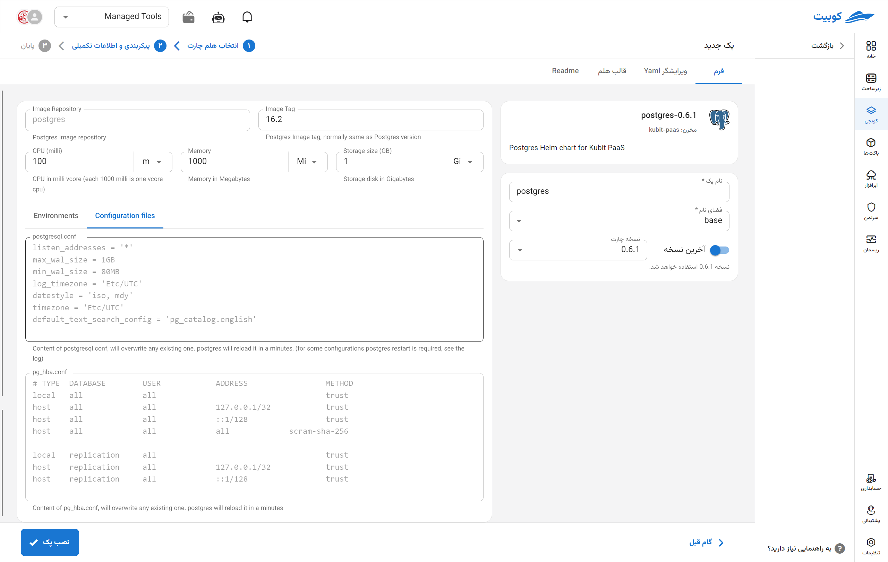

# پایگاه داده PostgreSQL

PostgreSQL یک سیستم مدیریت پایگاه داده رابطه‌ای متن‌باز و قدرتمند است که به دلیل پشتیبانی از استانداردهای SQL، قابلیت‌های پیشرفته مانند تراکنش‌های ACID، انواع داده‌های پیچیده، و توسعه‌پذیری بالا شناخته شده است. این پایگاه داده با امکاناتی مانند توابع ذخیره‌شده، ایندکس‌های پیشرفته، پشتیبانی از JSON و GIS، و قابلیت مقیاس‌پذیری در محیط‌های توزیع‌شده، برای کاربردهای متنوع از برنامه‌های کوچک تا سیستم‌های بزرگ سازمانی بسیار مناسب است. PostgreSQL به عنوان یکی از محبوب‌ترین گزینه‌ها در بین توسعه‌دهندگان و تیم‌های زیرساخت برای پیاده‌سازی بانک‌های اطلاعاتی قابل اطمینان و انعطاف‌پذیر شناخته می‌شود.

## شیوه نصب و گزینه‌های پک

پس از انتخاب [`کوبچی > پک‌‌ها > نصب پک`](../../kubchi/getting-started) پک PostgreSQL را انتخاب می‌کنیم.

فرم نصب عمومی PostgreSQL همانند [دیگر پک‌‌ها](../../kubchi/getting-started) می‌باشد.

### گزینه‌های اختصاصی پک

**پیکربندی‌‌‌‌‌‌‌‌ها شامل:**

- Configuration File: فایل پیکربندی مخصوص پک خود را در این بخش وارد کنید. نمونه فایل در این بخش آمده است.
- Environments: با کلیک روی بخش add new property می‌توان متغییرهای محیطی مورد نیاز برنامه را تنظیم کنید.
  
