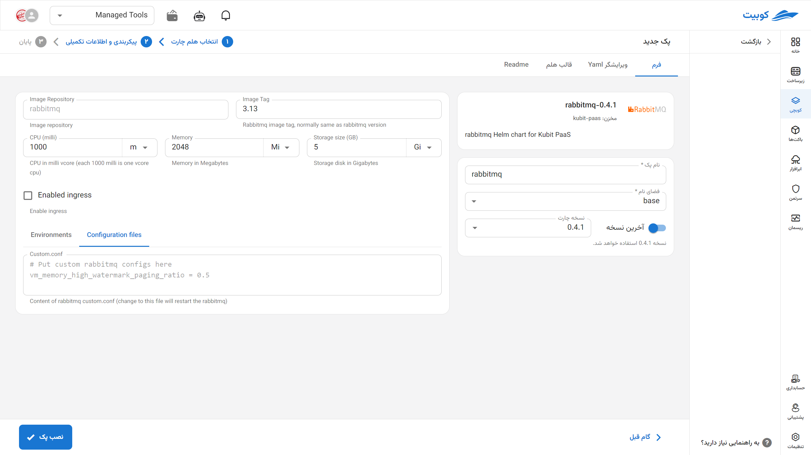

# پایگاه داده RabbitMQ

RabbitMQ یک سیستم پیام‌رسان صف‌محور (message broker) متن‌باز است که بر پایه پروتکل AMQP طراحی شده و وظیفه انتقال امن و قابل اطمینان پیام‌ها بین سرویس‌ها و اجزای مختلف یک سامانه را بر عهده دارد. این ابزار با پشتیبانی از صف‌ها، تبادل‌ها (exchanges)، و الگوهای مسیریابی متنوع، امکان برقراری ارتباط ناهمزمان، متعادل‌سازی بار و افزایش مقیاس‌پذیری سیستم‌های توزیع‌شده را فراهم می‌کند. RabbitMQ به‌ویژه در معماری‌های مبتنی بر میکروسرویس، پردازش جریان داده، و سیستم‌های نیازمند تضمین تحویل پیام‌ها کاربرد گسترده‌ای دارد و با قابلیت‌های مانیتورینگ و افزونگی، گزینه‌ای قابل اعتماد برای تیم‌های زیرساخت و توسعه به شمار می‌رود.

## شیوه نصب و گزینه‌های پک

پس از انتخاب [`کوبچی > پک‌‌ها > نصب پک`](../../kubchi/getting-started) پک RabbitMQ را انتخاب می‌کنیم.

فرم نصب عمومی RabbitMQ همانند [دیگر پک‌‌ها](../../kubchi/getting-started) می‌باشد.

### گزینه‌های اختصاصی پک

می‌توانید برای این پک، تنظیمات ingress را فعال کنید تا از طریق دامنه‌هایی که [ثبت کردید](../../kubchi/domains) به پک خود دسترسی داشته باشید.

- در بخش host از بین دامنه‌های ثبت شده خود (می‌توان از دامنه‌ی خارج کوبیت هم استفاده کرد) انتخاب کنید
- در بخش tls، از بین گواهی‌های ثبت شده خود (می‌توان از گواهی خارج کوبیت هم استفاده کرد) یک TLS/SSL معتبر انتخاب کنید

**پیکربندی‌‌‌‌‌‌‌‌های دیگر شامل:**

- Configuration File: فایل پیکربندی مخصوص پک خود را در این بخش وارد کنید. نمونه فایل در این بخش آمده است.
- Environments: با کلیک روی بخش add new property می‌توان متغییرهای محیطی مورد نیاز برنامه را تنظیم کنید.
  
