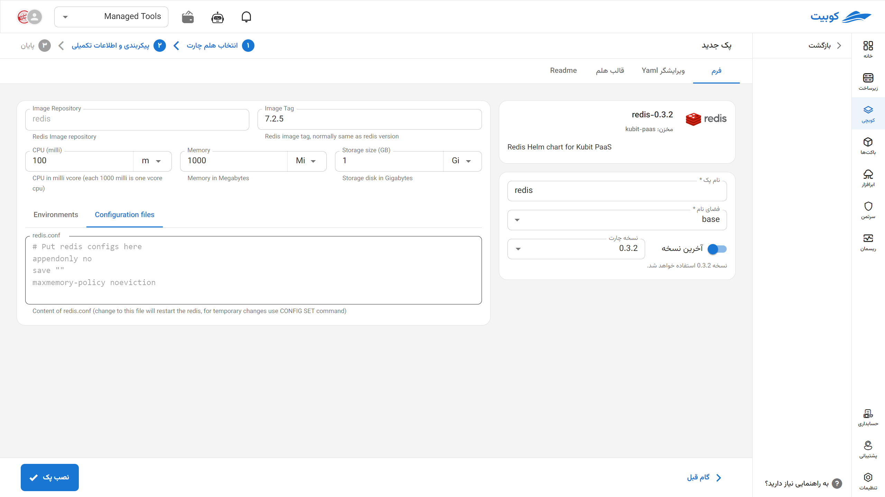

# پایگاه داده Redis

Redis یک پایگاه داده درون‌حافظه‌ای (in-memory) متن‌باز و سریع است که برای ذخیره‌سازی داده‌های ساخت‌یافته به‌صورت کلید-مقدار استفاده می‌شود. این سیستم به دلیل سرعت بسیار بالا، قابلیت پشتیبانی از انواع داده‌های پیشرفته مانند لیست‌ها، مجموعه‌ها و هش‌ها، و امکاناتی مانند کشینگ (caching)، صف‌های پیام، و مدیریت نشست‌های کاربری (session management) در برنامه‌های وب و سیستم‌های بلادرنگ بسیار محبوب است. Redis با قابلیت پشتیبانی از پایداری داده‌ها، کلاسترینگ و عملکرد مقیاس‌پذیر، به یکی از ابزارهای کلیدی در معماری‌های مدرن مبتنی بر میکروسرویس و زیرساخت‌های ابری تبدیل شده است.

## شیوه نصب و گزینه‌های پک

پس از انتخاب [`کوبچی > پک‌‌ها > نصب پک`](../../kubchi/getting-started) پک Redis را انتخاب می‌کنیم.

فرم نصب عمومی Redis همانند [دیگر پک‌‌ها](../../kubchi/getting-started) می‌باشد.

### گزینه‌های اختصاصی پک

**پیکربندی‌‌‌‌‌‌‌‌ها شامل:**

- Configuration File: فایل پیکربندی مخصوص پک خود را در این بخش وارد کنید. نمونه فایل در این بخش آمده است.
- Environments: با کلیک روی بخش add new property می‌توان متغییرهای محیطی مورد نیاز برنامه را تنظیم کنید.
  
