# کاربران (مدیریت دسترسی اعضا)

مدیر سازمان می‌تواند برای کاربران سازمان خود سطح دسترسی تعریف کند. در کوبیت می‌توان برای هر نقش مجوزهای خاصی صادر کرد و سپس می‌توان این نقش‌ها را به کاربران اختصاص داد.

از بخش **سازماندهی** وارد قسمت **کاربران** شوید:

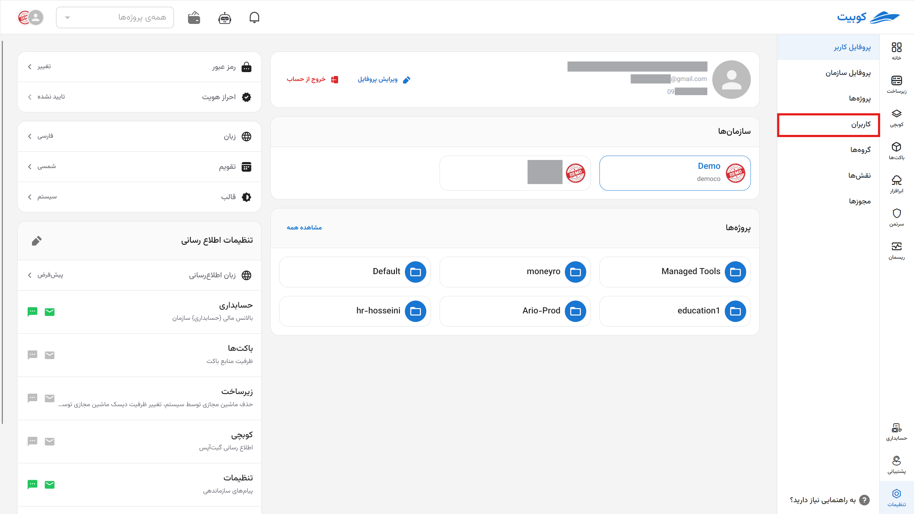

در این قسمت می‌توانید لیست کاربران سازمان را مشاهده کنید:
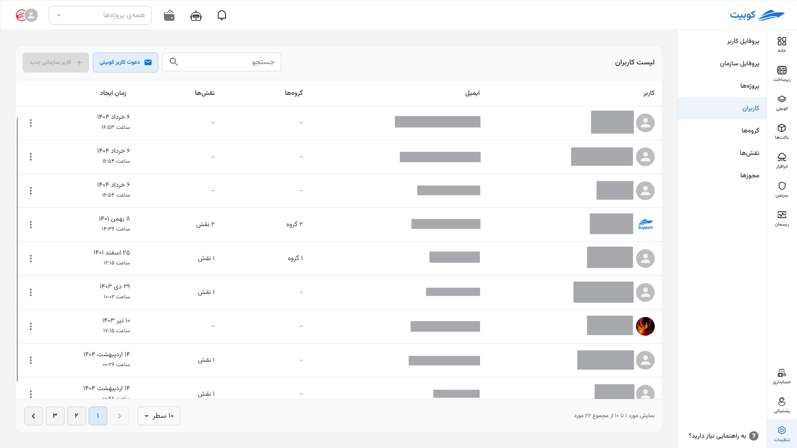

با کلیک روی نام هر کاربر، به صفحه اطلاعات کاربری آن کاربر هدایت می‌شوید:
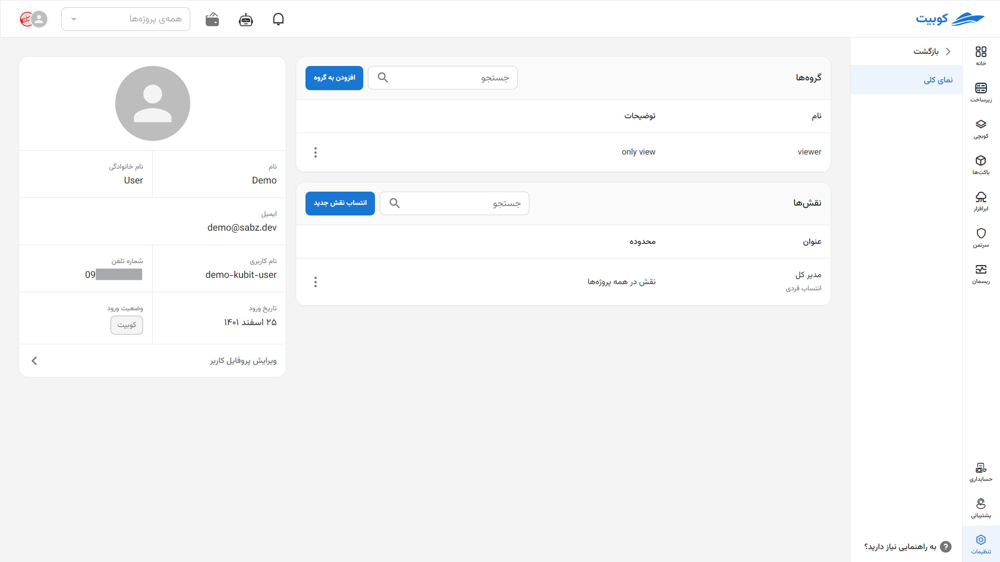

از طریق صفحه اطلاعات کاربر به لیست گروه‌ها و نقش‌های کاربر نیز می‌توانید دسترسی پیدا کنید.

## گروه‌های کاربر

در بخش **گروه‌ها**، لیست گروه‌های کاربر را مشاهده می‌کنید.
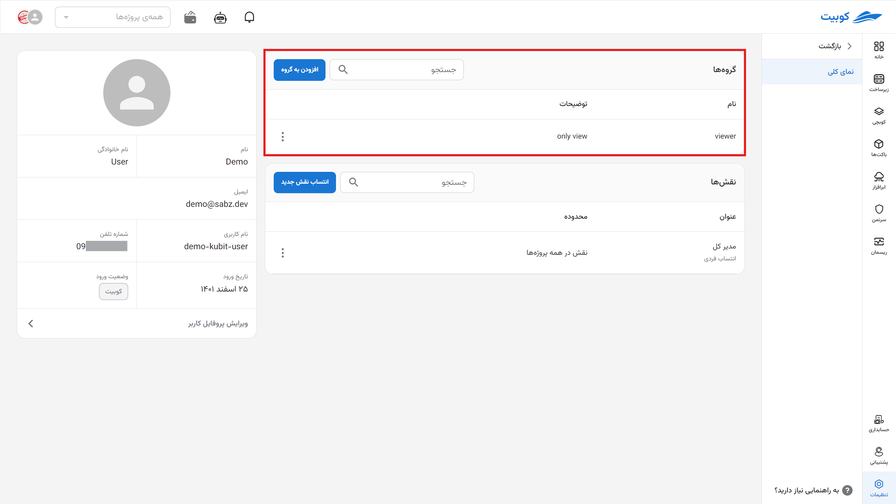

### افزودن کاربر به گروه

- برای افزودن کاربر به گروه‌های دیگر، روی دکمه **افزودن به گروه** کلیک کنید.
- از لیست گروه‌های سازمان، گروه موردنظر را انتخاب کنید.
- سپس با کلیک روی **افزودن**، کاربر را به گروه انتخاب شده، اضافه کنید.
  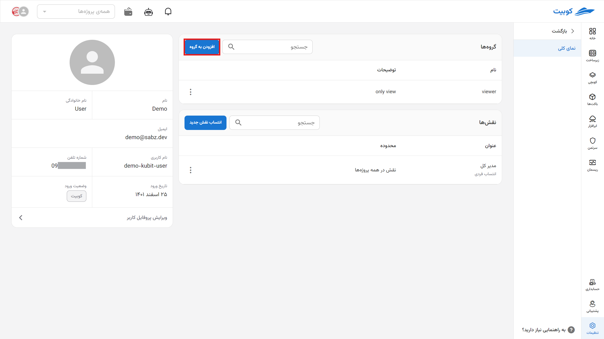
  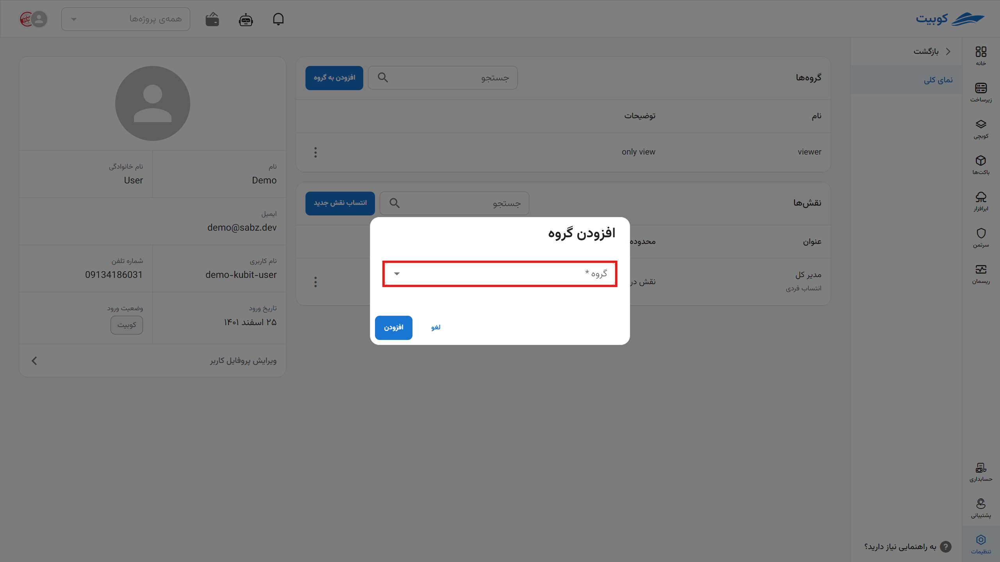
  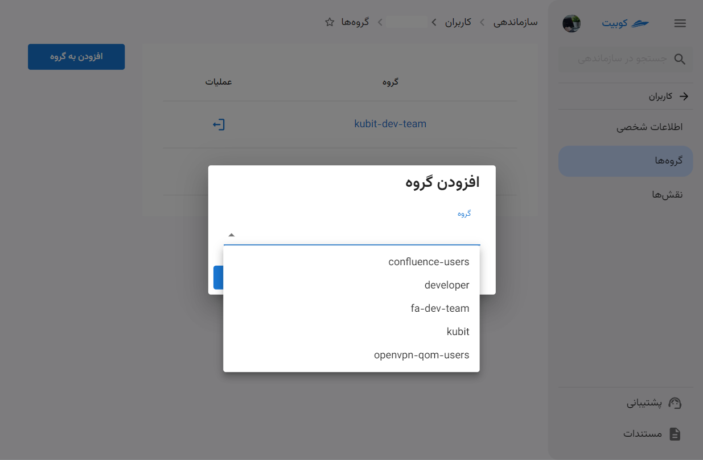
  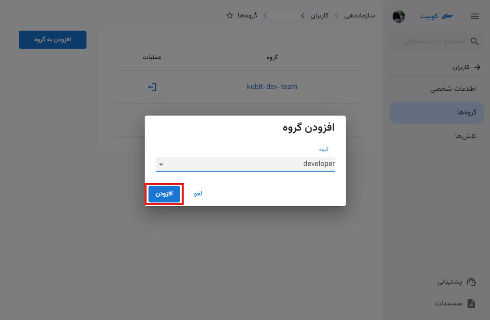

### ترک/حذف کاربر از گروه

- برای ترک/حذف کاربر از گروه، روی آیکون سه نقطه در ستون عملیات، کلیک کنید.
- سپس با کلیک روی **ترک گروه**، کاربر از گروه انتخاب شده، حذف می‌شود.
  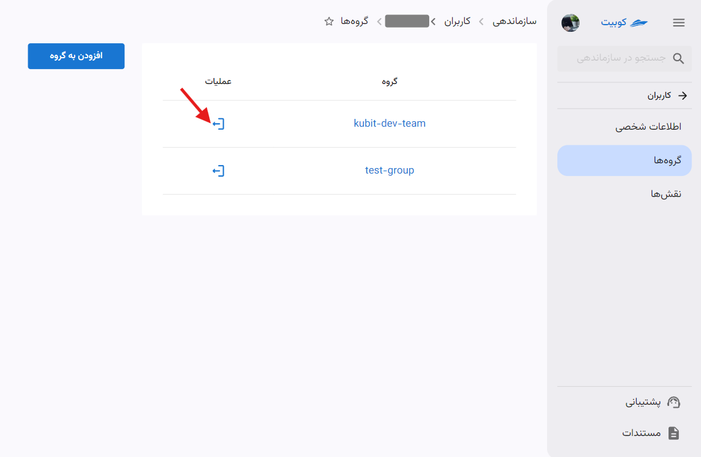
  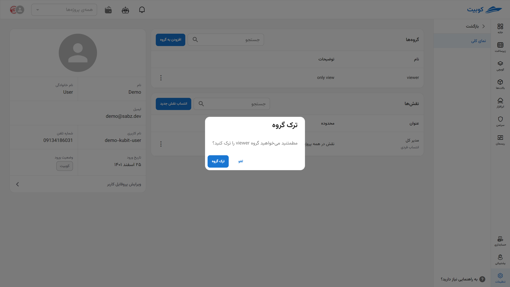

## نقش‌های کاربر

در بخش **نقش‌ها**، لیست نقش‌های کاربر را مشاهده می‌کنید.
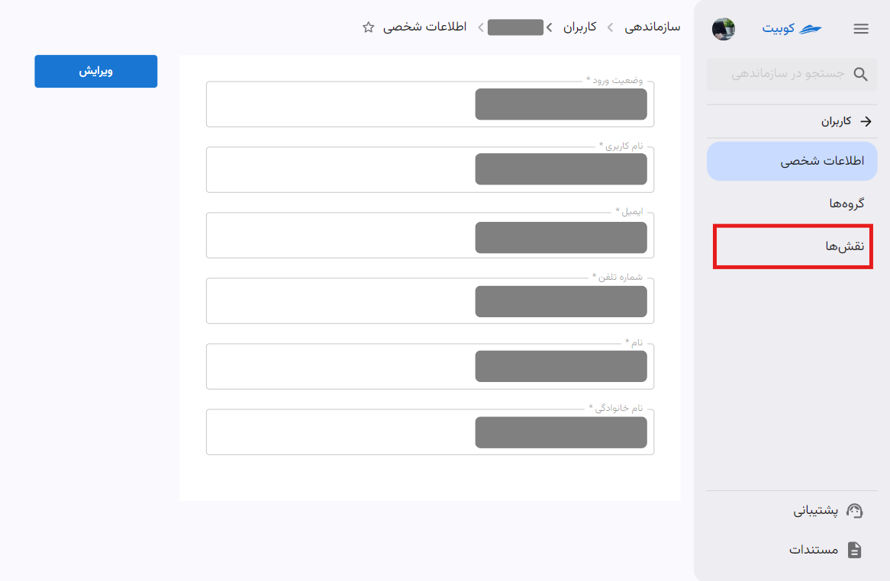

### انتساب نقش به کاربر

- برای افزودن نقش به نقش‌های کاربر، روی دکمه **انتساب نقش** کلیک کنید.
- از لیست نقش‌های موجود، نقش موردنظر را انتخاب کنید و سطح دسترسی در پروژه را تعیین کنید.
- سپس با کلیک روی **افزودن**، نقش انتخاب شده، به کاربر اضافه می‌شود.
  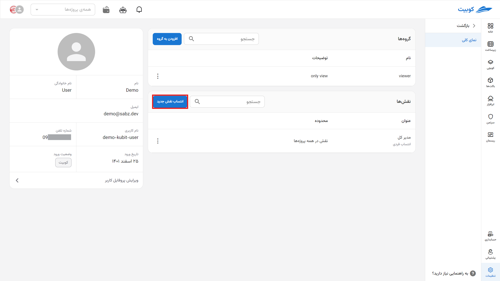
  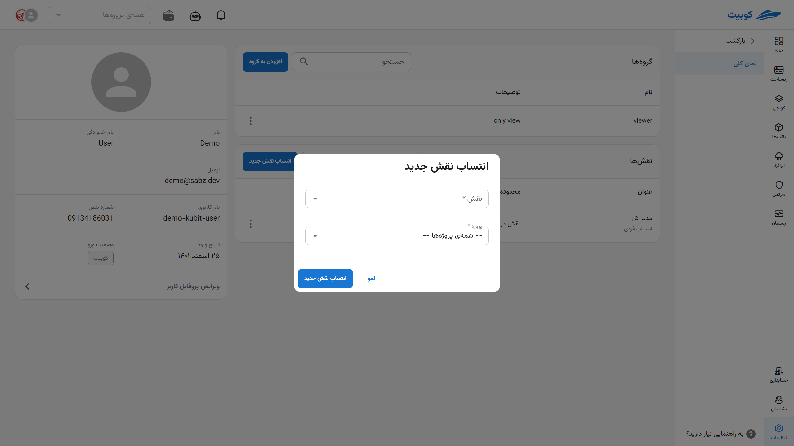
  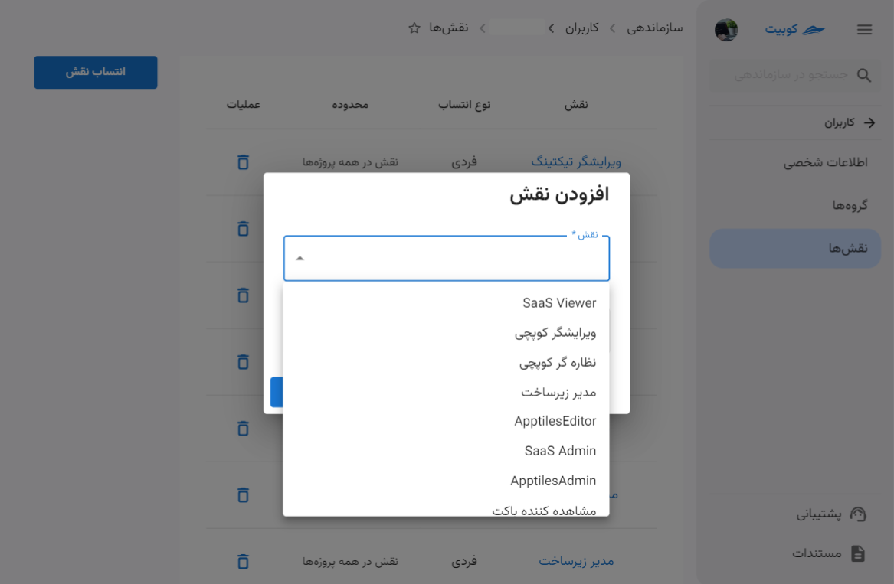
  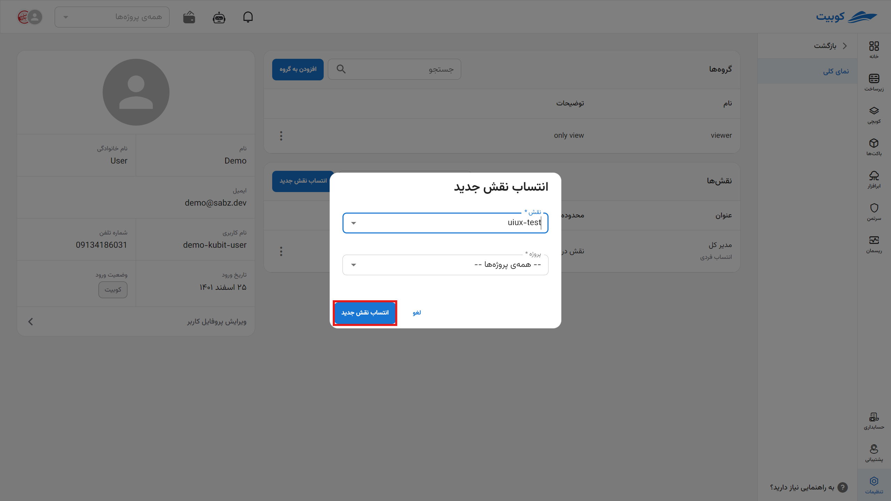

### حذف نقش از کاربر

- برای حذف نقش از نقش‌های کاربر، روی آیکون سه نقطه کلیک کنید.
- سپس با کلیک روی **پاک کردن**، نقش را از کاربر می‌گیرید (حذف می‌کنید).
  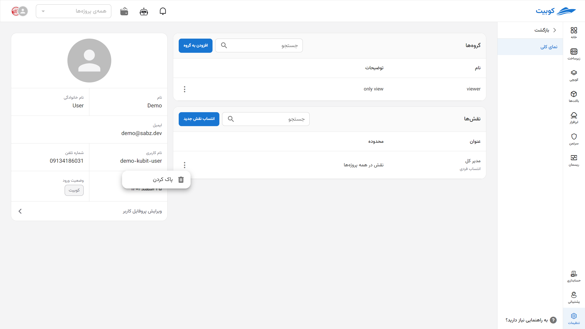
  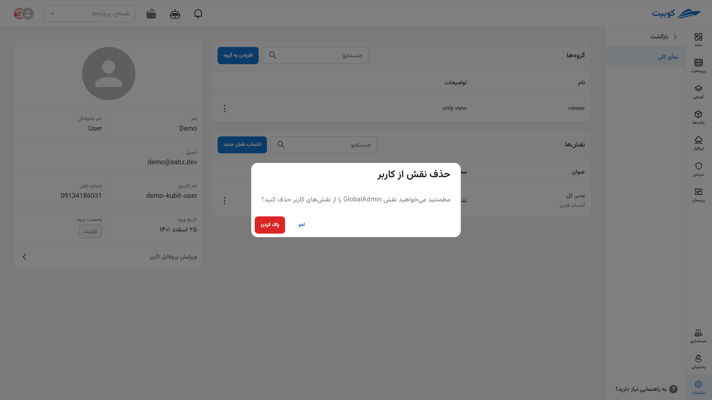
