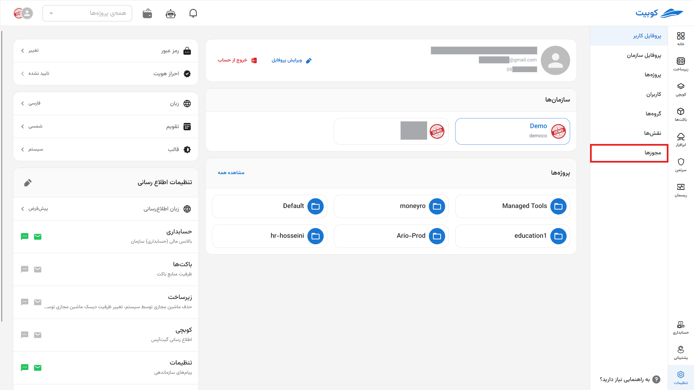

# مجوزها

## قوانین دسترسی (Access roles)

**قوانین دسترسی** ترکیبی از **افراد (کاربران)** و **نقش‌ها (Roles)** هستند که روی **گروه‌هایی از منابع** تعریف می‌شوند. این قوانین مشخص می‌کنند:

> **چه کسی، چه نقشی، روی کدام منابع داشته باشد.**

دسترسی کاربران به‌کمک **نقش‌ها و مجوزها (Permissions)** مدیریت می‌شود.

### مجوزها (Permissions)

برای این‌که یک کاربر بتواند به بخشی از سامانه کوبیت دسترسی پیدا کند، باید **مجوز مشخصی** داشته باشد.  
اما:

- مجوزها به‌صورت مستقیم به کاربران تعلق نمی‌گیرند.
- بلکه ابتدا در قالب **نقش** تعریف می‌شوند، سپس آن نقش به کاربر تخصیص می‌یابد.

برای مشاهده فهرست کامل مجوزها و توضیحات فنی، به مستند مجوزها مراجعه کنید.

در کوبیت به ازای هر سرویس، خدمات و دسترسی به آنها، مجوزهای مشخصی تعریف شده‌اند.

## مجوزهای موجود

از بخش **سازماندهی** وارد قسمت **مجوزها** شوید:

در این قسمت می‌توانید لیست مجوزهای موجود به ازای هر سرویس به همراه توضیحات آنها را مشاهده کنید:

