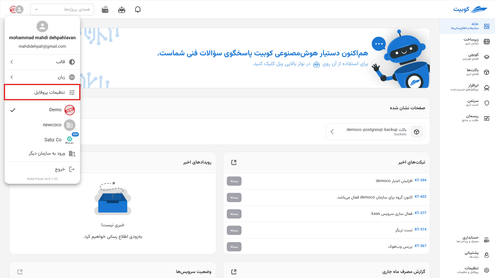
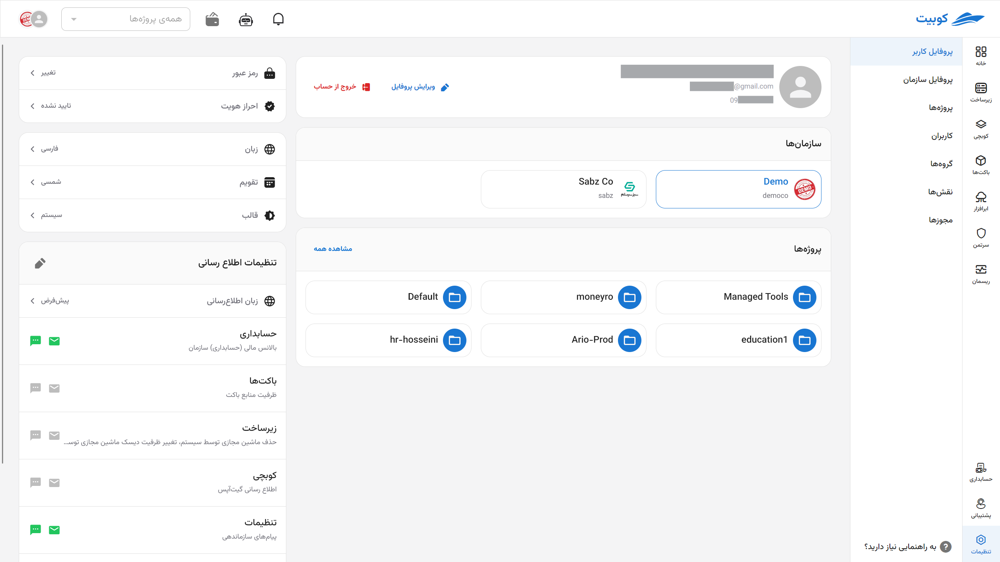
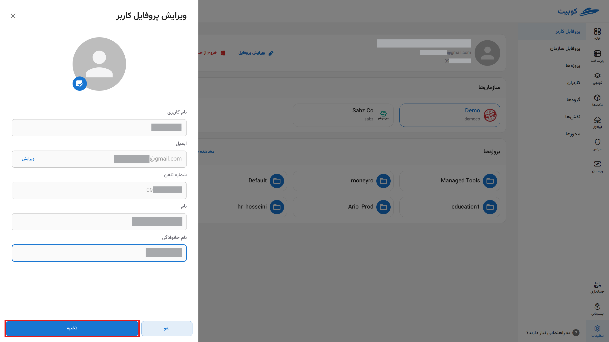
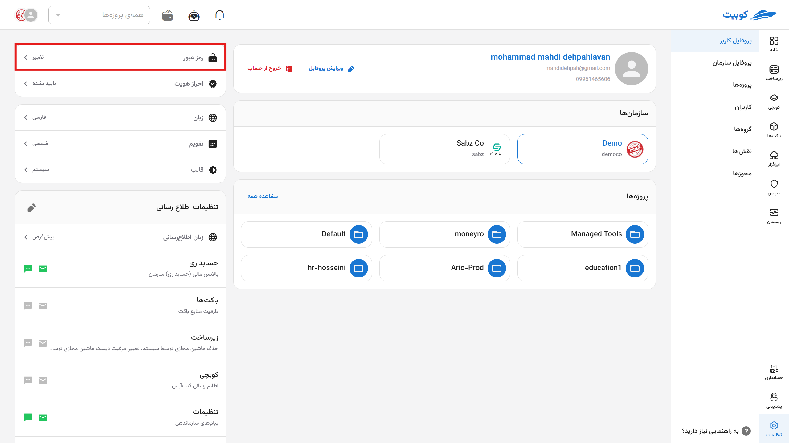
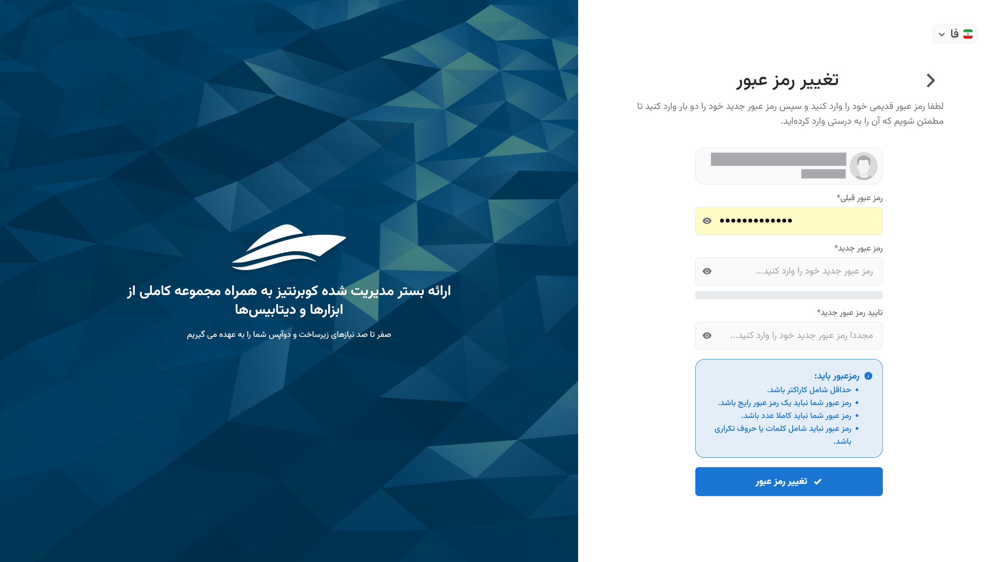
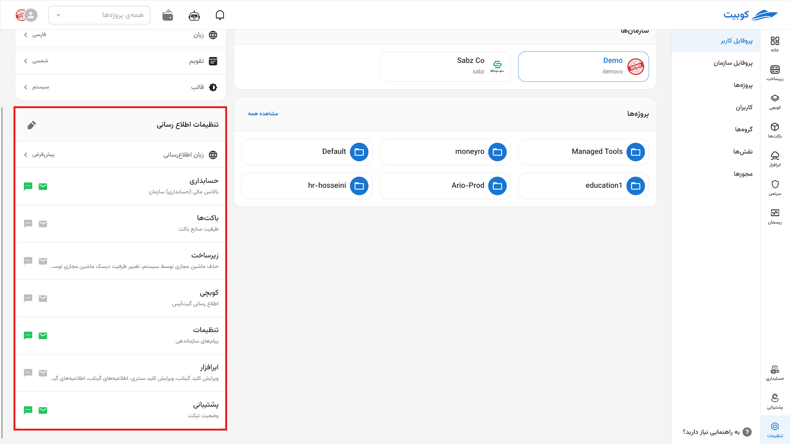
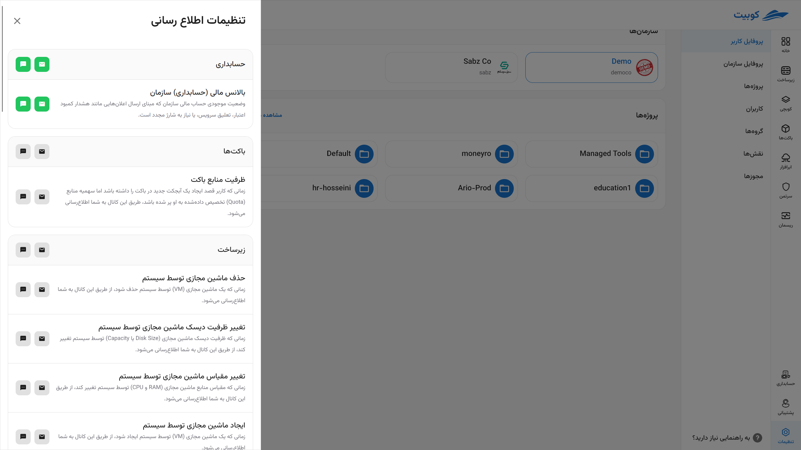

# تنظیمات پروفایل کاربری

برای تغییر اطلاعات کاربری شامل ایمیل، شماره تلفن، نام و نام خانوادگی عکس پروفایل، همچنین تغییر رمز عبور و ویرایش کانال‌های اطلاع‌رسانی، می‌توانید از بخش **تنظیمات پروفایل** اقدام کنید.

### ویرایش اطلاعات کاربری

وارد بخش **اطلاعات کاربر** در **تنظیمات پروفایل** شوید و روی سه نقطه سمت چپ جدول اطلاعات کاربر کلیک کرده و گزینه **ویرایش** را انتخاب کنید:

امکان انتخاب و تغییر عکس پروفایل نیز از این بخش فراهم است. پس از وارد کردن اطلاعات جدید، تغییرات خود را **ذخیره** کنید:

:::caution[توجه]
توجه داشته باشید که **نام کاربری**، **ایمیل** و **شماره تلفن** غیرقابل تغییر می‌باشند.
:::

### تغییر رمز عبور

:::caution[توجه!]
اگر در سازمان فعلی در پنل کوبیت نقش مدیر سیستم را داشته باشید، می‌توانید از طریق گزینه **تغییر رمز عبور**، رمز عبور خود را تغییر دهید. در غیر این صورت، دسترسی به تغییر رمز عبور را نخواهید داشت و باید به مدیر سازمان مراجعه کنید.
:::

وارد بخش **اطلاعات کاربر** در **تنظیمات پروفایل** شده و روی سه نقطه سمت چپ جدول اطلاعات کاربر کلیک کرده و گزینه **تغییر رمز عبور** را انتخاب کنید:

سپس رمز عبور قبلی و رمز عبور جدید را در فرم تغییر رمز عبور وارد کرده و روی دکمه **ارسال** کلیک کنید:

### ویرایش کانال‌های اطلاع‌رسانی

در بخش **اطلاع‌رسانی**، لیستی از کانال‌های مختلف جهت دریافت اعلان‌های سرویس‌های کوبیت موجود است. برای هر سرویسی که سیستم اطلاع‌رسانی آن تنظیم شده باشد، می‌توانید کانال‌های مرتبط را مشاهده کرده و به صورت جداگانه فعال یا غیرفعال نمایید:

