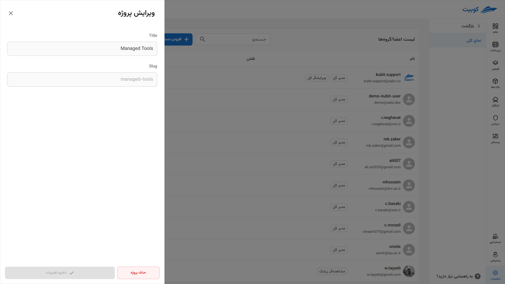
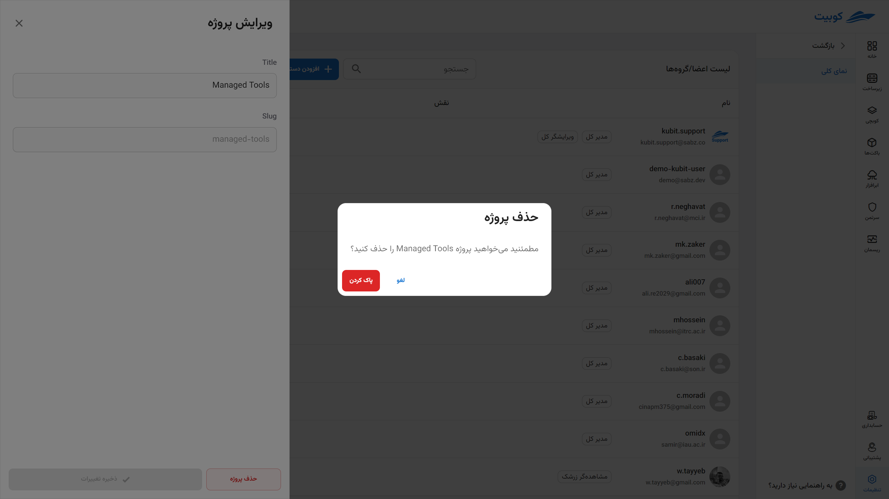
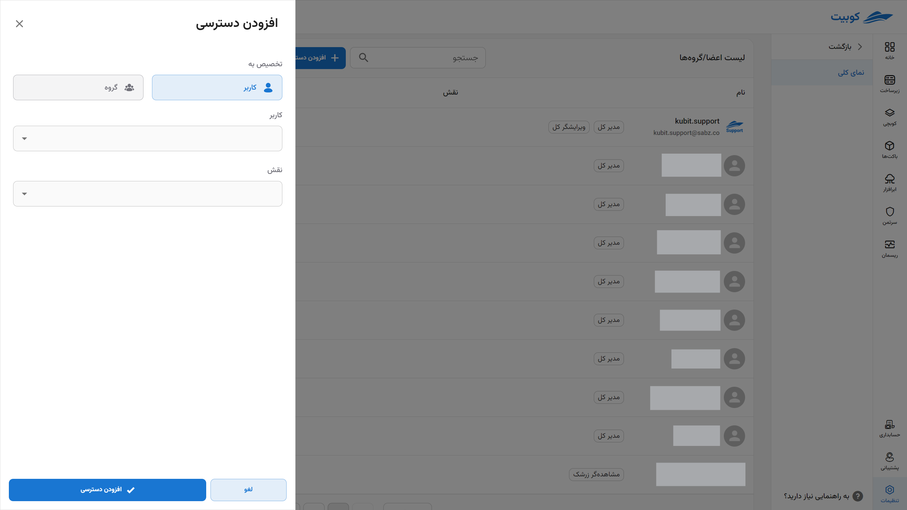
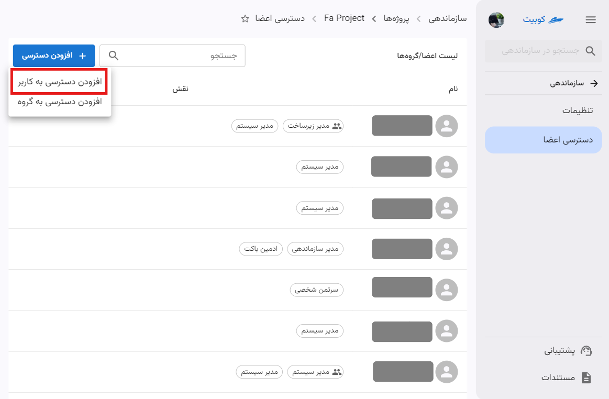

# پروژه‌ها

از بخش **سازماندهی** وارد قسمت **پروژه‌ها** شوید:

در این قسمت می‌توانید لیست پروژه‌های سازمان به همراه سرویس‌های متصل به آنها را مشاهده کنید:

با کلیک روی نام هر پروژه از لیست، به صفحه جزئیات آن پروژه هدایت می‌شوید. در این صفحه **تنظیمات** و مدیریت **دسترسی اعضا** وجود دارد:

## ساخت پروژه{#create-project}

برای ساخت پروژه جدید، روی دکمه‌ **پروژه جدید** کلیک کنید:

:::info[کلید یکتا برای هر پروژه]
در انتخاب مقدار کلید دقت نمایید، زیرا این فیلد به عنوان شناسه یکتا برای پروژه‌ها عمل می‌کند و پس از ساخت پروژه، قابل ویرایش نخواهد بود.
:::
سپس **عنوان** و **کلید** پروژه را وارد کرده و روی **ایجاد** کلیک کنید:

با انجام مراحل ذکر شده، پروژه ساخته می‌شود و از طریق لیست پروژه‌ها قابل دسترس است.

## ویرایش اطلاعات پروژه

ابتدا روی عنوان پروژه کلیک کنید تا به صفحه پروژه موردنظر وارد شوید:

سپس می‌توانید عنوان پروژه را تغییر داده و برای اعمال ویرایش، روی **ذخیره** کلیک کنید:

در این صفحه نیز به مدیریت سرویس‌های پروژه دسترسی خواهید داشت. در ادامه به توضیح مدیریت سرویس‌ها پرداخته شده است.

### اتصال سرویس به پروژه

همانطور که در تعریف مفهوم [پروژه](../#project) توضیح داده شد، منابع و سرویس‌ها ذیل پروژه معنا پیدا می‌کنند. برای استفاده از هر سرویس از سرویس‌های کوبیت، ابتدا باید سرویس موردنظر را به یک پروژه در سازمان متصل کنید. بدین معنی که استفاده از آن سرویس تنها تحت عنوان پروژه به‌خصوص امکان‌پذیر باشد.

#### قطع اتصال سرویس از پروژه

برای قطع اتصال سرویس از پروژه، روی دکمه سه نقطه سرویس موردنظر کلیک کرده و از دکمه **قطع اتصال** استفاده کنید:

### حذف پروژه

برای حذف پروژه، دو مسیر فراهم شده است: از طریق لیست پروژه‌ها و صفحه جزئیات پروژه.

#### شیوه اول: لیست پروژه‌ها

روی دکمه سه نقطه پروژه موردنظر کلیک کرده و گزینه **پاک کردن** را انتخاب کنید:

سپس روی **پاک کردن** کلیک کنید تا پروژه حذف شود:

#### شیوه دوم: صفحه جزئیات پروژه

با کلیک روی نام پروژه از لیست پروژه‌ها، به صفحه جزئیات وارد شوید و روی دکمه **حذف پروژه** کلیک کنید:

سپس روی **پاک کردن** کلیک کنید پروژه حذف شود:

## دسترسی اعضا

در بخش **دسترسی اعضا** لیستی از اعضای پروژه به همراه نقش در پروژه قابل مشاهده است:

همچنین از طریق این بخش می‌توانید جهت افزودن دسترسی به پروژه در دو سطح **کاربر** و **گروه** اقدام کنید.

از طریق دکمه **افزودن دسترسی** میتوانید گزینه های موجود برای دسترسی را مشاهده کنید:

### افزودن دسترسی به کاربر

برای افزودن دسترسی به کاربران، روی گزینه **افزودن دسترسی به کاربر** کلیک کنید:

با انتخاب کاربر از میان کاربران سازمان و نقش موردنظر از لیست نقش‌ها، دسترسی به پروژه را به کاربر اضافه کنید:

### افزودن دسترسی به گروه

برای افزودن دسترسی به گروه، روی گزینه **افزودن دسترسی به گروه** کلیک کنید:

با انتخاب گروه از میان گروه‌های سازمان و نقش موردنظر از لیست نقش‌ها، دسترسی به پروژه را به گروه کاربری اضافه کنید:

