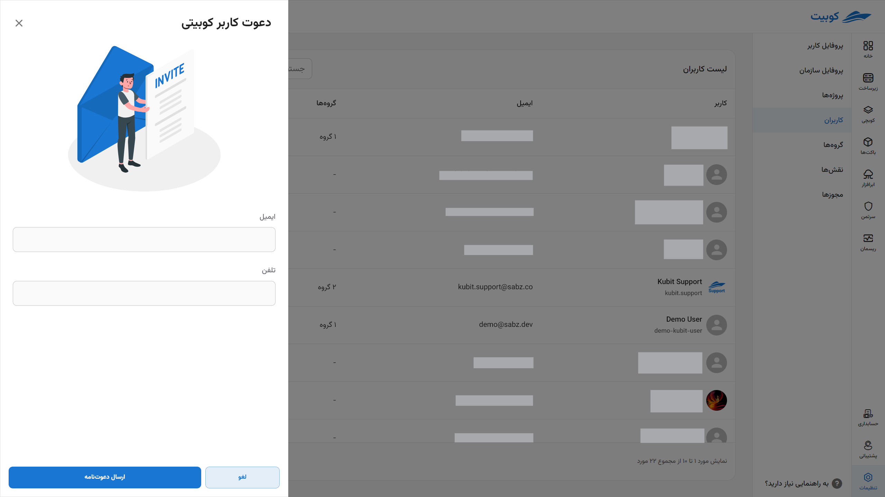

# مدیریت کاربران

:::info[مدیریت دسترسی‌ها] \* در سند [مدیریت دسترسی اعضا](iam) به تشریح مدیریت دسترسی‌های کاربران و سازمان پرداخته شده است.
:::

## انواع کاربران {#users-type}

در کوبیت دو نوع کاربر وجود دارد:

- **کاربران KUBIT** که مستقیماً در سامانه ثبت‌نام کرده‌اند.

- **کاربران LDAP** که از طریق اتصال سازمان به سامانه‌های احراز هویت مثل LDAP و معمولاً با ورود یکپارچه (SSO) وارد می‌شوند.

### کاربران کوبیت

کاربرانی که به صورت عادی در کوبیت ثبت‌نام می‌کنند، از نوع **کاربر کوبیت** هستند و از طریق **سامانه احراز هویت و مدیریت داخلی کوبیت** مدیریت می‌شوند.

#### سیستم LDAP{#ldap}

LDAP (Lightweight Directory Access Protocol) یک پروتکل برای دسترسی و مدیریت اطلاعات دایرکتوری در شبکه‌ها است. زمانی که سازمانی به LDAP متصل می‌شود، کاربران می‌توانند از طریق یک پایگاه داده مرکزی به اطلاعات مهم مانند اطلاعات حساب‌های کاربری، گروه‌ها و سطوح دسترسی، دسترسی داشته باشند. این اتصال به LDAP مدیریت ساده‌تر، امنیت بیشتر و امکان احراز هویت یکپارچه را فراهم می‌کند.

### کاربران LDAP

:::info[ورود یکپارچه (SSO)]

احراز هویت Single Sign-On (SSO) یا ورود یکپارچه یک طرح احراز هویت است که به کاربر اجازه می‌دهد با یک شناسه واحد به هر یک از چندین سیستم نرم‌افزاری مرتبط اما مستقل وارد شود. ورود یکپارچه به کاربر اجازه می‌دهد یک‌بار وارد شود و بدون وارد کردن مجدد فاکتورهای احراز هویت، به سامانه‌های سازمان دسترسی داشته باشد.

:::

در صورتی که سازمانی به سیستم LDAP متصل باشد، می‌توان مدیریت کاربران LDAP را در سیستم انجام داد. اگر امکان ورود یکپارچه (SSO) برای سازمان فعال باشد، کاربران که به صورت SSO احراز هویت شده‌اند، از طریق LDAP تعریف می‌شوند و در سیستم به عنوان **کاربر LDAP** شناخته می‌شوند.

## اضافه کردن کاربر سازمان

با توجه به [انواع کاربران در کوبیت](../#users-type)، می‌توانید کاربران جدید را از انواع LDAP و Kubit به سازمان اضافه کنید.
:::caution[اتصال سازمان به LDAP]

توجه داشته باشید تنها در صورتی که سازمان به سیستم LDAP متصل باشد، می توان کاربر از نوع LDAP به سازمان خود اضافه کنید. در بخش [سیستم LDAP](../#ldap) به توضیح این سیستم پرداخته شده است.

:::

برای افزودن کاربر، از بخش **کاربران** در **سازماندهی** روی دکمه **کاربر جدید** کلیک کنید:

سپس گزینه‌های مختلف افزودن کاربر را مشاهده می‌کنید:

در ادامه به توضیح مراحل هر کدام از این شیوه‌ها پرداخته شده است.

#### افزودن کاربر کوبیت

روی گزینه **کاربر کوبیت** کلیک کنید:

اطلاعات خواسته شده را برای دعوت کاربر وارد کرده و روی **ارسال دعوت‌نامه** کلیک کنید:

علاوه بر ارسال لینک دعوت‌نامه برای کاربر، لینک مربوطه نیز برای شما نمایش داده می‌شود:

نمونه لینک ارسال شده برای کاربر:

با کلیک روی لینک ارسال شده، کاربر به سازمان شما افزوده می‌شود.

#### افزودن کاربر LDAP

روی گزینه **LDAP** کلیک کنید:

سپس اطلاعات خواسته شده کاربر را وارد کنید:

پس از تایید اطلاعات و کلیک روی **افزودن کاربر LDAP** کاربر به سازمان افزوده خواهد شد.

##### ویرایش و حذف کاربر LDAP

برای ویرایش اطلاعات کاربر کافی است که در قسمت **کاربران** بخش **سازماندهی**، روی کاربر موردنظر را انتخاب و روی دکمه‌ی **ویرایش** کلیک کنید. ویرایش موردنظر را انجام دهید و سپس روی دکمه‌ی **تایید** کلیک کنید:

:::caution[توجه]
توجه داشته باشید که **نام کاربری** و **نوع وضعیت ورود** کاربر را نمی‌توانید تغییر دهید.
:::

