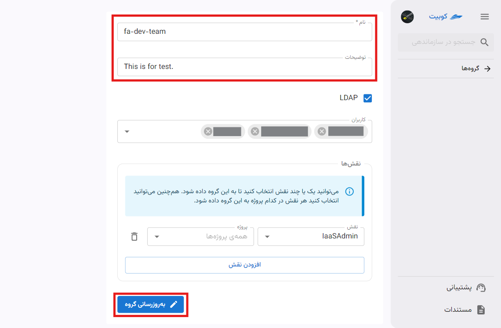

# گروه‌ها {#groups}

از بخش **سازماندهی** وارد قسمت **گروه‌ها** شوید:

در این قسمت می‌توانید لیست گروه‌های سازمان را مشاهده کنید:

با کلیک روی نام هر گروه، به صفحه جزئیات گروه هدایت می‌شوید:

## ساخت گروه

با کلیک روی دکمه‌ **گروه جدید**، می‌توانید یک گروه جدید تعریف کنید:

نام گروه و توضیحات مربوطه را وارد کنید. با کلیک روی دکمه **تایید**، گروه ایجاد شده و به صفحه لیست گروهها هدایت می‌شوید:

### افزودن کاربر به گروه

می‌توانید از قسمت **کاربران گروه‌**، کاربرانی را که می‌خواهید عضو این گروه باشند، انتخاب کنید:

برای افزودن کاربر به گروه، از بخش **کاربران** میتوان از بین کاربران سازمان، به این بخش عضو اضافه کرد.

_تصویر انتخاب کاربر از لیست کاربرای سازمان_

:::info[حذف کاربر از گروه]
برای حذف کاربر از گروه نیز از این قسمت میتوان استفاده کرد. کافیست روی علامت **ضربدر** کنار نام کاربران گروه کلیک کرد و با زدن دکمه **تایید** تغییرات اعمال شده را ثبت کرد.
:::

### افزودن نقش به گروه

برای افزودن نقش به گروه، مطابق مراحل و تصویر زیر عمل کنید:

همچنین می‌توانید از قسمت **نقش‌های گروه** نقش‌هایی را که می‌خواهید این گروه داشته باشد، به همراه تعیین سطح دسترسی در پروژه، انتخاب کنید:

## حذف گروه

برای حذف گروه، دو مسیر فراهم شده است: از طریق لیست گروه‌ها و از صفحه جزئیات گروه.

### شیوه اول: لیست گروه‌هاا

روی دکمه سه نقطه گروه موردنظر کلیک کرده و گزینه **پاک کردن** را انتخاب کنید:

### شیوه دوم: صفحه جزئیات گروه

با کلیک روی نام گروه از لیست گروه‌ها، به صفحه جزئیات وارد شوید و سپس روی دکمه **حذف گروه** کلیک کنید:

## ویرایش گروه

در ویرایش گروه، می توان عملیات هایی چون، ویرایش نام و توضیحات، افزودن یا حذف کاربر و افزودن یا حذف نقش در پروژه انجام داد.

ابتدا به صفحه جزئیات گروه بروید و روی دکمه **ویرایش گروه** کلیک کنید تا حالت ویرایش فعال شود:

حال میتوان ویرایش و تغغیرات موردنظر را انجام داد:

:::info[تایید تغییرات]
در هر مرحله از تغییرات، با کلیک روی دکمه **تایید** می‌توانید ویرایش‌های خود را نهایی کنید:

:::

### ویرایش اطلاعات گروه

برای ویرایش نام و توضیحات گروه، فقط کافیست اطلاعات جدید را وارد کنید. با کلیک روی دکمه **تایید** تغییرات شما اعمال می‌شوند:

