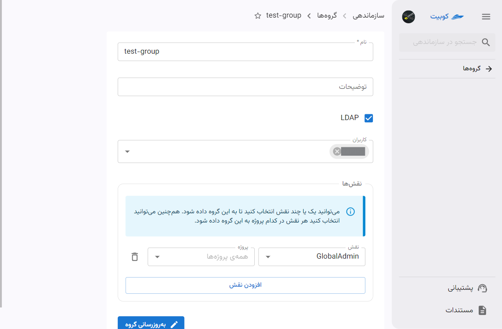
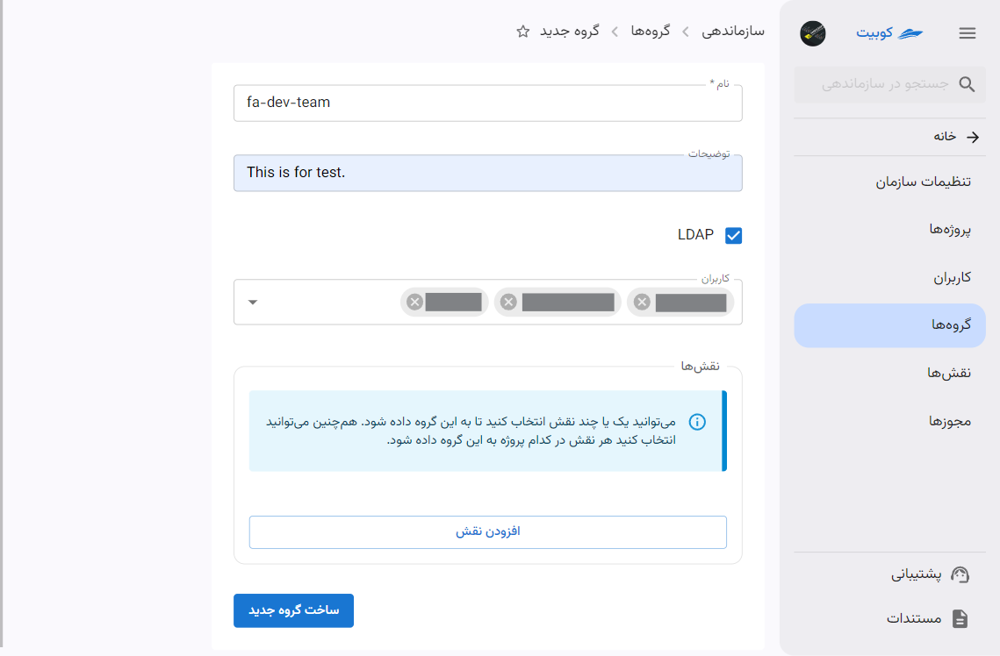
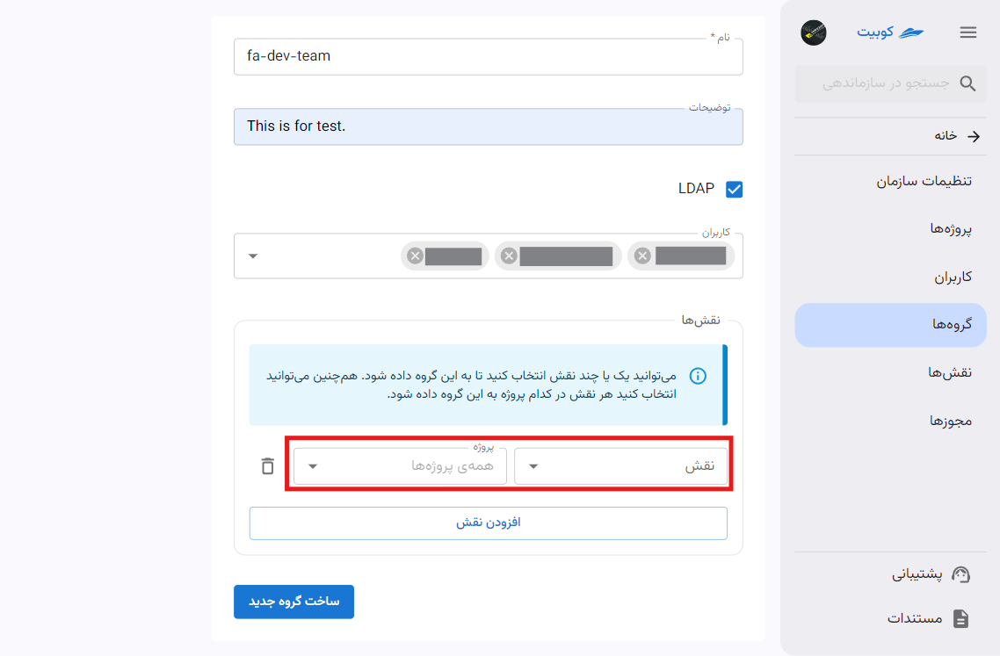
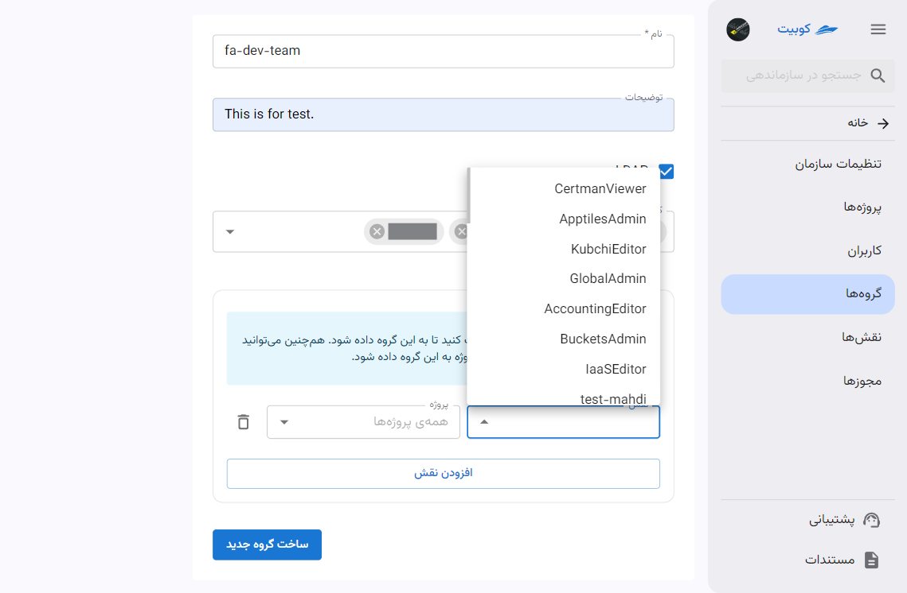
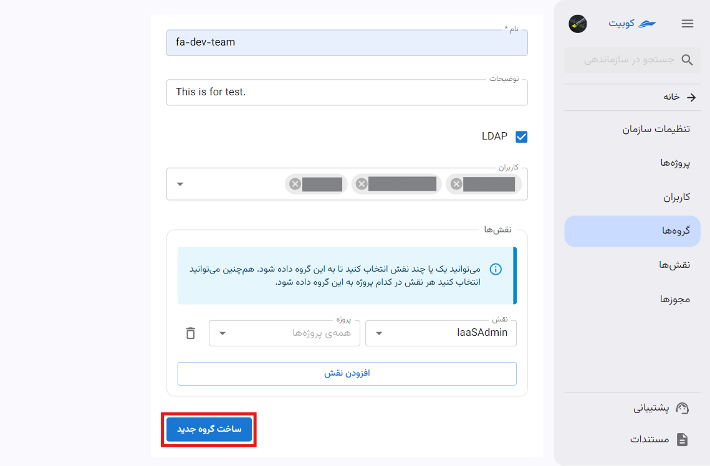
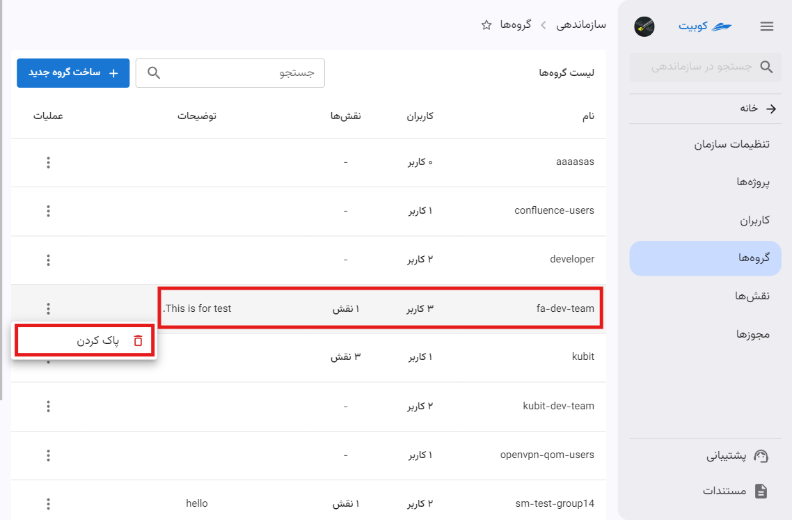
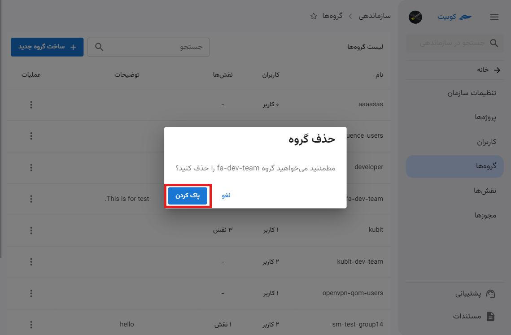
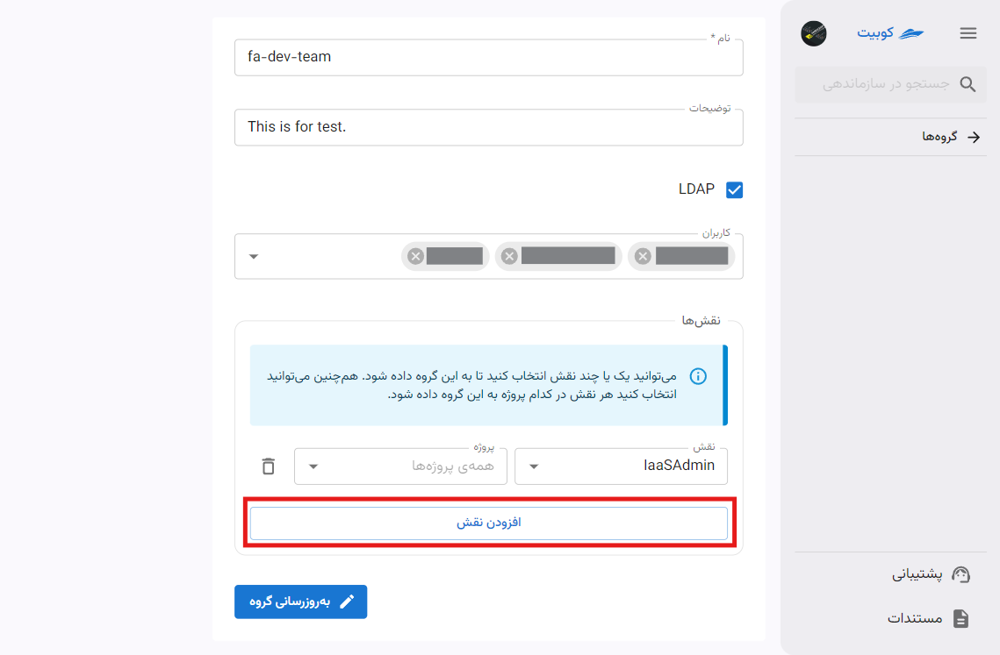

# گروه‌ها {#groups}

گروه‌ها برای دسته‌بندی کاربران و مدیریت دسترسی‌ها تعریف شده‌اند. در حال حاضر در کوبیت فقط می‌توان به یک گروه نقش‌های مشخصی تخصیص داد. در صورت اتصال سازمان به [LDAP](../#ldap)، امکانات دیگری از جمله سینک با گروه‌های LDAP، فراهم خواهد شد.

از بخش **سازماندهی** وارد قسمت **گروه‌ها** شوید:

در این قسمت می‌توانید لیست گروه‌های سازمان را مشاهده کنید:

با کلیک روی نام هر گروه، به صفحه جزئیات گروه هدایت می‌شوید:

## ساخت گروه{#create-group}

با کلیک روی دکمه‌ **گروه جدید**، می‌توانید یک گروه جدید تعریف کنید:

:::info[مقادیر اختیاری]
مقادیر **توضیحات**، **کاربران** و **نقش‌ها** اختیاری می‌باشند و تنها با وارد کردن **نام** می‌توانید گروه خود را ایجاد کنید. این مستند با فرض وارد کردن تمام اطلاعات موردنیاز نوشته شده است.
:::

**نام** و توضیحات را وارد کرده و کاربران را از لیست کاربران سازمان انتخاب کنید:

برای افزودن نقش به گروه، روی دکمه **افزودن نقش** کلیک کنید:

سپس نقش موردنظر خود را از لیست نقش‌های موجود انتخاب کرده و سطح دسترسی در پروژه را تعیین کنید:

در انتها روی دکمه **ساخت گروه جدید** کلیک کنید:

گروه ایجاد شده و به صفحه لیست گروه‌ها هدایت می‌شوید:

## حذف گروه

برای حذف گروه، به لیست گروه‌ها رفته و روی دکمه سه نقطه گروه موردنظر کلیک کرده و گزینه **پاک کردن** را انتخاب کنید:

سپس با انتخاب گزینه **پاک کردن**، گروه حذف می‌شود:

## ویرایش گروه

در ویرایش گروه، می‌توان عملیات‌هایی چون، ویرایش نام و توضیحات، افزودن یا حذف کاربر و افزودن یا حذف نقش در گروه انجام داد.

### ویرایش اطلاعات گروه

- برای ویرایش نام و توضیحات گروه، فقط کافیست اطلاعات جدید را وارد کنید.
- سپس با کلیک روی دکمه **به‌روزرسانی گروه** تغییرات شما اعمال می‌شوند.
  

### حذف/اضافه کاربر

#### افزودن کاربر

- برای افزودن کاربر به گروه کاربری، از قسمت **کاربران‌**، کاربران موردنظر را از لیست کاربران سازمان انتخاب کنید.
- سپس با کلیک روی دکمه **به‌روزرسانی گروه** کاربر انتخاب شده به گروه اضافه می‌شود.
  

#### حذف کاربر

- برای حذف کاربر از گروه، کافیست روی علامت **ضربدر** کنار نام کاربر کلیک کنید:
- سپس با کلیک روی دکمه **به‌روزرسانی گروه** تغییرات اعمال شده را ثبت کنید:
  

### حذف/اضافه نقش

#### افزودن نقش

برای افزودن نقش به گروه کاربری، از قسمت **نقش‌ها**، روی **افزودن نقش** کلیک کنید:

نقش موردنظر به همراه سطح دسترسی در پروژه را انتخاب کنید:

سپس با کلیک روی دکمه **به‌روزرسانی گروه** نقش انتخاب شده به گروه اضافه می‌شود:

#### حذف نقش

- برای حذف نقش از گروه، کافیست روی آیکون **سطل زباله** نقش مربوطه کلیک کنید.
- سپس با کلیک روی دکمه **به‌روزرسانی گروه** تغییرات اعمال شده را ثبت کنید.
  
