# مدیریت دسترسی اعضا

مدیر سازمان می‌تواند برای کاربران سازمان خود سطح دسترسی تعریف کند. در کوبیت می‌توان برای هر نقش مجوزهای خاصی صادر کرد و سپس می‌توان این نقش‌ها را به کاربران اختصاص داد.

## مدیریت کاربران

از بخش **سازماندهی** وارد قسمت **کاربران** شوید:

در این قسمت می‌توانید لیست کاربران سازمان را مشاهده کنید:

با کلیک روی نام هر کاربر، به صفحه اطلاعات کاربری آن کاربر هدایت می‌شوید:
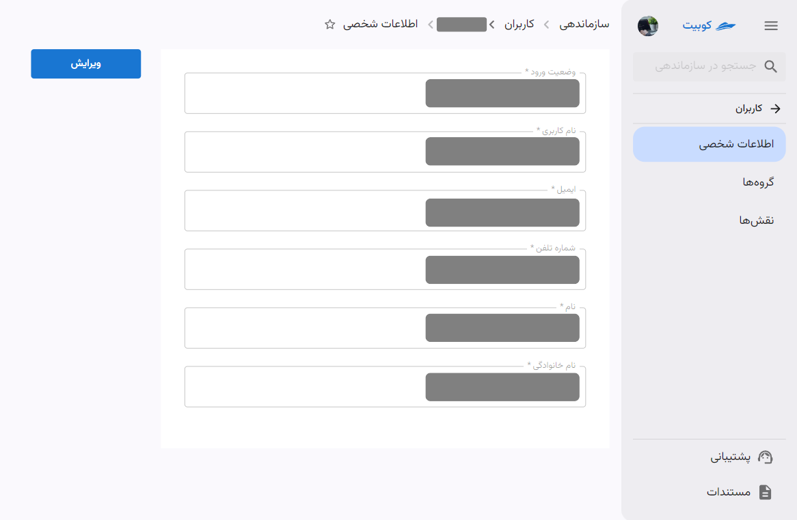

از طریق صفحه اطلاعات کاربر به لیست گروه ها و نقش های کاربر نیز میتوانید دسترسی پیدا کنید:

#### گروه های کاربر

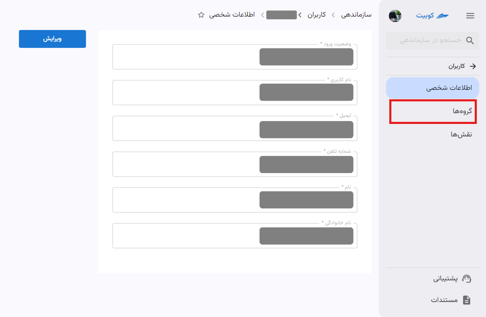

#### نقش های کاربر

### انتساب نقش به کاربر

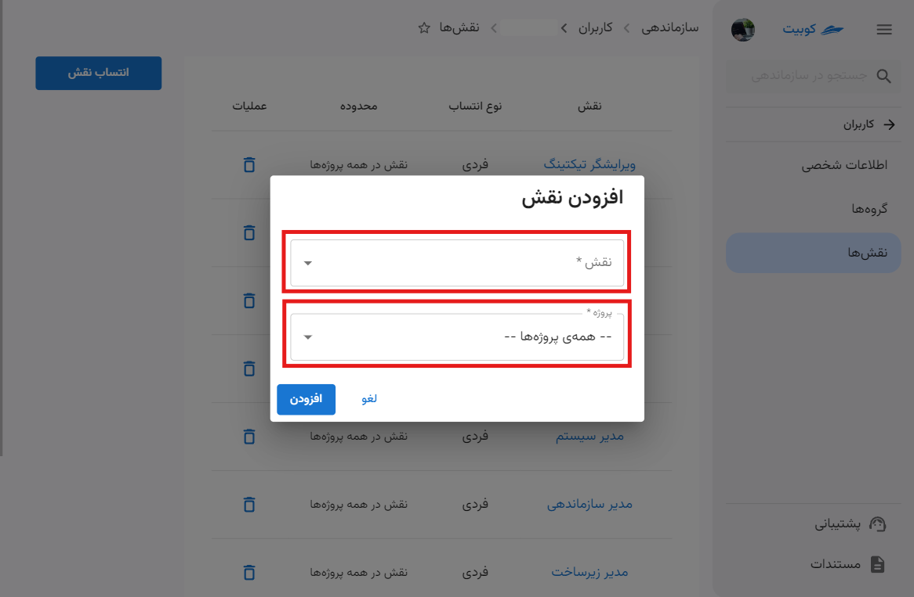

### حذف نقش از کابر

### افزودن کاربر به گروه

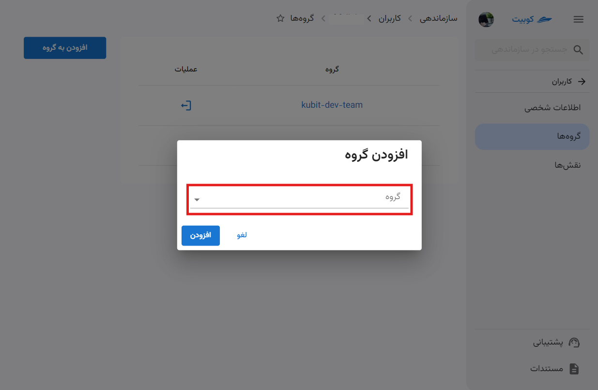

### ترک/حذف کاربر از گروه

### اضافه کردن کاربر سازمان

با توجه به انواع کاربران در کوبیت، می توانید کاربران جدید را نیز از انواع LDAP و Kubit انتخاب کنید.
:::caution[اتصال سازمان به LDAP]
توجه داشته باشید تنها در صورتی که سازمان به سیستم LDAP متصل باشد، می توان کاربر از نوع LDAP به سازمان خود اضافه کنید. در بخش [سیستم LDAP](../#ldap) به توضیح این سیستم پرداخته ایم.
:::

برای افزودن کاربر، از بخش **کاربران** روی دکمه **کاربر جدید** کلیک کنید:

سپس گزینه های مختلف افزودن کاربر را مشاهده می کنید:

در ادامه به توضیح مراحل هر کدام از این شیوه های پرداخته ایم.

#### افزودن کاربر LDAP

روی گزینه **LDAP** کلیک کنید:

سپس اطلاعات خواسته شده کاربر را وارد کنید:

پس از تایید اطلاعات و کلیک روی **افزودن کاربر LDAP** کاربر به سازمان افزوده خواهد شد.

##### ویرایش و حذف کاربر LDAP

برای ویرایش اطلاعات کاربر کافی است که در قسمت **کاربران**‌ بخش **سازماندهی**، روی کاربر موردنظر را انتخاب و روی دکمه‌ی **ویرایش** کلیک کنید. ویرایش موردنظر را انجام دهید و سپس روی دکمه‌ی **تایید** کلیک کنید:
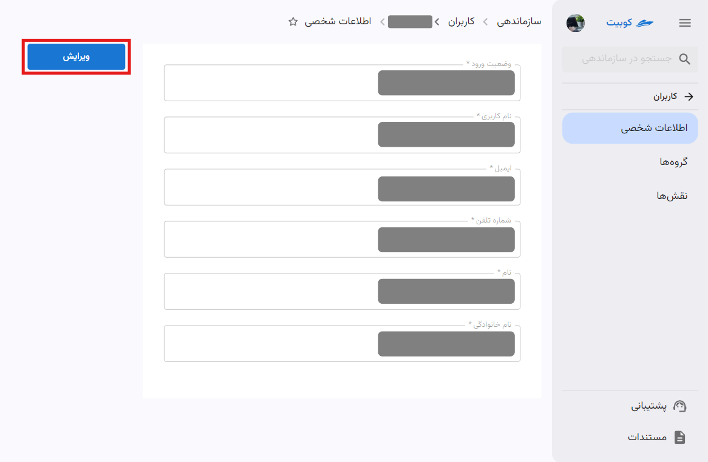
:::caution[توجه]
توجه داشته باشید که **نام کاربری** و **نوع وضعیت ورود** کاربر را نمیتوانید تغییر دهید.
:::

#### افزودن کاربر کوبیت

روی گزینه **کاربر کوبیت** کلیک کنید:

سپس اطلاعات خواسته شده را برای دعوت کاربر وارد کنید:

## تنظیمات نقش‌ها {#roles}

از بخش **سازماندهی** وارد قسمت **نقش‌ها** شوید:
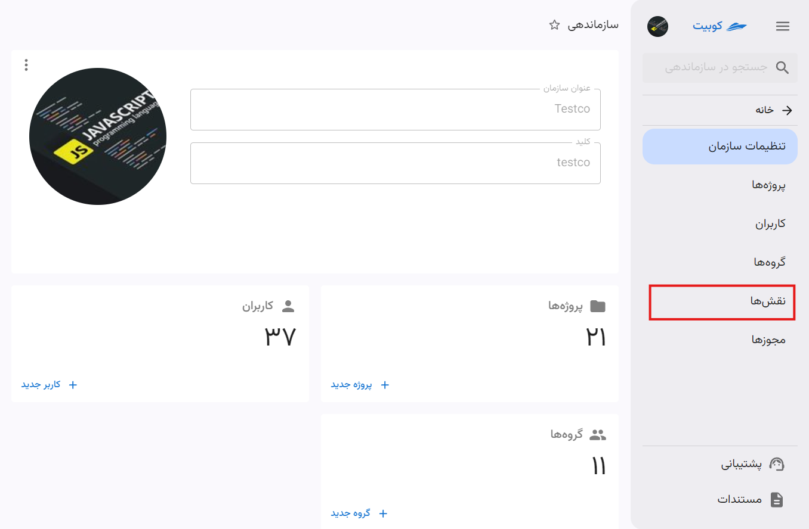

در این قسمت می‌توانید لیست نقش‌های موجود را مشاهده کنید:

با کلیک روی نام هر نقش، به صفحه جزئیات نقش هدایت می‌شوید:

### ساخت نقش جدید

با کلیک روی دکمه‌ی **نقش جدید** می‌توانید یک نقش جدید تعریف کنید:

سپس نام نقش و توضیحات مربوطه را وارد کنید:

بعد از این مرحله، نقش ایجاد شده و به صفحه جزئیات نقش هدایت می‌شوید. همچنین، نقش ساخته شده از لیست نقش‌ها قابل مشاهده است:
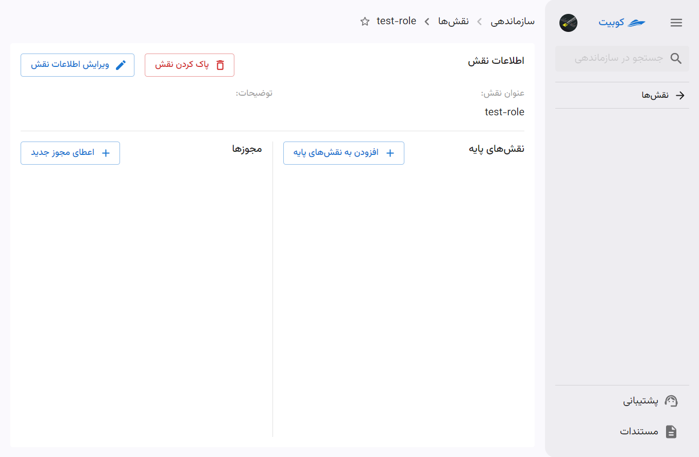

اما این نقش تنها یک نقش خالی است و باید مجوزهای مورد نظر را به آن اضافه کنید. در ادامه به افزودن نقش پایه و اعطای مجوز به نقش ایجاد شده می‌پردازیم.

#### افزودن نقش پایه به نقش جاری

:::tip[نقش های پایه]
در این قسمت می‌توان نقش جدید را از نقش‌های موجود ارث‌بری کرد. با این کار، دسترسی‌ها و مجوزهایی که در نقش ارث‌برده شده وجود دارد، به این نقش نیز اختصاص داده خواهد شد.
:::

برای این کار باید در تب **نقش‌های پایه**، روی دکمه **افزودن به نقش های پایه** کلیک کنید:

سپس از لیست نقش های پایه، نقش موردنظر را انتخاب کنید:

پس از تایید و کلیک روی **افزودن نقش پایه**، این نقش به لیست نقش‌های سازمان اضافه خواهد شد.

همان‌طور که مشاهده می‌شود، با افزودن نقش پایه به نقش جاری، مجوزهای آن نقش پایه نیز به مجوزهای نقش جاری افزوده می‌شوند:
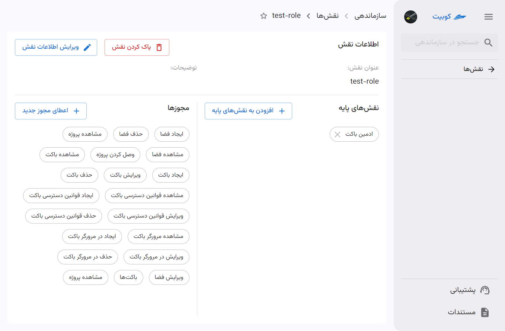

:::tip[انتساب مجوز به نقش]
علاوه بر مجوزهایی که از طریق نقش پایه به نقش جاری افزوده می‌شوند، می‌توانید به صورت جداگانه نیز مجوزهای مورد نظر خود را به نقش اضافه کنید.
:::

#### انتساب مجوز به نقش

برای افزودن مجوز به نقش، روی دکمه **اعطای مجوز جدید** کلیک کنید:

سپس از لیست مجوزهای موجود، مجوز موردنظر را انتخاب کنید:
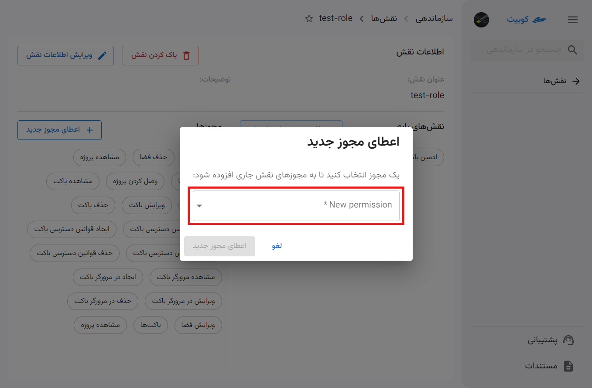

پس از تایید و کلیک روی اعطای مجوز جدید، این مجوزهای نقش جاری اضافه خواهد شد:
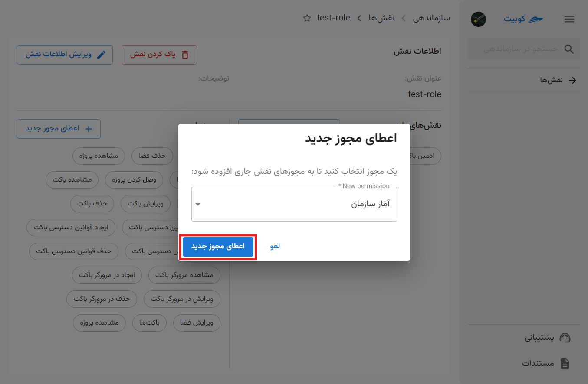

:::tip[توجه]
هر نقش، تمام مجوزهای همه نقش‌های پایه‌ی خود را به ارث می‌برد.
به عبارت دیگر، با انتخاب یک نقش جدیدِ پایه برای نقش جدید، در واقع تمام مجوزهای آن نقش را به این نقش افزوده‌اید!
بنابراین هر نقش، به اندازه تمام نقش‌های پایه‌ی خود، به اضافه مجوزهایی که صراحتاً به آن داده‌اید، قدرت دارد.
:::

:::caution[محدودیت در حذف مجوز]
توجه داشته باشید که مجوزهایی که به واسطه افزودن نقش پایه به نقش جاری شما افزوده شده‌اند، قابل حذف نمی‌باشند و تنها می‌توانید مجوزهایی را که خودتان افزوده‌اید، از نقش حذف کنید. این کار با کلیک کردن روی آیکون **سطل زباله** کنار نام مجوز، امکان‌پذیر است:

:::

### حذف نقش

برای حذف نقش، دو مسیر فراهم شده است: از طریق لیست نقش‌ها و از صفحه جزئیات نقش.

#### شیوه اول: لیست نقش‌ها

روی دکمه سه نقطه نقش موردنظر کلیک کرده و گزینه **پاک کردن** را انتخاب کنید:
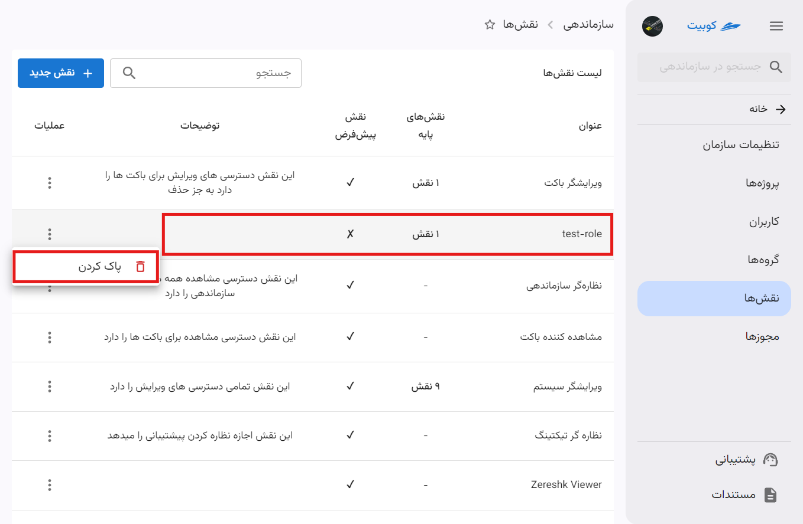

#### شیوه دوم: صفحه جزئئیات نقش

با کلیک روی نام نقش از لیست نقش‌ها، به صفحه جزئیات وارد شوید و سپس روی دکمه **پاک کردن نقش** کلیک کنید:
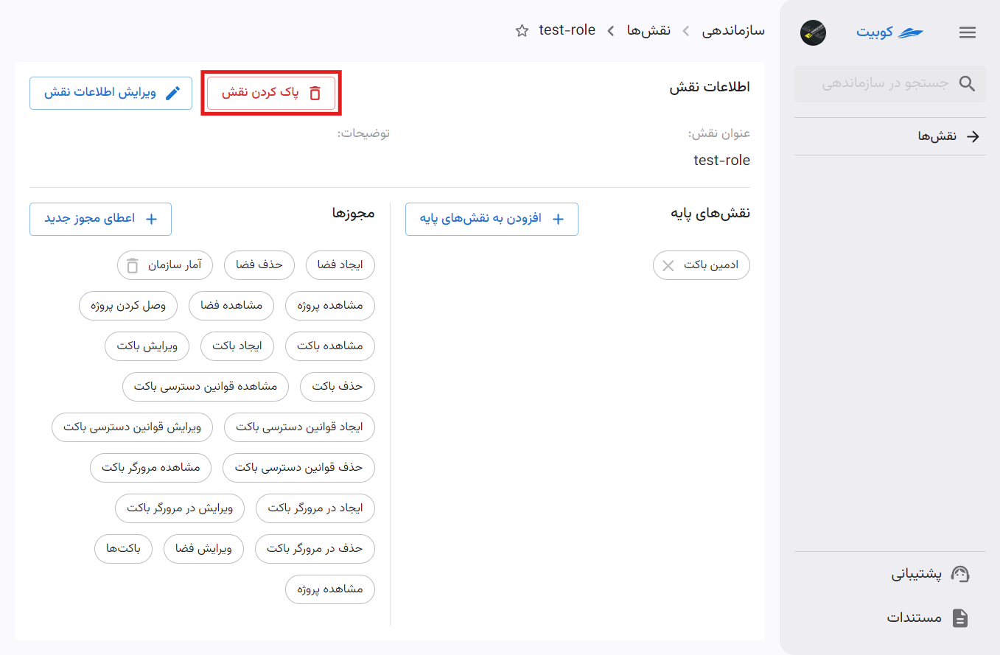
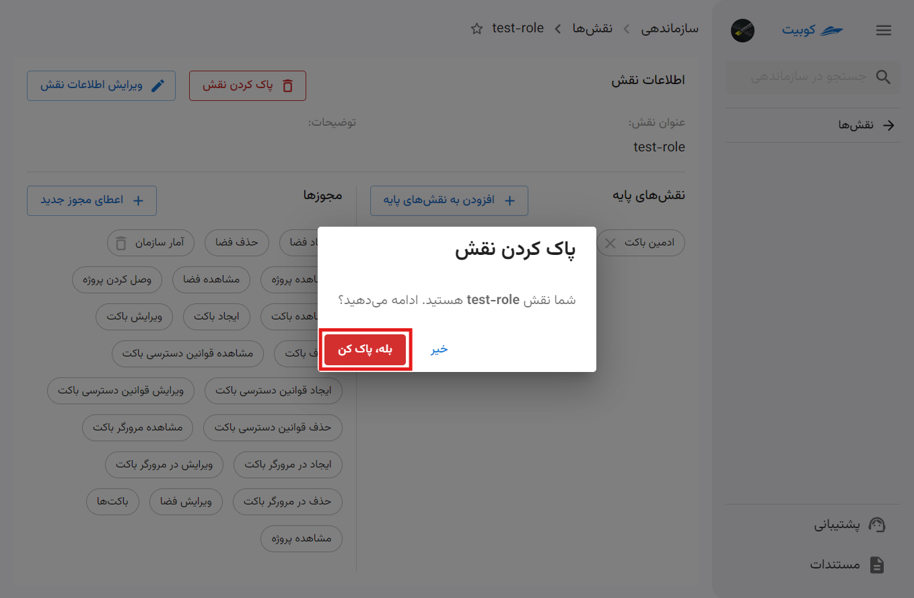

### ویرایش اطلاعات نقش

برای ویرایش نام و توضیحات نقش، روی دکمه **ویرایش اطلاعات نقش** کلیک کنید و اطلاعات جدید را وارد کنید. با کلیک روی دکمه **ویرایش** تغییرات شما اعمال می‌شوند:
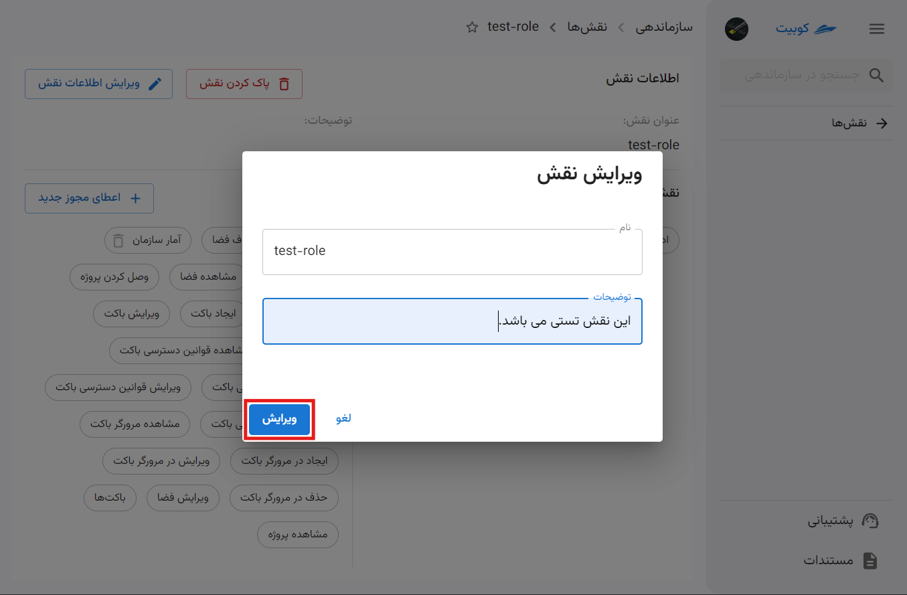

:::tip[ویرایش لیست نقش های پایه و مجوزها]
برای حذف و اضافه نقش‌های پایه و مجوزهای نسبت داده شده به هر نقش، از طریق صفحه جزئیات نقش می‌توانید اقدام کنید.
:::

## تنظیمات گروه‌هاا

از بخش **سازماندهی** وارد قسمت **گروه‌ها** شوید:

در این قسمت می‌توانید لیست گروه‌های سازمان را مشاهده کنید:
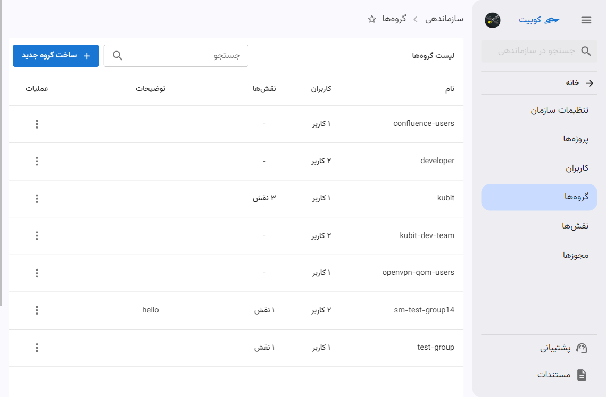

با کلیک روی نام هر گروه، به صفحه جزئیات گروه هدایت می‌شوید:

### ساخت گروه

با کلیک روی دکمه‌ **گروه جدید**، می‌توانید یک گروه جدید تعریف کنید:

نام گروه و توضیحات مربوطه را وارد کنید. با کلیک روی دکمه **تایید**، گروه ایجاد شده و به صفحه لیست گروهها هدایت می‌شوید:

#### افزودن کاربر به گروه

می‌توانید از قسمت **کاربران گروه‌**، کاربرانی را که می‌خواهید عضو این گروه باشند، انتخاب کنید:

برای افزودن کاربر به گروه، از بخش **کاربران** میتوان از بین کاربران سازمان، به این بخش عضو اضافه کرد.

_تصویر انتخاب کاربر از لیست کاربرای سازمان_

:::info[حذف کاربر از گروه]
برای حذف کاربر از گروه نیز از این قسمت میتوان استفاده کرد. کافیست روی علامت **ضربدر** کنار نام کاربران گروه کلیک کرد و با زدن دکمه **تایید** تغییرات اعمال شده را ثبت کرد.
:::

#### افزودن نقش به گروه

برای افزودن نقش به گروه، مطابق مراحل و تصویر زیر عمل کنید:

_تصویر اضافه کردن نقش و پروژه به گروه_

همچنین می‌توانید از قسمت **نقش‌های گروه** نقش‌هایی را که می‌خواهید این گروه داشته باشد، به همراه تعیین سطح دسترسی در پروژه، انتخاب کنید:

### حذف گروه

برای حذف گروه، دو مسیر فراهم شده است: از طریق لیست گروه ها و از صفحه جزئیات گروه.

#### شیوه اول: لیست گروه ها

روی دکمه سه نقطه گروه موردنظر کلیک کرده و گزینه **پاک کردن** را انتخاب کنید:

#### شیوه دوم: صفحه جزئیات گروه

با کلیک روی نام گروه از لیست گروه ها، به صفحه جزئیات وارد شوید و سپس روی دکمه **حذف گروه** کلیک کنید:

### ویرایش گروه

در ویرایش گروه، می توان عملیات هایی چون، ویرایش نام و توضیحات، افزودن یا حذف کاربر و افزودن یا حذف نقش در پروژه انجام داد.

ابتدا به صفحه جزئیات گروه بروید و روی دکمه **ویرایش گروه** کلیک کنید تا حالت ویرایش فعال شود:

حال میتوان ویرایش و تغغیرات موردنظر را انجام داد:

:::info[تایید تغییرات]
در هر مرحله از تغییرات، با کلیک روی دکمه **تایید** می‌توانید ویرایش‌های خود را نهایی کنید:

:::

#### ویرایش اطلاعات گروه

برای ویرایش نام و توضیحات گروه، فقط کافیست اطلاعات جدید را وارد کنید. با کلیک روی دکمه **تایید** تغییرات شما اعمال می‌شوند:

## افزودن دسترسی به کاربران

برای دادن دسترسی به کاربران، پس از افزودن نقش، باید آن را به لیست نقش‌های کاربر اضافه کنیم. برای این کار، طبق مراحل زیر پیش می رویم:
وارد قسمت **کاربران** در بخش **سازماندهی** شوید و کاربر موردنظر را انتخاب کنید:
وارد تب **نقش‌ها** شوید و روی دکمه‌ی **انتساب نقش** کلیک کنید:
:::info[انتخاب پروژه به خصوص]
اگر می‌خواهید تنها برای پروژه‌ی معینی به کاربر دسترسی بدهید، باید در حین انتخاب نقش، پروژه‌ی مدنظرتان را نیز انتخاب کنید.
:::
در پنجره‌‌ای که باز شده است، نقش موزدنظر به همراه پروژه ای که میخواهید کاربر در آن نقش داشته باشد را انتخاب کنید:

با زدن روی دکمه‌ی **افزودن** نقش جدید به نقش‌های کاربر اضافه می‌شود.

### اضافه کردن گروه به کاربران

گروه برای دسته بندی کردن کاربران تعریف شده. در حال حاضر در کوبیت فقط میتوان به یک گروه نقش های مشخصی تخصیص داد. در صورت اتصال به ldap میتوان استفاده های خاص دیگری از گروه ها داشت.
