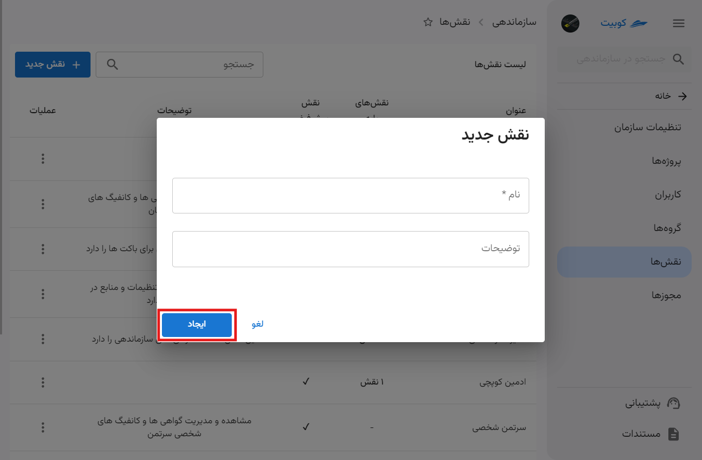
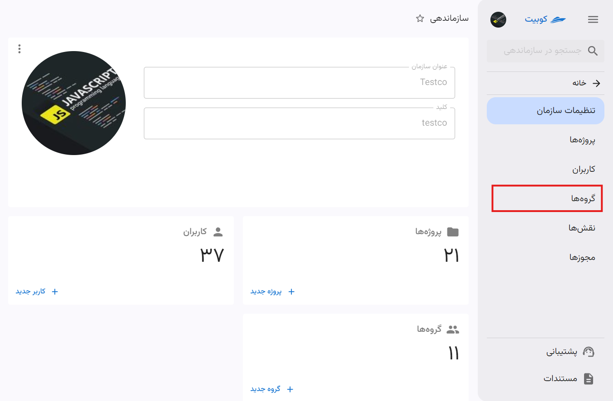
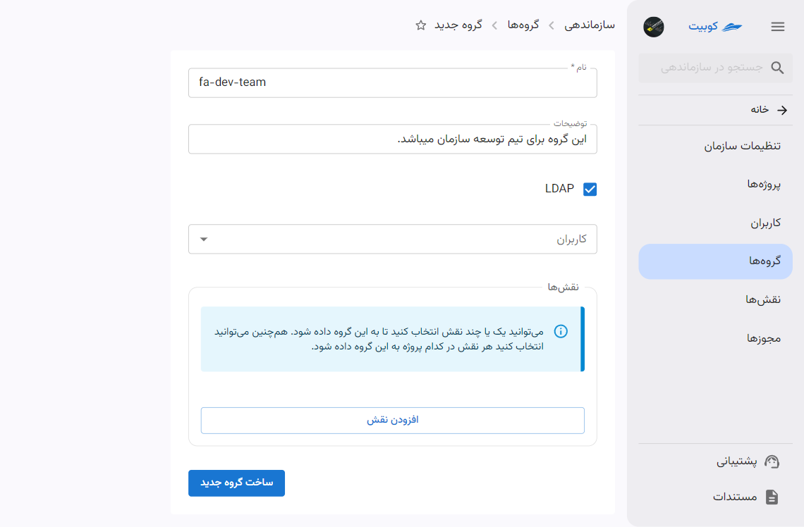

# مدیریت دسترسی اعضا

مدیر سازمان می‌تواند برای کاربران سازمان خود سطح دسترسی تعریف کند. در کوبیت می‌توان برای هر نقش مجوزهای خاصی صادر کرد و سپس می‌توان این نقش‌ها را به کاربران اختصاص داد.

## اضافه کردن کاربر سازمان

## تنظیمات نقش ها {#roles}

از طریق منوی سمت راست وارد قسمت **نقش‌ها** در بخش **سازماندهی** شوید:

در این قسمت می‌توانید لیست نقش های موجود را مشاهده کنید:

### ساخت نقش جدید

با کلیک بر روی دکمه‌ی **نقش جدید** می‌توانید یک نقش جدید تعریف کنید:

سپسُ باید نام نقش و توضیحات مربوطه را وارد کنید:

بعد از این مرحله، نقش ایجاد شده است و به صفحه حزئیات نقش هدایت می شوید. نقش ساخته شده نیز از لیست نقش ها قابل مشاهده می باشد، اما این نقش تنها یک نقش خالی است و باید مجوزهای موردنظر را به آن اضافه کنید.

:::tip[نقش های پایه]
در این قسمت می‌توان نقش جدید را از نقش‌های موجود ارث‌بری کرد. با این کار دسترسی‌ها و مجوزهایی که در نقش ارث‌برده شده وجود دارد، به این نقش نیز اختصاص داده خواهد شد.
:::
برای این کار باید در تب **نقش‌های پایه**، روی دکمه **افزودن به نقش های پایه** کلیک کنید:

سپس از لیست نقش های پایه، نقش موردنظرتان را انتخاب کنید:

پس از تایید و کلیک روی **افزودن نقش پایه**، این نقش به لیست نقش‌های سازمان اضافه خواهد شد.

همانطور که مشاهده می شود، با افزودن نقش پایه به نقش جاری، مجوزهای آن نقش پایه نیز به مجوزهای نقش جاری هم افزوده می شوند:

:::tip[انتساب مجوز به نقش]
علاوه بر مجوزهایی که از طریق نقش پایه به نقش جاری افزوده میشوند، میتوانید به صورت جداگانه نیز مجوزهای موردنظر خود را به نقش اضافه کنید.
:::
برای افزودن مجوز به نقش، روی دکمه **اعطای مجوز جدید** کلیک کنید:

علاوه بر انتساب نقش، می‌توان مجوزهای مورد نظر را نیز به نقش جدید اضافه کرد:

_باتن اعطای مجوز جدید_

_لیست مجوزهای موجود_

:::caution[توجه]
هر نقش، تمام مجوزهای همه نقش‌های پایه‌ی خود را به ارث می‌برد.
به عبارت دیگر، با انتخاب یک نقش جدید پایه برای این نقش، در واقع تمام مجوزهای آن نقش را به این نقش افزوده‌اید!
بنابراین هر نقش، به اندازه تمام نقش‌های پایه‌ی خود، به اضافه مجوزهایی که صراحتاً به آن داده‌اید، قدرت دارد.
:::

## تنظیمات گروه ها

از بخش **سازماندهی** وارد قسمت **گروه‌ها** شوید:

در این قسمت می‌توانید لیست گروه‌های سازمان را مشاهده کنید:

### ساخت گروه

برای ساخت گروه جدید، بر روی دکمه‌ی **ایجاد گروه** کلیک کنید:

در این قسمت، باید نام گروه و توضیحات مربوطه را اضافه کنید:

سپس، در قسمت **کاربران گروه‌** می‌توانید کاربرانی را که می‌خواهید عضو این گروه باشند، مشخص کنید. همچنین از قسمت **نقش‌های گروه** می‌توانید نقش‌هایی را که می‌خواهید این گروه داشته باشد، انتخاب کنید و تعیین کنید که هر نقش متعلق به چه پروژه‌ای است.

### حذف گروه

برای حذف یک گروه کافی است که بر روی دکمه‌ی سه نقطه کلیک کرده و گزینه **پاک کردن** را انتخاب کنید.

### ویرایش گروه

در ویرایش گروه، عملیات هایی چون، ویرایش نام و توضیحات، افزودن یا حذف کاربر و افزودن یا حذف نقش در پروژه انجام داد.

#### ویرایش نام و توضیحات

برای انجام این کار، کافیست روی نام گروه موردنظر از لیست گروه ها کلیک کرده و بر روی دکمه **ویرایش گروه** کلیک کنید:

#### افزودن نقش به گروه

برای افزودن نقش به گروه، مطابق مراحل و تصویر زیر عمل کنید:

_تصویر اضافه کردن نقش و پروژه به گروه_

#### افزودن کاربر به گروه

برای افزودن کاربر به گروه، از بخش **کاربران** میتوان از بین کاربران سازمان، به این بخش عضو اضافه کرد.

_تصویر انتخاب کاربر از لیست کاربرای سازمان_

:::info[حذف کاربر از گروه]
برای حذف کاربر از گروه نیز از این قسمت میتوان استفاده کرد. کافیست بر روی علامت **ضربدر** کنار نام کاربران گروه کلیک کرد و با زدن دکمه **تایید** تغییرات اعمال شده را ثبت کرد.
:::

## افزودن دسترسی به کاربران

برای دادن دسترسی به کاربران، پس از افزودن نقش، باید آن را به لیست نقش‌های کاربر اضافه کنیم. برای این کار، طبق مراحل زیر پیش می رویم:
وارد قسمت **کاربران** در بخش **سازماندهی** شوید و کاربر موردنظر را انتخاب کنید:
وارد تب **نقش‌ها** شوید و بر روی دکمه‌ی **انتساب نقش** کلیک کنید:
:::info[انتخاب پروژه به خصوص]
اگر می‌خواهید تنها برای پروژه‌ی معینی به کاربر دسترسی بدهید، باید در حین انتخاب نقش، پروژه‌ی مدنظرتان را نیز انتخاب کنید.
:::
در پنجره‌‌ای که باز شده است، نقش موزدنظر به همراه پروژه ای که میخواهید کاربر در آن نقش داشته باشد را انتخاب کنید:

با زدن بر روی دکمه‌ی **افزودن** نقش جدید به نقش‌های کاربر اضافه می‌شود.

### اضافه کردن گروه به کاربران

گروه برای دسته بندی کردن کاربران تعریف شده. در حال حاضر در کوبیت فقط میتوان به یک گروه نقش های مشخصی تخصیص داد. در صورت اتصال به ldap میتوان استفاده های خاص دیگری از گروه ها داشت.
