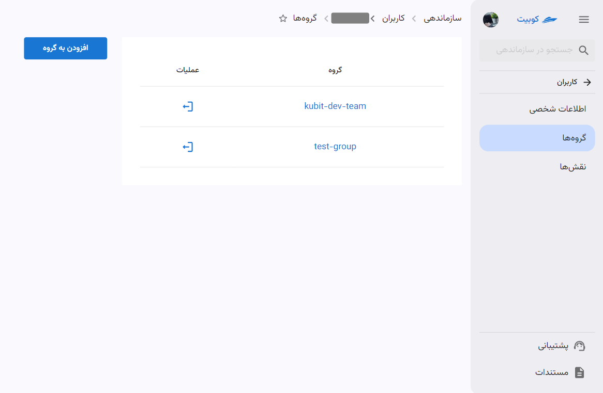
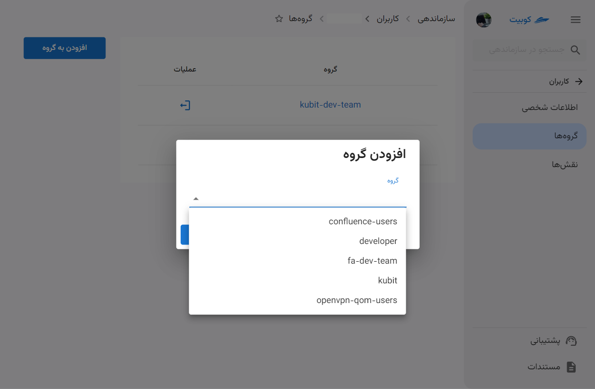
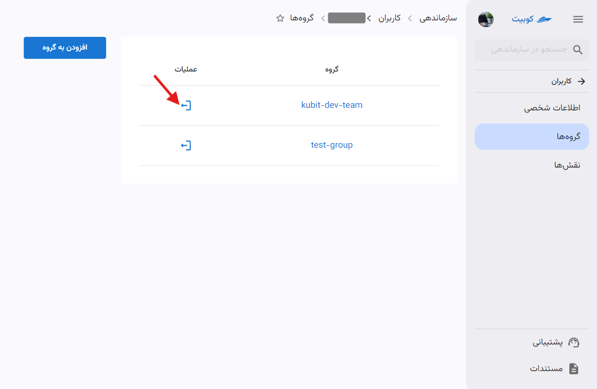
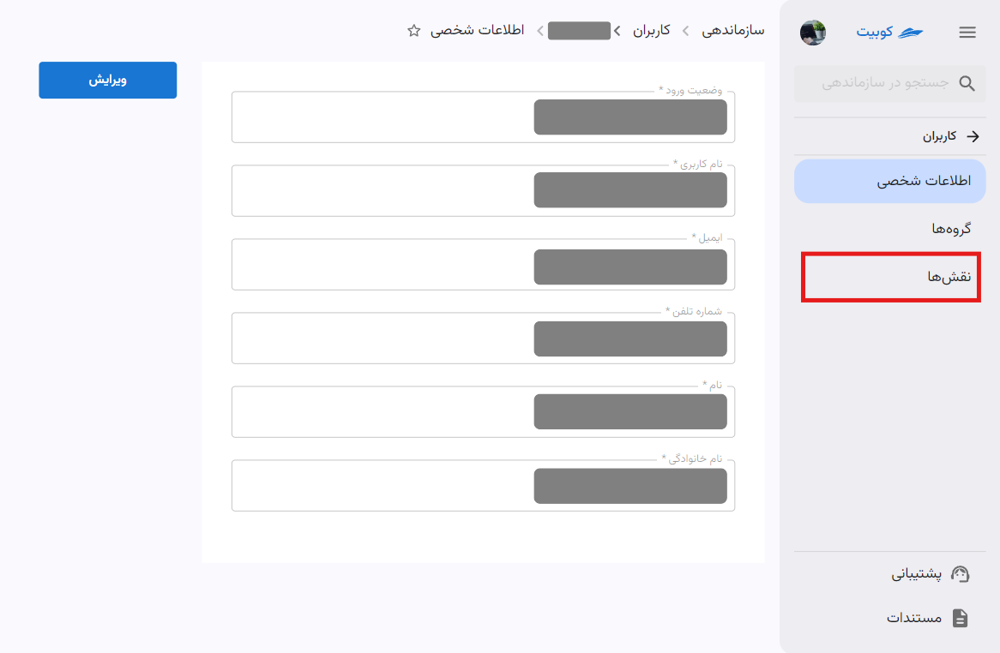
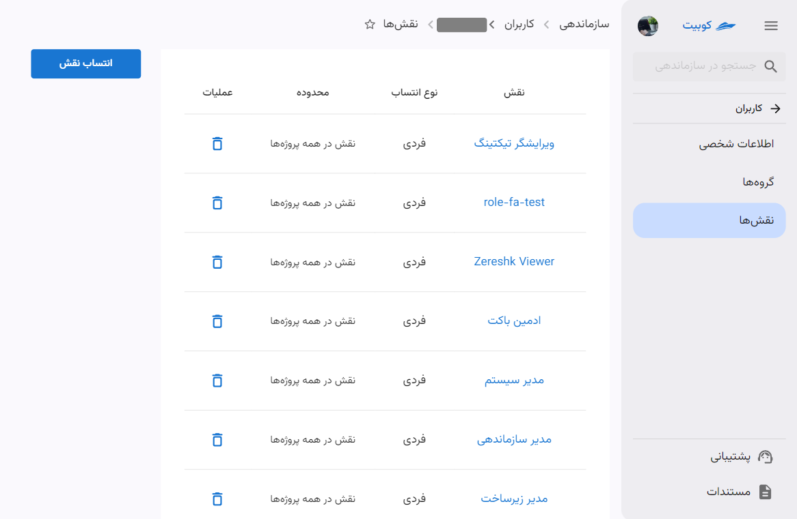
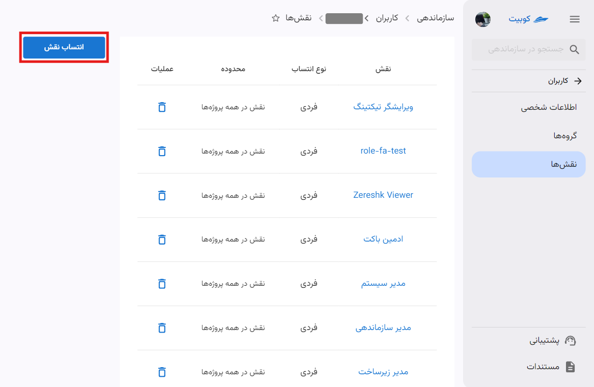
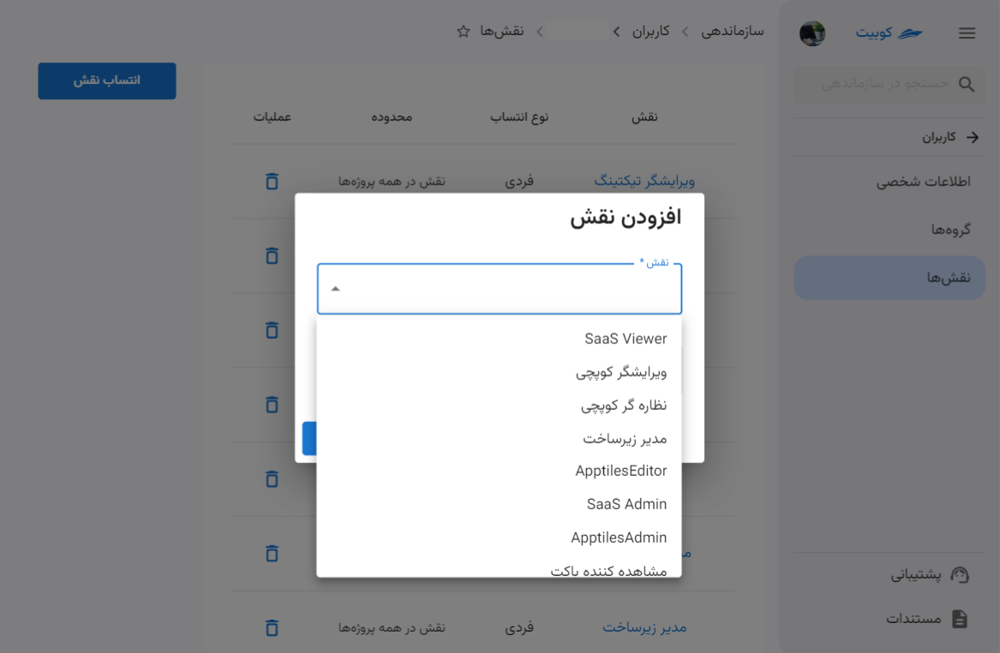
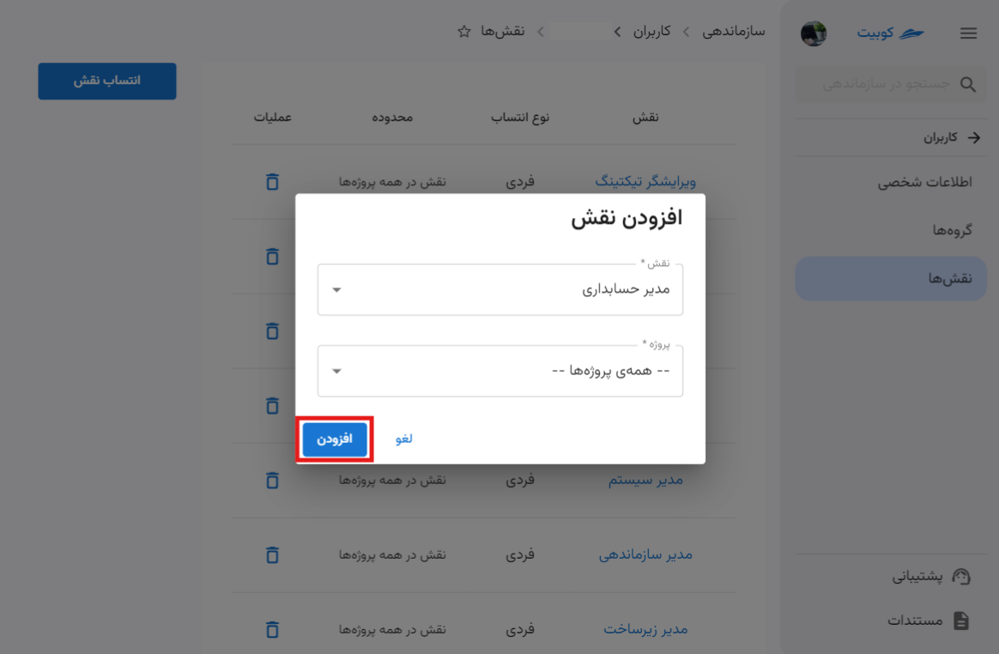
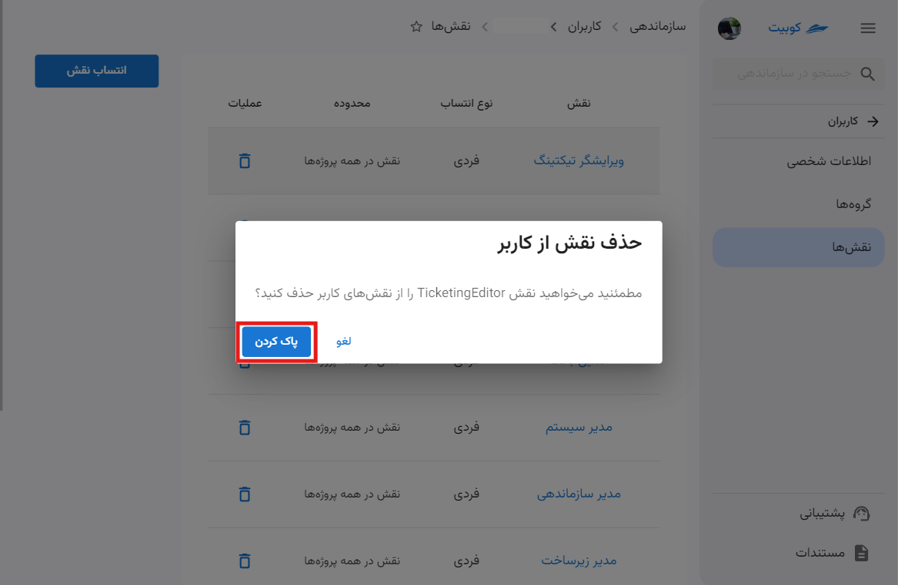

# مدیریت دسترسی اعضا

مدیر سازمان می‌تواند برای کاربران سازمان خود سطح دسترسی تعریف کند. در کوبیت می‌توان برای هر نقش مجوزهای خاصی صادر کرد و سپس می‌توان این نقش‌ها را به کاربران اختصاص داد.

از بخش **سازماندهی** وارد قسمت **کاربران** شوید:

در این قسمت می‌توانید لیست کاربران سازمان را مشاهده کنید:

با کلیک روی نام هر کاربر، به صفحه اطلاعات کاربری آن کاربر هدایت می‌شوید:

از طریق صفحه اطلاعات کاربر به لیست گروه‌ها و نقش‌های کاربر نیز می‌توانید دسترسی پیدا کنید.

#### گروه‌های کاربر

با کلیک بر روی گزینه **گروه‌ها** به لیست گروه‌های کاربر هدایت می‌شوید:

### افزودن کاربر به گروه

- برای افزودن کاربر به گروه‌های دیگر، روی دکمه **افزودن به گروه** کلیک کنید.
- از لیست گروه‌های سازمان، گروه موردنظر را انتخاب کنید.
- سپس با کلیک روی **افزودن**، کاربر را به گروه انتخاب شده، اضافه می‌کنید.
  
  
  
  

### ترک/حذف کاربر از گروه

#### نقش‌های کاربر

### انتساب نقش به کاربر

- برای افزودن نقش به نقش‌های کاربر، روی دکمه **انتساب نقش** کلیک کنید.
- از لیست نقش‌های موجود، نقش موردنظر را انتخاب کنید و سطح دسترسی در پروژه را تعیین کنید.
- سپس با کلیک روی **افزودن**، نقش انتخاب شده، به کاربر اضافه می‌شود.
  
  
  
  

### حذف نقش از کاربر

