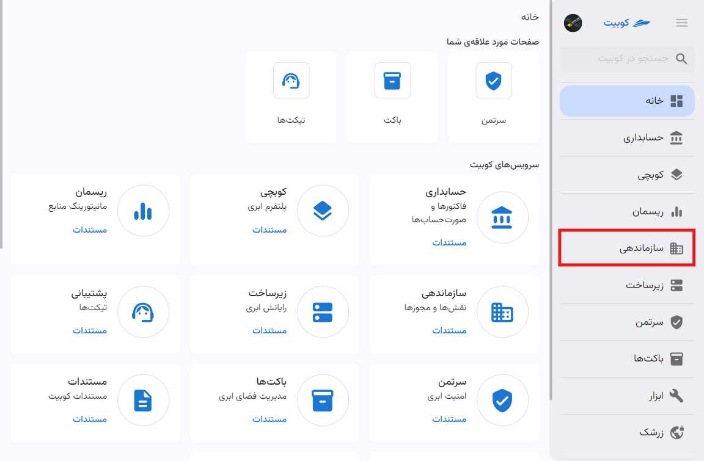

---
subDocuments:
  - organization
  - projects
  - iam
  - user-management
  - roles
  - groups
  - permissions
---

# سازماندهی

بخش **سازماندهی**، دسترسی به تمامی اطلاعات و تنظیمات مرتبط با سازمان، از جمله مدیریت سرویس‌ها، پروژه‌ها، کاربران و دسترسی اعضا را فراهم می‌کند.

## مفاهیم پایه

### پروژه {#project}

پروژه‌ها واحدهای کوچکتری هستند که در ذیل سازمان تعریف می‌شوند و شامل مجموعه‌ای از منابع می‌باشند. به عبارت دیگر، منابع موجود در سیستم مانند VM، bucket، و pack باید در یک پروژه ایجاد شوند. هر پروژه می‌تواند شامل دسترسی برای کاربران خاصی باشد که این کاربران فقط به منابع ذیل آن پروژه دسترسی داشته باشند. در سند [پروژه](./projects) به تشریح پروژه‌ها و دستورالعمل‌های این بخش پرداخته شده است.

### انواع کاربران {#users-type}

در کوبیت دو نوع کاربر وجود دارد: کاربران LDAP و KUBIT.

#### کاربران LDAP

در صورتی که سازمانی به LDAP متصل باشد، می‌توان مدیریت کاربران LDAP را در سیستم انجام داد. اگر امکان ورود یکپارچه (SSO) برای سازمان فعال باشد، کاربرانی که از طریق ورود یکپارچه به سیستم وارد می‌شوند از نوع LDAP هستند.

##### سیستم LDAP{#ldap}

LDAP (Lightweight Directory Access Protocol) یک پروتکل برای دسترسی و مدیریت اطلاعات دایرکتوری در شبکه‌ها است. زمانی که سازمانی به LDAP متصل می‌شود، کاربران می‌توانند از طریق یک پایگاه داده مرکزی به اطلاعات مهم مانند اطلاعات حساب‌های کاربری، گروه‌ها و سطوح دسترسی، دسترسی داشته باشند. این اتصال به LDAP مدیریت ساده‌تر، امنیت بیشتر و امکان احراز هویت یکپارچه را فراهم می‌کند.
:::info[ورود یکپارچه (SSO)]
احراز هویت Single Sign-On (SSO) یا ورود یکپارچه یک طرح احراز هویت است که به کاربر اجازه می‌دهد با یک شناسه واحد به هر یک از چندین سیستم نرم‌افزاری مرتبط اما مستقل وارد شود. ورود یکپارچه به کاربر اجازه می‌دهد یک‌بار وارد شود و بدون وارد کردن مجدد فاکتورهای احراز هویت، به سامانه‌های سازمان دسترسی داشته باشد.
:::

#### کاربران KUBIT

کاربرانی که به صورت عادی در کوبیت ثبت‌نام می‌کنند، از نوع کاربر KUBIT هستند.

در سند [مدیریت دسترسی اعضا](./iam) به تشریح مدیریت دسترسی‌های کاربران و سازمان پرداخته شده است.

## مجوزها

برای ایجاد دسترسی به هر سرویس در کوبیت، مجوزهایی برای کاربران تعریف می‌شود. این مجوزها از طریق نقش‌ها به کاربران اختصاص داده می‌شوند.
در سند [مجوزها](./permissions) به توضیح بیشتر لیست مجوزات پرداخته شده است.

## نقش‌ها

هر نقش مجموعه‌ای از مجوزها است. برای اعطای دسترسی به کاربران باید نقش‌های مشخص به همراه مجوزهای مشخص تعریف کرد و به کاربران مورد نظر تخصیص داد. نقش‌ها می‌توانند به صورت درختی از یکدیگر ارث‌بری داشته باشند. در سند [نقش‌ها](./roles) به توضیح بیشتر و تنظیمات نقش‌ها پرداخته شده است.

:::info[انواع نقش‌ها]
در کوبیت دو نوع نقش وجود دارد: نقش **پیشفرض** و نقش **پایه**.

#### نقش پیش‌فرض

نقش‌هایی که به صورت پیش‌فرض در کوبیت تعریف شده‌اند و از ابتدا در همه سازمان‌ها قابل استفاده هستند.

#### نقش پایه

نقش‌های پایه، نقش‌های ارث برده شده هستند. به عنوان مثال، اگر نقش A از نقش‌های B و C ارث برده باشد، نقش‌های B و C نقش‌های پایه برای A هستند.

:::

:::tip[قوانین دسترسی]
قوانین دسترسی، مجموعه‌ای از افراد و نقش‌ها هستند. این قوانین روی گروه‌های منابع تعریف می‌شوند و ترکیب آن‌ها تعیین می‌کند چه شخصی چه نقشی روی چه منابعی داشته باشد.
:::

## گروه‌ها

گروه‌ها برای دسته‌بندی کاربران تعریف شده‌اند. در حال حاضر در کوبیت فقط می‌توان به یک گروه نقش‌های مشخصی تخصیص داد. در صورت اتصال سازمان به LDAP، امکانات دیگری از جمله سینک با گروه‌های LDAP، فراهم خواهد شد. در سند [گروه‌ها](./groups) به توضیح بیشتر و تنظیمات گروه‌ها پرداخته شده است.
