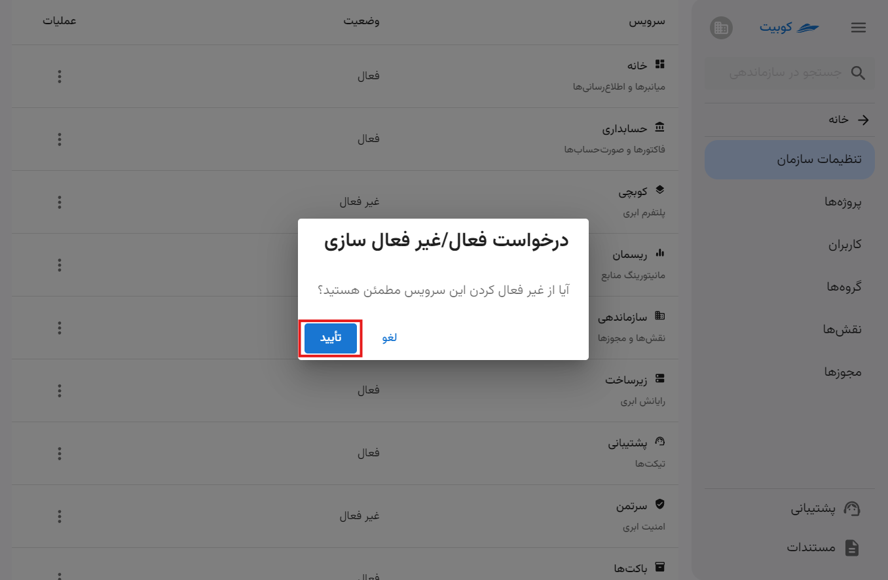
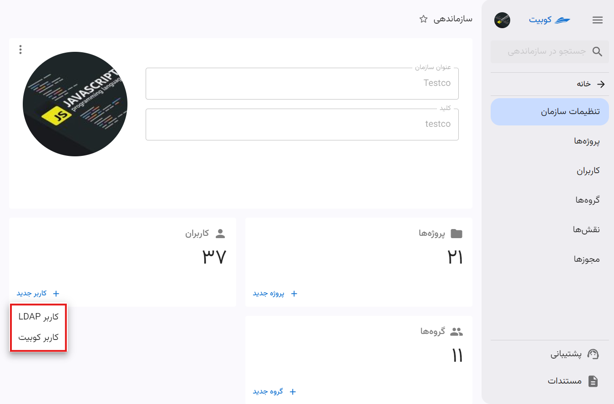
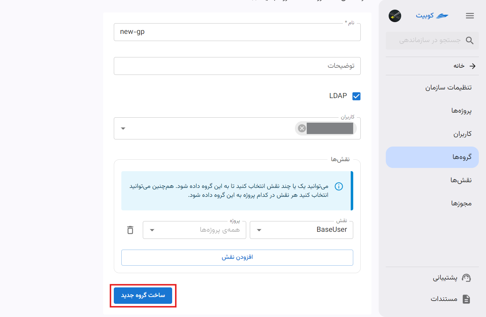

# تنظیمات سازمان

تنظیمات اصلی سازمان شامل مدیریت پروژه‌ها، کاربران، گروه‌ها، نقش‌ها، مجوزها و سرویس‌ها می‌باشد.

## سرویس‌ها

سرویس‌ها خدمات، امکانات و منابعی هستند که کوبیت در اختیار کاربران و سازمان‌ها می‌گذارد.
:::caution[توجه]
برای استفاده از هر سرویس، ابتدا باید سرویس موردنظر برای سازمان شما فعال شده باشد. در بخش [نحوه فعال‌سازی و غیرفعال‌سازی](#activate-deactivate) به آموزش بیشتر پرداخته شده است.
:::

### لیست سرویس‌ها

لیست سرویس‌های ارائه شده به صورت زیر می باشد:

|                                             |                                                          توضیحات سرویس |
| ------------------------------------------- | ---------------------------------------------------------------------: |
| [کوبچی](../../kubchi) (پلتفرم ابری)         |                       مدیریت کوبیت با استفاده از کوبرنیتیز توسعه یافته |
| [زیرساخت](../../iaas) (رایانش ابری)         |        سرویس ارائه‌ دهنده منابع ابری نظیر پردازنده، حافظه، دیسک و شبکه |
| [باکت‌ها](../../buckets) (مدیریت فضای ابری) |                                      سرویس ذخیره‌سازی و مدیریت داده‌ها |
| [ریسمان](../../resmon) (مدیریت منابع)       |            نظارت بر میزان استفاده از منابع (CPU/RAM/Disk) در کل کلاستر |
| [سرتمن](../../certman) (امنیت ابری)         | سامانه‌ متمرکز به منظور تجمیع مدیریت امکانات حفاظتی و امنیتی مورد نیاز |
| [زرشک](../../zereshk) (پراکسی)              |                                               ضد تحریم و پراکسی هوشمند |
| [رسان](../../resan) (مرکز پیام)             |                 سرویس پیام‌رسانی مرکزی و ارائه APIهای مختلف ارسال پیام |

:::info[سرویس‌های پیش‌فرض]
برخی سرویس‌ها پس از ایجاد حساب کاربری و ساخت سازمان، به صورت پیش‌فرض برای سازمان فعال می‌شوند. این سرویس‌ها شامل **زیرساخت** و **باکت‌ها** می‌باشند.
:::

در انتهای صفحه **تنظیمات سازمان**، لیست تمام سرویس‌های کوبیت وجود دارد و وضعیت هر سرویس در سازمان فعلی قابل مشاهده می‌باشد:

در ادامه به توضیحات سرویس‌ها و نحوه فعال‌سازی/غیرفعال‌سازی آن‌ها می‌پردازیم.

## نحوه فعال‌سازی و غیرفعال‌سازی سرویس‌ها{#activate-deactivate}

فعال/غیرفعال سازی یک سرویس توسط سرویس پشتیبانی کوبیت انجام می شود، به این صورت که یک تیکت شامل درخواست شما ایجاد شده و برای پشتیبانی ارسال می شود. پس از تایید توسط پشتیبانی، سرویس برای شما فعال خواهد شد. در ادامه به شرح این مراحل می‌پردازیم.

- ابتدا باید روی دکمه سه نقطه مرتبط با هر سرویس کلیک کنید.
- سپس متناسب با وضعیت فعلی سرویس، گزینه **درخواست فعال‌سازی** یا **درخواست غیرفعال‌سازی** را انتخاب کنید.
- متناظر با درخواست شما، تیکتی ساخته شده و برای تیم پشتیبانی کوبیت ارسال می‌شود.

### فعال‌سازی

### غیرفعال‌سازی

با مراجعه به صفحه سرویس پشتیبانی، می‌توانید تیکت ساخته شده متناسب با درخواست خود را مشاهده کنید:

## پروژه‌ها

از بخش **پروژه‌ها** دسترسی سریع به **لیست پروژه‌‌ها** و **ایجاد پروژه جدید** فراهم شده است.

با کلیک روی **پروژه‌ها** به لیست پروژه‌ها هدایت می‌شوید:

با کلیک روی **پروژه جدید** در کارت **پروژه‌ها**، می‌توانید یک پروژه جدید ایجاد کنید:

**عنوان** و **کلید** پروژه را وارد کرده و روی **ایجاد** کلیک کنید:

برای توضیح بیشتر ساخت پروژه، می‌توانید به سند [ساخت پروژه](../project#create-project) مراجعه کنید.

## کاربران

از بخش **کاربران** دسترسی سریع به **لیست کاربران** و **افزودن کاربران جدید** فراهم شده است.

با کلیک روی **کاربران** به لیست کاربران هدایت می‌شوید:

با کلیک روی **کاربر جدید** در کارت **کاربران**، می‌توانید کاربر جدید به سازمان اضافه کنید:

سپس گزینه‌های مختلف افزودن کاربر را مشاهده می کنید:

در ادامه به توضیح مراحل هر کدام از این شیوه‌ها پرداخته شده است.

:::info[افزودن کاربر]
برای توضیح بیشتر مراحل افزودن کاربر، می‌توانید به سند [مدیریت کاربران](../user-management) مراجعه کنید.
:::

#### افزودن کاربر کوبیت

در صورت افزودن کاربری کوبیتی، روی گزینه **کاربر کوبیت** کلیک کنید تا به فرم ارسال دعوت‌نامه هدایت شوید.

سپس اطلاعات خواسته شده را برای دعوت کاربر وارد کنید و روی **ارسال دعوت‌نامه** کلیک کنید:

#### افزودن کاربر LDAP

در صورت افزودن کاربر LDAP، روی گزینه **کاربر LDAP** کلیک کنید تا به فرم ساخت کاربر هدایت شوید.

سپس اطلاعات خواسته شده کاربر را وارد کنید و روی **افزودن کاربر LDAP** کلیک کنید:

## گروه‌ها

از بخش **گروه‌ها** دسترسی سریع به **لیست گروه‌ها** و **ایجاد گروه جدید** فراهم شده است.

با کلیک روی **گروه‌ها** به لیست گروه‌ها هدایت می‌شوید:

با کلیک روی **گروه جدید** در کارت **کاربران**، می‌توایند یک گروه جدید ایجاد کنید:

سپس اطلاعات مورد نیاز برای ساخت گروه را وارد کرده و روی **ساخت گروه جدید** کلیک کنید:

:::info[توجه]
اضافه کردن مقادیری مانند کاربران و نقش‌ها، اختیاری بوده و در آینده نیز می‌توانید این مقادیر را به گروه ساخته شده، اضافه کنید.
:::
با تایید اطلاعات وارد شده، گروه ساخته شده و از طریق لیست گروه‌ها قابل دسترسی است.

برای توضیح بیشتر ساخت گروه، می‌توانید به سند [ساخت گروه](../groups#create-group) مراجعه کنید.
