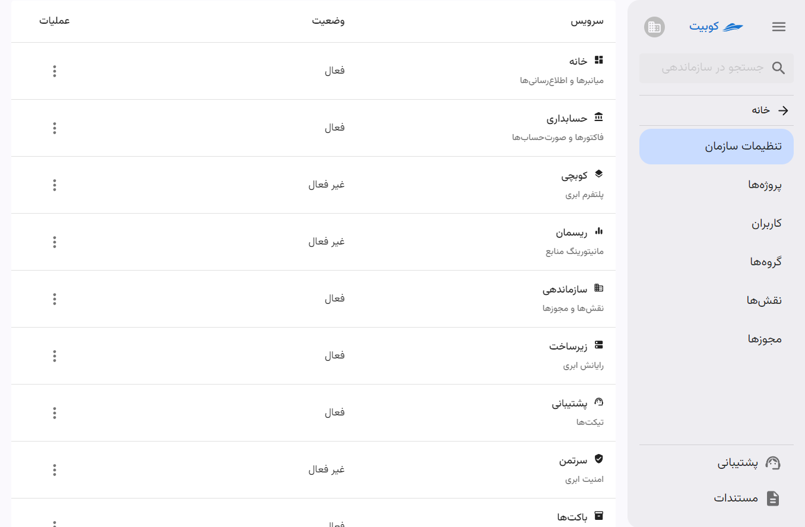

# تنظیمات سازمان

تنظیمات اصلی سازمان شامل مدیریت پروژه‌ها، کاربران، گروه‌ها، نقش‌ها، مجوزها و سرویس‌ها می‌باشد.

## سرویس‌ها

سرویس‌ها خدمات، امکانات و منابعی هستند که کوبیت در اختیار کاربران و سازمان‌ها می‌گذارد.
:::caution[توجه]
برای استفاده از هر سرویس، ابتدا باید سرویس موردنظر برای سازمان شما فعال شده باشد.
:::

### لیست سرویس‌ها

لیست سرویس‌های ارائه شده به صورت زیر می باشد:

|                                             |                                                          توضیحات سرویس |
| ------------------------------------------- | ---------------------------------------------------------------------: |
| [کوبچی](../../kubchi) (پلتفرم ابری)         |                       مدیریت کوبیت با استفاده از کوبرنیتیز توسعه یافته |
| [زیرساخت](../../iaas) (رایانش ابری)         |        سرویس ارائه‌ دهنده منابع ابری نظیر پردازنده، حافظه، دیسک و شبکه |
| [باکت‌ها](../../buckets) (مدیریت فضای ابری) |                                      سرویس ذخیره‌سازی و مدیریت داده‌ها |
| [ریسمان](../../resmon) (مدیریت منابع)       |            نظارت بر میزان استفاده از منابع (CPU/RAM/Disk) در کل کلاستر |
| [سرتمن](../../certman) (امنیت ابری)         | سامانه‌ متمرکز به منظور تجمیع مدیریت امکانات حفاظتی و امنیتی مورد نیاز |
| [زرشک](../../zereshk) (پراکسی)              |                                               ضد تحریم و پراکسی هوشمند |
| [رسان](../../resan) (مرکز پیام)             |                 سرویس پیام‌رسانی مرکزی و ارائه APIهای مختلف ارسال پیام |

:::info[سرویس‌های پیش‌فرض]
برخی سرویس‌ها پس از ایجاد حساب کاربری و ساخت سازمان، به صورت پیش‌فرض برای سازمان فعال می‌شود. این سرویس‌ها شامل **زیرساخت** و **باکت‌ها** می‌باشند.
:::

در انتهای صفحه **تنظیمات سازمان**، لیست تمام سرویس‌های کوبیت وجود دارد و وضعیت هر سرویس در سازمان فعلی قابل مشاهده می‌باشد:

در ادامه به توضیحات سرویس‌ها و نحوه فعال‌سازی/غیرفعال‌سازی آن‌ها می‌پردازیم.

## نحوه فعال‌سازی و غیرفعال‌سازی سرویس‌ها

فعال/غیرفعال سازی یک سرویس توسط سرویس پشتیبانی کوبیت انجام می شود، به این صورت که یک تیکت شامل درخواست شما ایجاد شده و برای تیم پشتیبانی ارسال می شود. در ادامه به شرح مراحل می پردازیم.

- ابتدا باید روی دکمه سه نقطه مرتبط با هر سرویس کلیک کنید.
- سپس متناسب با وضعیت فعلی سرویس، گزینه **درخواست فعال‌سازی** یا **درخواست غیرفعال‌سازی** را انتخاب کنید.
- متناظر با درخواست شما، تیکتی ساخته شده و به تیم پشتیبانی کوبیت ارسال می‌شود.

### فعال‌سازی

### غیرفعال‌سازی

با مراجعه به صفحه سرویس پشتیبانی، می‌توانید تیکت ساخته شده متناسب با درخواست خود را مشاهده کنید:

## پروژه‌ها

از بخش **پروژه‌ها** دسترسی سریع به لیست پروژه های سازمان و ایجاد پروژه جدید فراهم شده است.

با کلیک بر **پروژه‌ها** به لیست پروژه‌ها هدایت می‌شوید:

با کلیک روی **پروژه جدید** می‌توانید یک پروژه جدید ایجاد کنید:

سپس عنوان و کلید پروژه را وارد کنید:

با تایید اطلاعات وارد شده، پروژه ساخته شده و از طریق لیست پروژه‌ها قابل دسترسی است.

## کاربران

از بخش **کاربران** دسترسی سریع به لیست کاربران سازمان و افزودن کاربران جدید فراهم شده است.

با کلیک روی **کاربران** به لیست کاربران هدایت می‌شوید:

برای افزودن کاربر، از بخش **کاربران** روی دکمه **کاربر جدید** کلیک کنید:

سپس گزینه های مختلف افزودن کاربر را مشاهده می کنید:

در ادامه به توضیح مراحل هر کدام از این شیوه های پرداخته شده است.

#### افزودن کاربر LDAP

سپس اطلاعات خواسته شده کاربر را وارد کنید:

پس از تایید اطلاعات و کلیک روی **افزودن کاربر LDAP** کاربر به سازمان افزوده خواهد شد.

#### افزودن کاربر کوبیت

سپس اطلاعات خواسته شده را برای دعوت کاربر وارد کنید:

## گروه‌ها

از بخش **گروه‌ها** دسترسی سریع به لیست گروه‌های سازمان و ایجاد گروه جدید فراهم شده است.

با کلیک روی **گروه‌ها** به لیست گروه‌ها هدایت می‌شوید:

با کلیک روی **گروه جدید** میتوایند یک گروه جدید ایجاد کنید:

سپس اطلاعات مورد نیاز را وارد کنید:

:::info[توجه]
اضافه کردن مقادیری مانند کاربران و نقش ها، اختیاری بوده و در آینده نیز می‌توانید این مقادیر را به گروه ساخته شده، اضافه کنید.
:::
با تایید اطلاعات وارد شده، گروه ساخته شده و از طریق لیست گروه‌ها قابل دسترسی است.
