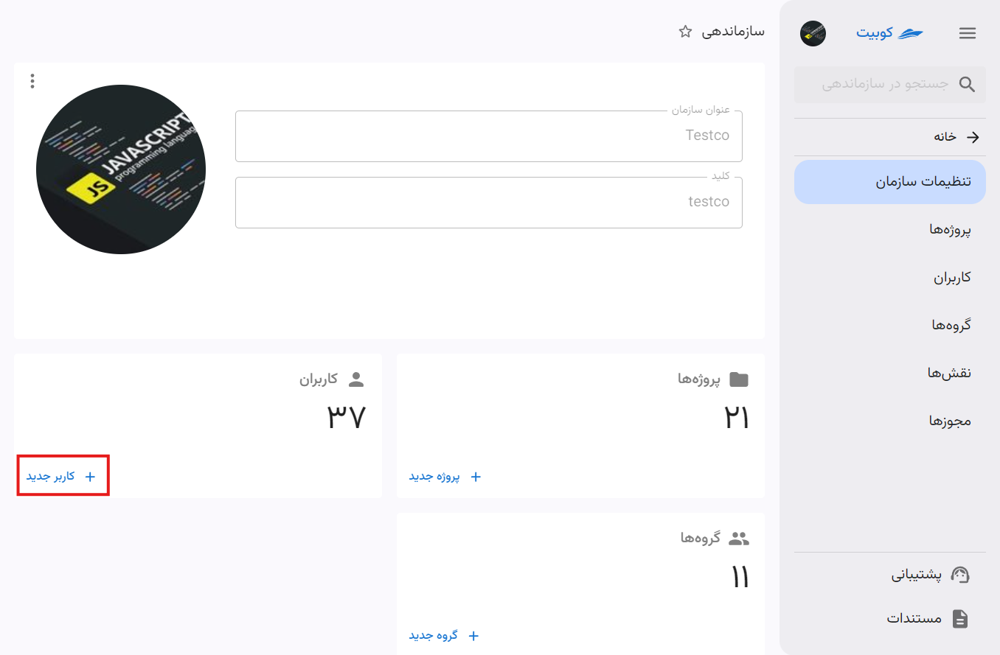
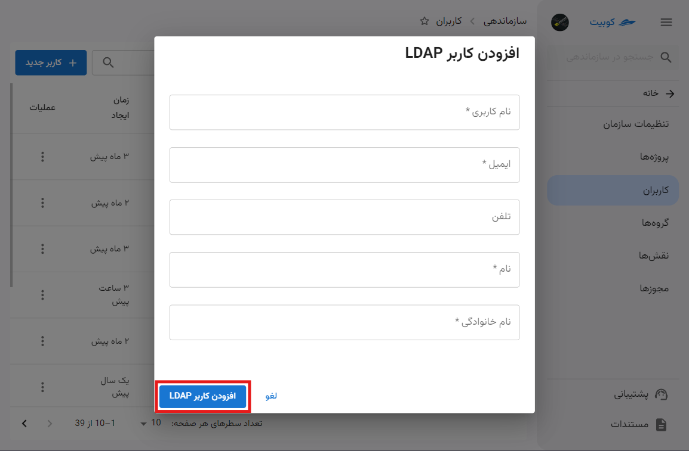
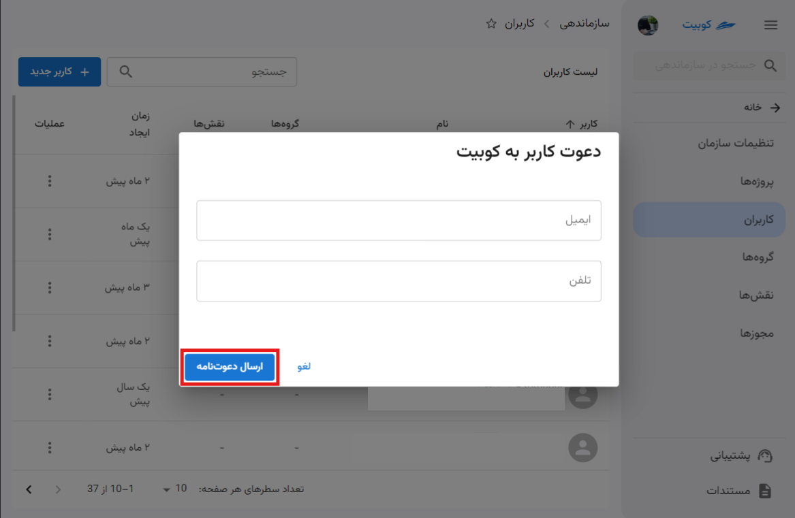

# تنظیمات سازمان

تنظیمات اصلی سازمان شامل مدیریت پروژه‌ها، کاربران، گروه‌های دسترسی و سرویس‌ها می‌باشد.

## سرویس‌ها و نحوه استفاده

سرویس‌ها شامل خدمات، امکانات و منابعی هستند که کوبیت در اختیار کاربران خود می‌گذارد. برای استفاده از هر سرویس، ابتدا باید سرویس موردنظر برای سازمان شما فعال شده باشد. در ادامه به توضیحات سرویس‌ها و نحوه فعال‌سازی/غیرفعال‌سازی آن‌ها می‌پردازیم.

### لیست سرویس‌ها

در انتهای صفحه **تنظیمات سازمان**، لیست تمام سرویس‌های کوبیت وجود دارد و وضعیت هر سرویس در سازمان فعلی قابل مشاهده می‌باشد:

## نحوه فعال‌سازی و غیرفعال‌سازی سرویس‌ها

برای فعال یا غیرفعال‌سازی هر سرویس، ابتدا باید روی دکمه سه نقطه مرتبط با هر سرویس کلیک کنید:

سپس متناسب با وضعیت فعلی سرویس، می‌توانید گزینه **درخواست فعال‌سازی** یا **درخواست غیرفعال‌سازی** را انتخاب کنید.

### فعال‌سازی

### غیرفعال‌سازی

## پروژه‌ها

از بخش **پروژه‌ها** دسترسی سریع به لیست پروژه های سازمان و ایجاد پروژه جدید فراهم شده است.

با کلیک بر **پروژه‌ها** به لیست پروژه‌ها هدایت می‌شوید:

با کلیک بر روی **پروژه جدید** می‌توانید یک پروژه جدید ایجاد کنید:

سپس عنوان و کلید پروژه را وارد کنید:

با تایید اطلاعات وارد شده، پروژه ساخته شده و از طریق لیست پروژه‌ها قابل دسترسی است.

## کاربران

از بخش **کاربران** دسترسی سریع به لیست کاربران سازمان و افزودن کاربران جدید فراهم شده است.

با کلیک روی **کاربران** به لیست کاربران هدایت می‌شوید:

برای افزودن کاربر، از بخش **کاربران** روی دکمه **کاربر جدید** کلیک کنید:

سپس گزینه های مختلف افزودن کاربر را مشاهده می کنید:

در ادامه به توضیح مراحل هر کدام از این شیوه های پرداخته ایم.

#### افزودن کاربر LDAP

سپس اطلاعات خواسته شده کاربر را وارد کنید:

پس از تایید اطلاعات و کلیک روی **افزودن کاربر LDAP** کاربر به سازمان افزوده خواهد شد.

#### افزودن کاربر کوبیت

سپس اطلاعات خواسته شده را برای دعوت کاربر وارد کنید:

## گروه‌ها

از بخش **گروه‌ها** دسترسی سریع به لیست گروه‌های سازمان و ایجاد گروه جدید فراهم شده است.

با کلیک بر **گروه‌ها** به لیست گروه‌ها هدایت می‌شوید:

با کلیک بر روی **گروه جدید** میتوایند یک گروه جدید ایجاد کنید:

سپس عنوان و توضیحات گروه را وارد کنید:

با تایید اطلاعات وارد شده، پروژه ساخته شده و از طریق لیست پروژه‌ها قابل دسترسی است.
