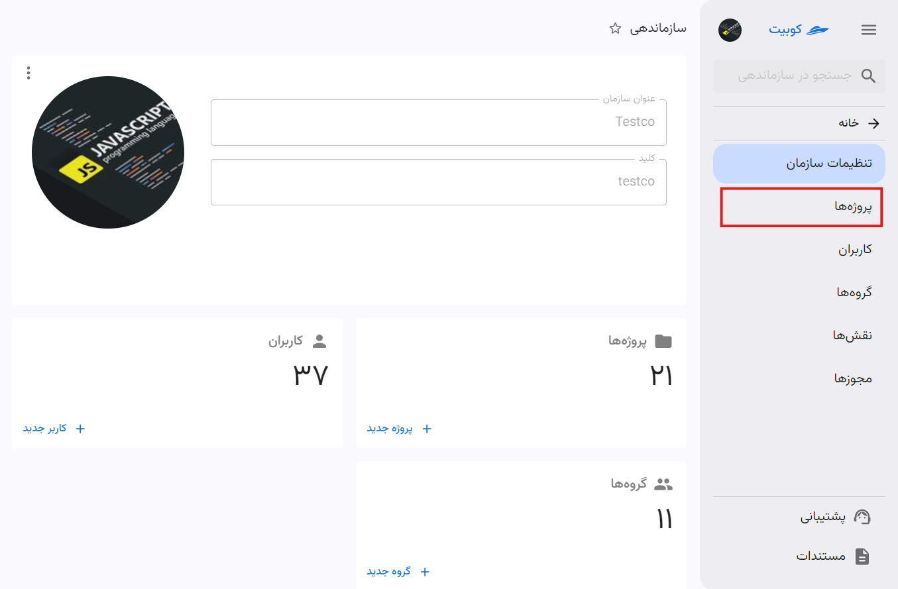
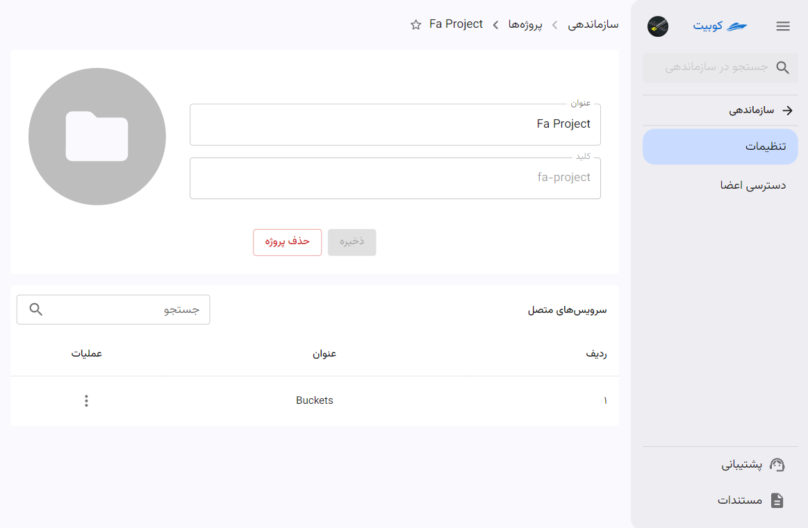
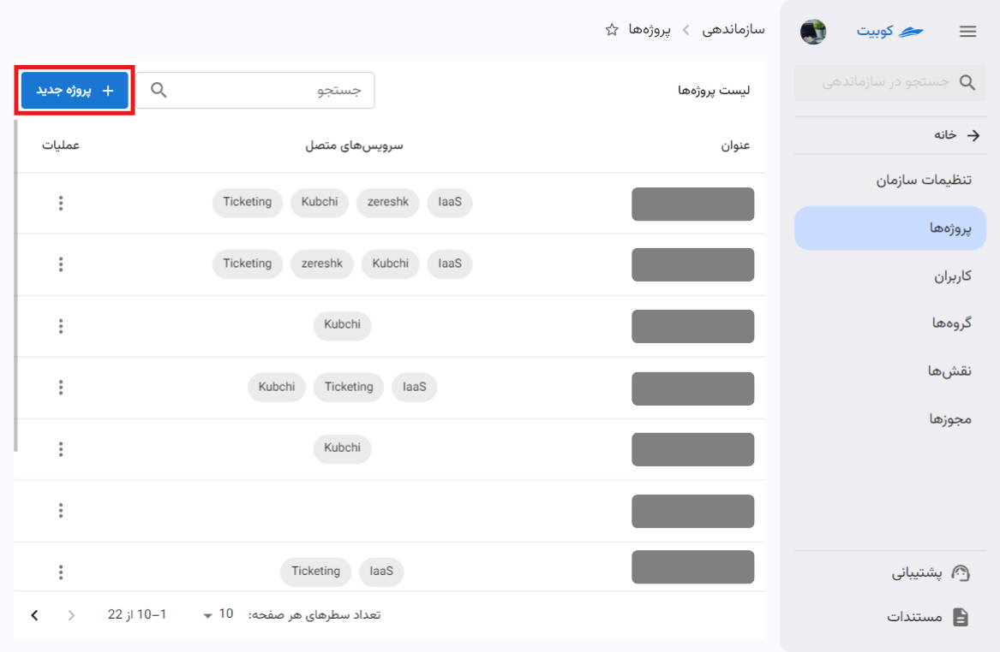
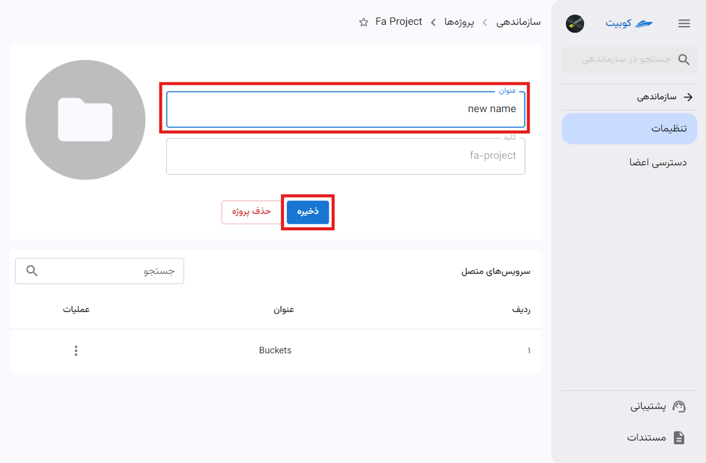
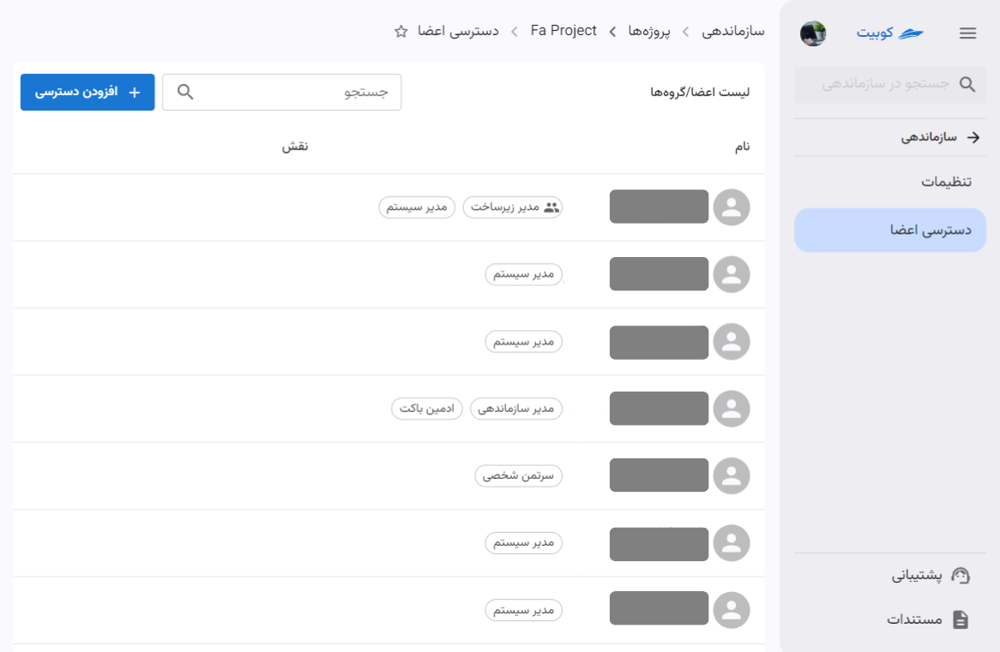
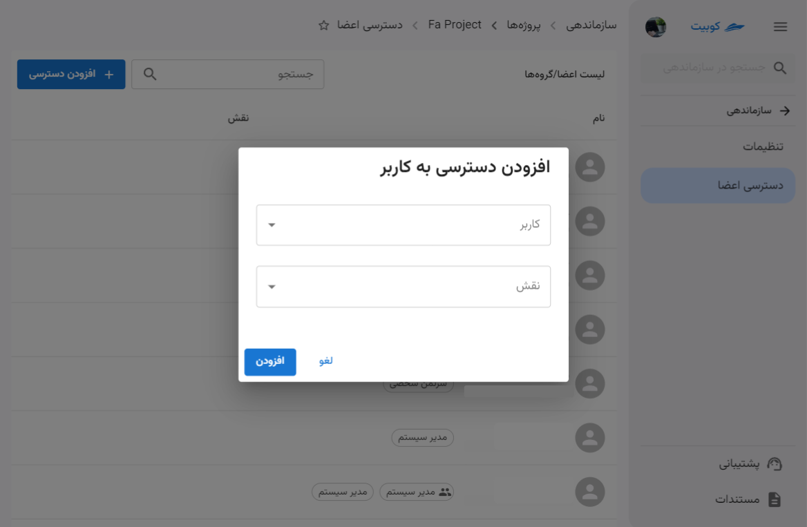
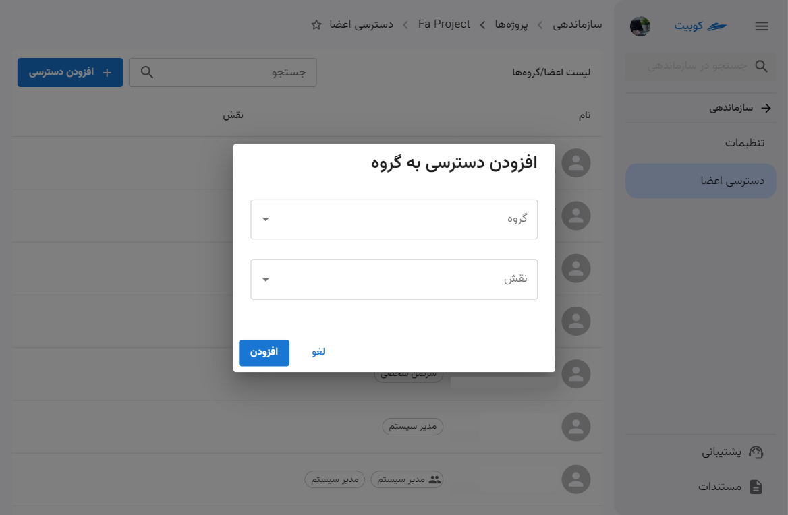

# پروژه‌ها

از بخش **سازماندهی** وارد قسمت **پروژه‌ها** شوید:

در این قسمت می‌توانید لیست پروژه‌های سازمان به همراه سرویس‌های متصل به آنها را مشاهده کنید:

با کلیک روی نام هر پروژه، به صفحه تنظیمات پروژه موردنظر هدایت می‌شوید:

## ساخت پروژه

با کلیک روی دکمه‌ **پروژه جدید** می‌توانید یک پروژه جدید تعریف کنید:

سپس عنوان و کلید پروژه را وارد کنید:

با تایید اطلاعات وارد شده، پروژه ساخته شده و از طریق لیست پروژه‌ها قابل دسترسی است.

## ویرایش پروژه

ابتدا روی عنوان پروژه کلیک کنید و وارد صفحه پروژه موردنظر شوید:

سپس می‌توانید عنوان پروژه را ویرایش کنید:

## اتصال سرویس به پروژه

همانطور که در تعریف مفهوم [پروژه](../#project) توضیح داده شد، منابع و سرویس‌ها ذیل پروژه معنا پیدا می‌کنند. برای استفاده از هر سرویس از سرویس‌های کوبیت، ابتدا باید سرویس موردنظر را به یک پروژه در سازمان متصل کنید. بدین معنی که استفاده از آن سرویس تنها تحت عنوان پروژه به‌خصوص امکان‌پذیر باشد.

## قطع اتصال سرویس از پروژه

برای قطع اتصال سرویس از پروژه، روی دکمه سه نقطه سرویس موردنظر کلیک کرده و از دکمه **قطع اتصال** استفاده کنید:

## مدیریت دسترسی اعضا

در بخش **دسترسی اعضا** لیستی از اعضا به همراه نقش در پروژه قابل مشاهده است:

افزودن دسترسی به پروژه در دو سطح کاربر و گروه انجام می‌شود:

### افزودن دسترسی به کاربر

با انتخاب کاربر از میان کاربران سازمان و نقش موردنظر از لیست نقش‌ها، دسترسی به پروژه را به کاربر اضافه کنید:

### افزودن دسترسی به گروه

با انتخاب گروه از میان گروه‌های سازمان و نقش موردنظر از لیست نقش‌ها، دسترسی به پروژه را به گروه اضافه کنید:

