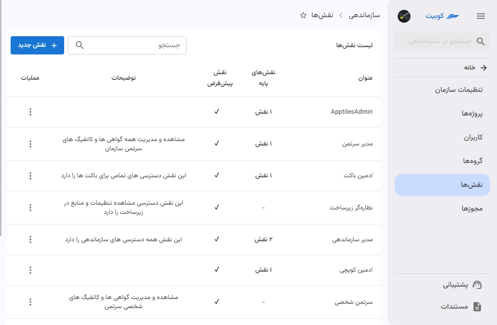
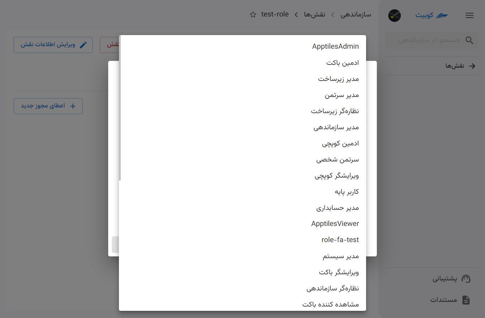
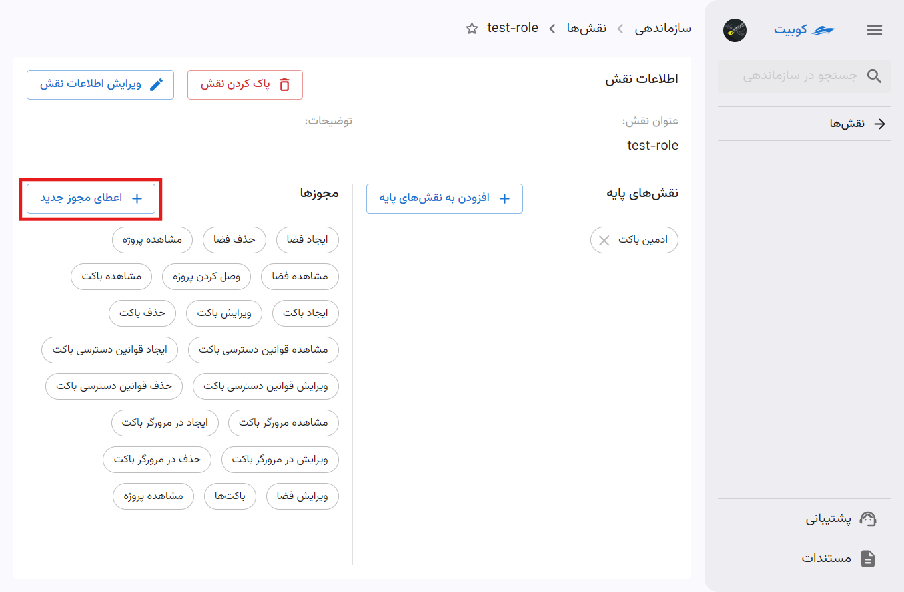
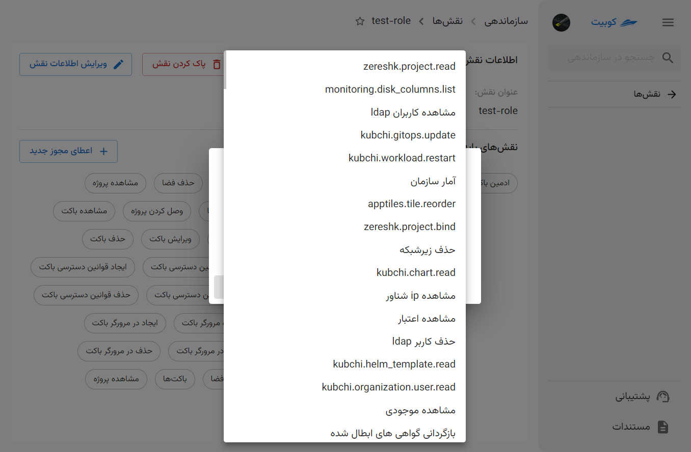
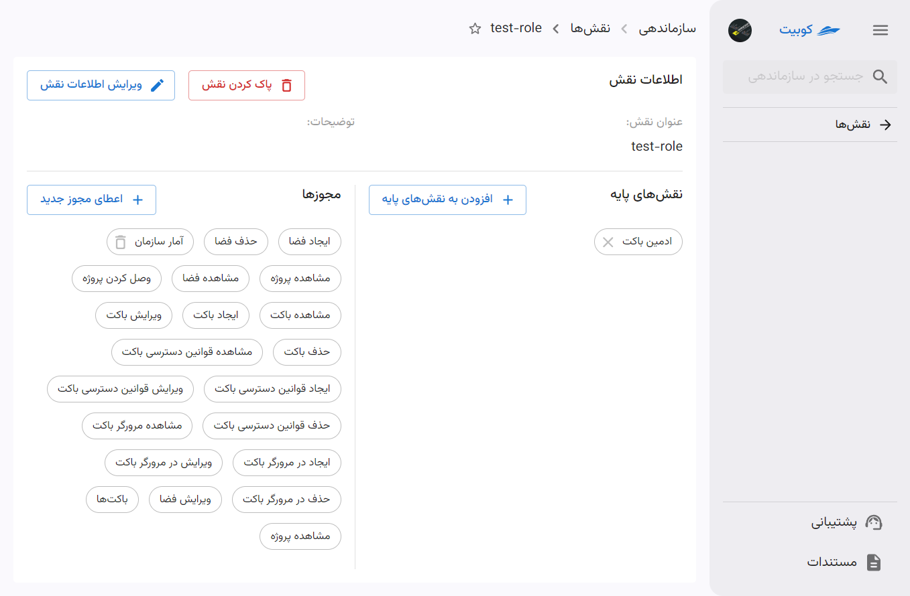
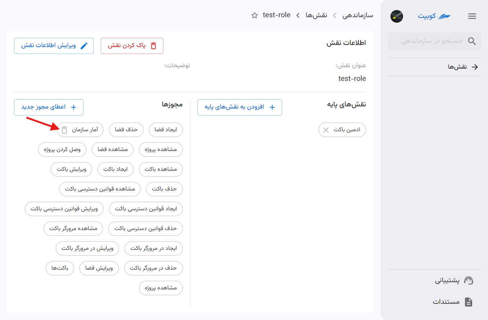
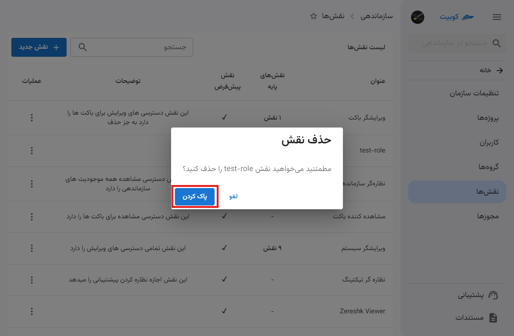
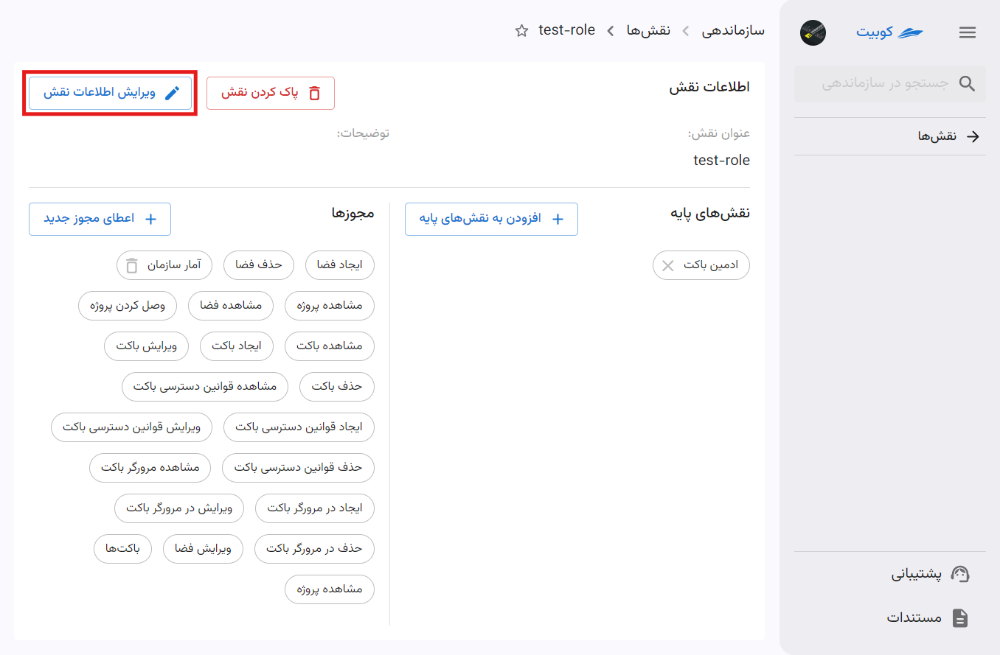

# نقش‌ها {#roles}

از بخش **سازماندهی** وارد قسمت **نقش‌ها** شوید:

در این قسمت می‌توانید لیست نقش‌های موجود را مشاهده کنید:

با کلیک روی نام هر نقش، به صفحه جزئیات نقش هدایت می‌شوید:

## ساخت نقش

برای ساخت نقش جدید، روی دکمه‌ **نقش جدید** کلیک کنید:

سپس نام نقش و توضیحات مربوطه را وارد کرده و روی **ایجاد** کلیک کنید:

بعد از این مرحله به صفحه جزئیات نقش هدایت می‌شوید:

اما این نقش تنها یک نقش خالی است و باید مجوزهای مورد نظر را به آن اضافه کنید. در ادامه به افزودن نقش پایه و اعطای مجوز به نقش ایجاد شده می‌پردازیم.

### افزودن نقش پایه به نقش جاری

:::tip[نقش‌های پایه]
در این قسمت می‌توان نقش جدید را از نقش‌های موجود ارث‌بری کرد. با این کار، دسترسی‌ها و مجوزهایی که در نقش ارث‌برده شده وجود دارد، به این نقش نیز اختصاص داده خواهد شد.
:::

برای این کار باید در تب **نقش‌های پایه**، روی دکمه **افزودن به نقش‌های پایه** کلیک کنید:

سپس از لیست نقش‌های پایه، نقش موردنظر را انتخاب کنید:

پس از تایید و کلیک روی **افزودن نقش پایه**، این نقش به لیست نقش‌های سازمان اضافه خواهد شد.

همان‌طور که مشاهده می‌شود، با افزودن نقش پایه به نقش جاری، مجوزهای آن نقش پایه نیز به مجوزهای نقش جاری افزوده می‌شوند:

:::tip[انتساب مجوز به نقش]
علاوه بر مجوزهایی که از طریق نقش پایه به نقش جاری افزوده می‌شوند، می‌توانید به صورت جداگانه نیز مجوزهای مورد نظر خود را به نقش اضافه کنید.
:::

### انتساب مجوز به نقش

برای افزودن مجوز به نقش، روی دکمه **اعطای مجوز جدید** کلیک کنید:

سپس از لیست مجوزهای موجود، مجوز موردنظر را انتخاب کنید:

پس از تایید و کلیک روی اعطای مجوز جدید، مجوز انتخاب شده به مجوزهای نقش جاری اضافه خواهد شد:

:::tip[توجه]
هر نقش، تمام مجوزهای همه نقش‌های پایه‌ی خود را به ارث می‌برد.
به عبارت دیگر، با انتخاب یک نقش جدیدِ پایه برای نقش جدید، در واقع تمام مجوزهای آن نقش را به این نقش افزوده‌اید!
بنابراین هر نقش، به اندازه تمام نقش‌های پایه‌ی خود، به اضافه مجوزهایی که صراحتاً به آن داده‌اید، قدرت دارد.
:::

:::caution[محدودیت در حذف مجوز]
توجه داشته باشید که مجوزهایی که به واسطه افزودن نقش پایه به نقش جاری شما افزوده شده‌اند، قابل حذف نمی‌باشند و تنها می‌توانید مجوزهایی را که خودتان افزوده‌اید، از نقش حذف کنید. این کار با کلیک کردن روی آیکون **سطل زباله** کنار نام مجوز، امکان‌پذیر است:

:::

## حذف نقش

برای حذف نقش، دو مسیر فراهم شده است: از طریق لیست نقش‌ها و صفحه جزئیات نقش.

### شیوه اول: لیست نقش‌ها

روی دکمه سه نقطه نقش موردنظر کلیک کرده و گزینه **پاک کردن** را انتخاب کنید:

سپس روی **پاک کردن** کلیک کنید تا نقش حذف شود:

### شیوه دوم: صفحه جزئیات نقش

با کلیک روی نام نقش از لیست نقش‌ها، به صفحه جزئیات وارد شوید و روی دکمه **پاک کردن نقش** کلیک کنید:

سپس روی **بله، پاک کن** کلیک کنید تا نقش حذف شود:

## ویرایش اطلاعات نقش

برای ویرایش نام و توضیحات نقش، روی دکمه **ویرایش اطلاعات نقش** کلیک کنید و اطلاعات جدید را وارد کنید:

با کلیک روی دکمه **ویرایش** تغییرات شما اعمال می‌شوند:

:::tip[ویرایش لیست نقش‌های پایه و مجوزها]
برای حذف و اضافه نقش‌های پایه و مجوزهای نسبت داده شده به هر نقش نیز، از طریق صفحه جزئیات نقش می‌توانید اقدام کنید.
:::
