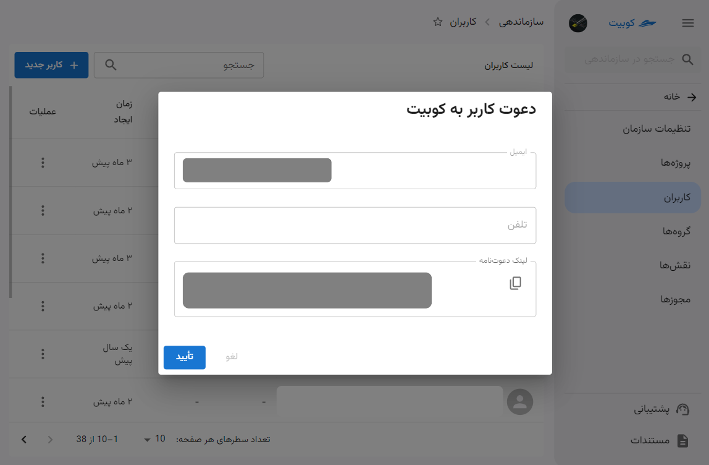
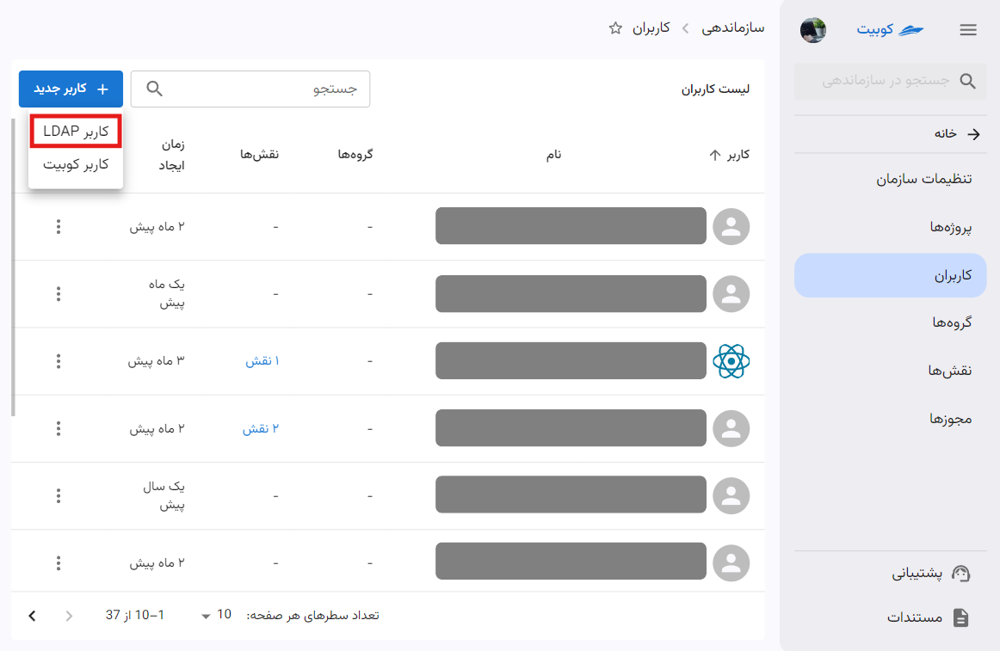

# مدیریت کاربران

## اضافه کردن کاربر سازمان

با توجه به [انواع کاربران در کوبیت](../#users-type)، می‌توانید کاربران جدید را از انواع LDAP و Kubit به سازمان اضافه کنید.
:::caution[اتصال سازمان به LDAP]
توجه داشته باشید تنها در صورتی که سازمان به سیستم LDAP متصل باشد، می توان کاربر از نوع LDAP به سازمان خود اضافه کنید. در بخش [سیستم LDAP](../#ldap) به توضیح این سیستم پرداخته شده است.
:::

برای افزودن کاربر، از بخش **کاربران** در **سازماندهی** روی دکمه **کاربر جدید** کلیک کنید:

سپس گزینه‌های مختلف افزودن کاربر را مشاهده می‌کنید:

در ادامه به توضیح مراحل هر کدام از این شیوه‌ها پرداخته شده است.

#### افزودن کاربر کوبیت

روی گزینه **کاربر کوبیت** کلیک کنید:

اطلاعات خواسته شده را برای دعوت کاربر وارد کرده و روی **ارسال دعوت‌نامه** کلیک کنید:

علاوه بر ارسال لینک دعوت‌نامه برای کاربر، لینک مربوطه نیز برای شما نمایش داده می‌شود:

نمونه لینک ارسال شده برای کاربر:

با کلیک روی لینک ارسال شده، کاربر به سازمان شما افزوده می‌شود.

#### افزودن کاربر LDAP

روی گزینه **LDAP** کلیک کنید:

سپس اطلاعات خواسته شده کاربر را وارد کنید:

پس از تایید اطلاعات و کلیک روی **افزودن کاربر LDAP** کاربر به سازمان افزوده خواهد شد.

##### ویرایش و حذف کاربر LDAP

برای ویرایش اطلاعات کاربر کافی است که در قسمت **کاربران** بخش **سازماندهی**، روی کاربر موردنظر را انتخاب و روی دکمه‌ی **ویرایش** کلیک کنید. ویرایش موردنظر را انجام دهید و سپس روی دکمه‌ی **تایید** کلیک کنید:

:::caution[توجه]
توجه داشته باشید که **نام کاربری** و **نوع وضعیت ورود** کاربر را نمی‌توانید تغییر دهید.
:::

