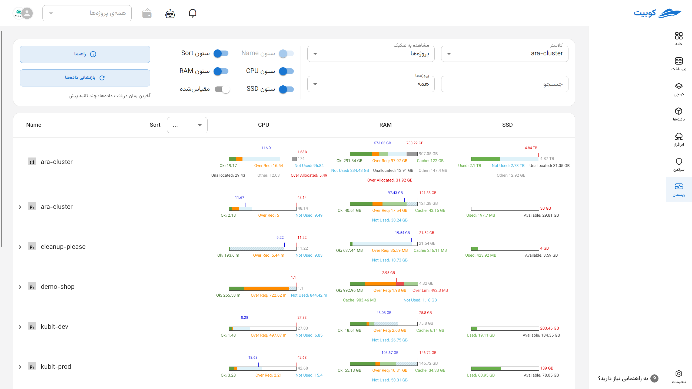
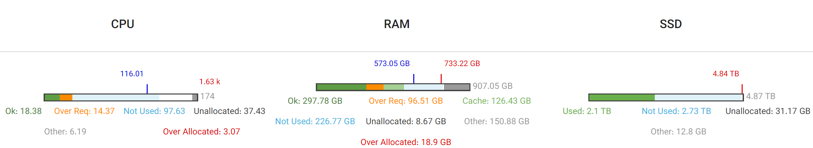
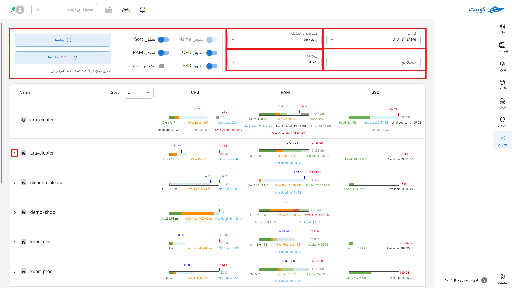
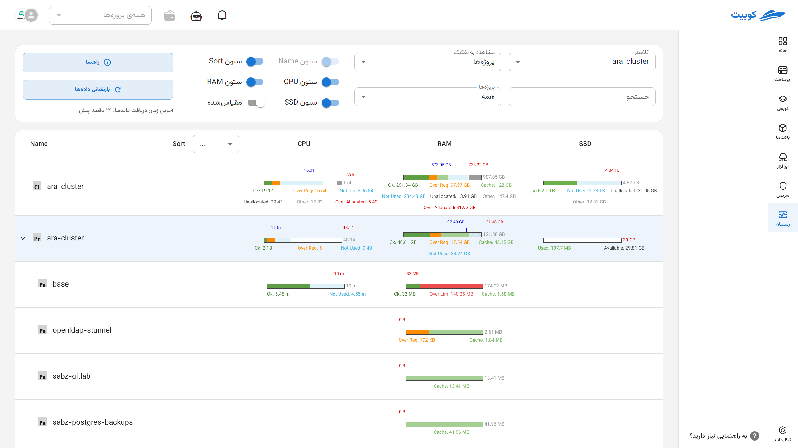
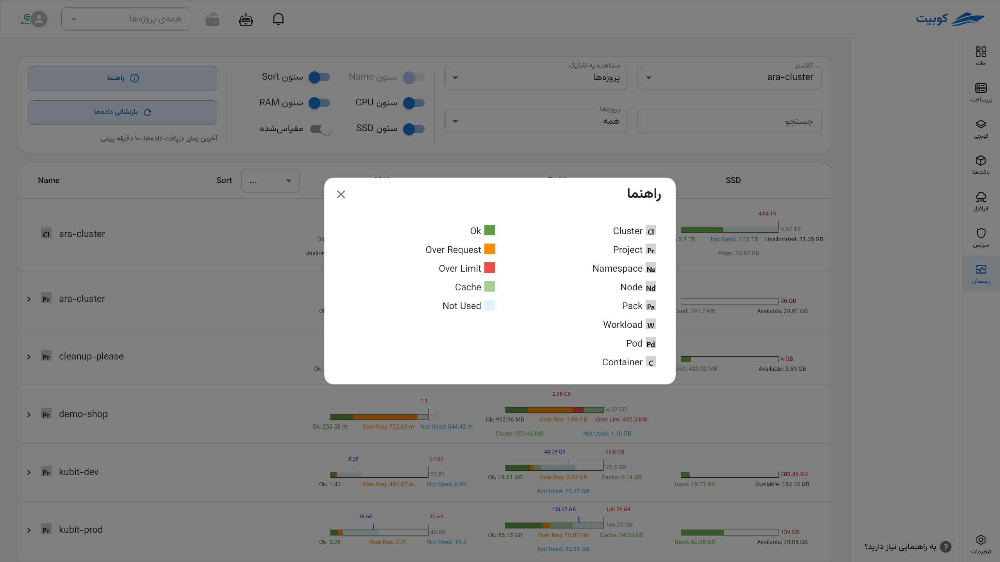
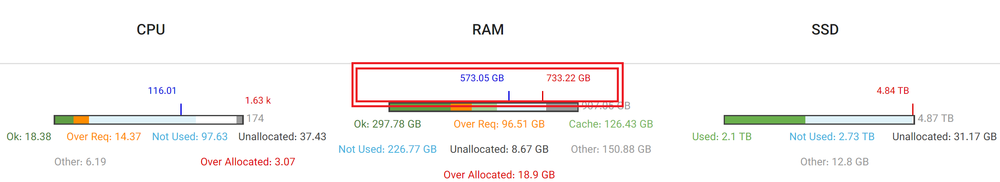
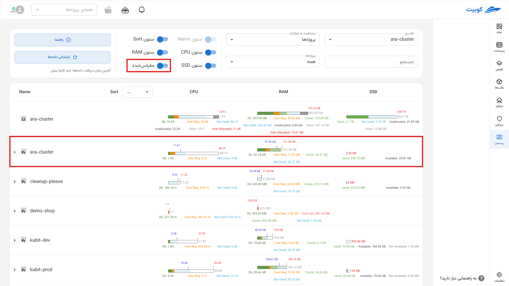

# ریسمان (رصد منابع)

در سیستم‌های مبتنی بر کلاستر، مانند Kubernetes و سایر محیط‌های ابری، مدیریت منابع سخت‌افزاری و نرم‌افزاری از اهمیت بالایی برخوردار است. در **زیرسامانه ریسمان (Resource Monitor)**، به منظور پایش دقیق، تخصیص بهینه و شناسایی وضعیت سلامت منابع، پارامترهای متنوعی تعریف و گزارش می‌شوند. این مستند به شرح دقیق پارامترهای مربوط به منابع مختلف (پردازنده، حافظه، دیسک) در زیربخش‌های کلاستر پرداخته و دسته‌بندی آن‌ها را با زبانی دقیق و ساختارمند ارائه می‌کند. هدف کمک به متخصصان DevOps و زیرساخت در درک سریع و کارآمد پارامترهای کلیدی است.

در این سند [نحوه محاسبه نمودارها و نمایش آن‌ها](#monitoring) به همراه [مفاهیم پایه](#concepts) توضیح شده‌اند.

---

## تعاریف پایه {#concepts}

- **کلاستر (Cluster):** مجموعه‌ای از نودها (سرورها) که منابع خود را به صورت مشترک مدیریت و به ورک‌لودها اختصاص می‌دهند.
- **نود (Node):** یک سرور فیزیکی یا مجازی که در کلاستر وجود دارد و ورک‌لود روی آن اجرا می‌شود.
- **فضانام (Namespace):** محدوده‌ای منطقی برای جداکردن منابع و ورک‌لودها در کلاستر.
- **ورک‌لود (Workload):** بار کاری اجرایی در قالب مجموعه‌ای از پادها (مانند اپلیکیشن‌ها یا سرویس‌ها).
- **پاد (Pod):** کوچک‌ترین واحد اجرایی شامل یک یا چند کانتینر در Kubernetes.
- **کانتینر (Container):** محیط ایزوله برای اجرای برنامه‌ها در داخل پاد.

:::info[تعاریف پایه]
برای درک بهتر به بخش [مفاهیم](../../kubchi/concepts) کوبچی سربزنید.
:::

---

## دسته‌بندی پارامترهای منابع

پارامترهای منابع به سه دسته اصلی تقسیم می‌شوند:

- **پردازنده (CPU)**
- **حافظه (Memory)**
- **دیسک (Disk)** از نوع SSD یا HDD

:::success[واحدهای حافظه در کوبرنتیز (Memory Resource Units)]

واحدهای حافظه بر اساس [استاندارد کوبرنتیز](https://kubernetes.io/docs/concepts/configuration/manage-resources-containers/) است.

در کوبرنتیز، مقدار حافظه برای کانتینرها برحسب **بایت (Bytes)** تعریف می‌شود و می‌توان آن را با عدد یا پسوند مشخص کرد.

### انواع پسوندها:

- **اعشاری (پایه ۱۰):**  
   `k`, `M`, `G`, `T`, `P`, `E`  
   مثال: `400M` یعنی ۴۰۰ مگابایت
- **باینری (پایه ۲):**  
   `Ki`, `Mi`, `Gi`, `Ti`, `Pi`, `Ei`  
   مثال: `400Mi` یعنی ۴۰۰ مِبی‌بایت (تقریباً ۴۲۰ مگابایت)

### نکته مهم:

:::warning

واحدها **حساس به حروف بزرگ و کوچک** هستند. مثلاً:

- `400m` یعنی ۰٫۴ بایت
- `400M` یا `400Mi` مقدار واقعی حافظه

برای دقت بیشتر، از واحدهای باینری مثل `Mi` و `Gi` استفاده کنید و همیشه به حروف بزرگ/کوچک دقت داشته باشید.

:::

هر کدام از این منابع در زیربخش‌های مختلف کلاستر (نود و غیرنود) پارامترهای خاص خود را دارند. جدول زیر دسته‌بندی کلی پارامترها را نشان می‌دهد:

| منبع             | پارامترها در نود                                                                                                                           | پارامترها در غیرنود                                                                |
| ---------------- | ------------------------------------------------------------------------------------------------------------------------------------------ | ---------------------------------------------------------------------------------- |
| پردازنده و حافظه | ظرفیت (Capacity) - حد (Limit) - درخواست (Request) - استفاده شده (Used) - استفاده مازاد (Over Request) - مجموع استفاده فرزندان (Child Used) | حد (Limit) - درخواست (Request) - استفاده شده (Used) - استفاده مازاد (Over Request) |
| دیسک             | اختصاص داده شده (Allocated) - مجموع ظرفیت فرزندان (Child Capacity) - استفاده شده (Used) - ظرفیت (Capacity) - در دسترس (Available)          | استفاده شده (Used) - ظرفیت (Capacity) - در دسترس (Available)                       |

---

## شرح پارامترهای کلیدی به تفکیک منابع

| پارامتر                        | پردازنده و حافظه‌ی نود | پردازنده و حافظه غیر نود | دیسک نود | دیسک غیرنود | توضیحات                                                                   | منابع/فایل‌های Kubernetes مرتبط                                                              |
| ------------------------------ | :--------------------: | :----------------------: | :------: | :---------: | ------------------------------------------------------------------------- | -------------------------------------------------------------------------------------------- |
| ظرفیت (Capacity)               |           ✔           |            ✔            |    ✔    |             | حداکثر ظرفیت موجود برای آن منبع                                           | مشخصات Node (بخش `status.capacity` در `kubectl get node -o yaml`)                            |
| حد (Limit)                     |           ✔           |            ✔            |          |             | محدودیتی که برای منبع تعیین شده؛ صفر یا مقدار نداشتن به معنی بی‌نهایت است | فایل YAML مربوط به Pod/Container (مثلاً `deployment.yaml`)                                   |
| درخواست (Request)              |           ✔           |            ✔            |          |             | مقدار منابعی که به طور تضمینی درخواست شده‌اند                             | فایل YAML مربوط به Pod/Container (مثلاً `deployment.yaml`)                                   |
| استفاده شده (Used)             |           ✔           |            ✔            |    ✔    |     ✔      | میزان منابع مصرف شده در حال حاضر                                          | Metrics Server، kubelet، cadvisor، و گزارشات `kubectl top`                                   |
| استفاده مازاد (Over Request)   |           ✔           |            ✔            |          |             | میزان استفاده بیش از درخواستstatus)                                       | این اطلاعات معمولاً توسط سامانه‌های پایش استخراج می‌شود. (مانند PromethusRule و AlertManger) |
| در دسترس (Available)           |                        |                          |    ✔    |     ✔      | مقدار منابع قابل استفاده باقی‌مانده                                       | Metrics Server، kubelet، cadvisor، و گزارشات `kubectl top`                                   |
| اختصاص داده شده (Allocated)    |                        |                          |    ✔    |             | منابعی که به صورت رسمی به اجزای مختلف اختصاص یافته‌اند                    | ترکیب درخواست‌ها (Request) و کوئوتاها (ResourceQuota)                                        |
| ظرفیت فرزندان (Child Capacity) |                        |                          |    ✔    |             | مجموع ظرفیت اختصاص یافته به زیرمجموعه‌های فرزند                           | اطلاعات جمع‌آوری شده از پادها و کانتینرهای روی نود                                           |
| استفاده فرزندان (Child Used)   |           ✔           |                          |          |             | میزان مصرف منابع توسط فرزندان                                             | اطلاعات جمع‌آوری شده از پادها و کانتینرهای روی نود                                           |

---

## تکه‌های نمودار وضعیت منابع

هر نمودار وضعیت منابع، نمایشگر بخش‌هایی با رنگ و برچسب‌های مختلف است که وضعیت مصرف و تخصیص منابع را مشخص می‌کند. جدول زیر شرح بخش‌های مختلف نمودار را نشان می‌دهد:

| وضعیت استفاده     | برچسب         | رنگ             | پردازنده و حافظه نود | پردازنده و حافظه غیرنود | دیسک نود | دیسک غیرنود |
| ----------------- | ------------- | --------------- | :------------------: | :---------------------: | :------: | :---------: |
| استفاده بدون مشکل | Ok            | سبز             |          ✔          |           ✔            |          |             |
| استفاده مازاد     | Over Req      | نارنجی          |          ✔          |           ✔            |          |             |
| استفاده نادرست    | Over Lim      | قرمز            |          ✔          |           ✔            |          |             |
| استفاده نشده      | Not Used      | آبی             |          ✔          |           ✔            |    ✔    |             |
| اختصاص نیافته     | Unallocated   | سفید            |          ✔          |                         |    ✔    |             |
| سایر (سایر موارد) | Other         | خاکستری         |          ✔          |                         |    ✔    |             |
| استفاده کلی       | Used          | سبز/نارنجی/قرمز |                      |                         |    ✔    |     ✔      |
| در دسترس          | Available     | سفید            |                      |                         |          |     ✔      |
| خارج از دسترس     | Not Available | خاکستری         |                      |                         |          |     ✔      |

---

## نشانگرهای نمودار

نمودارهای منابع دارای نشانگرهایی برای مشخص کردن وضعیت‌های کلیدی هستند:

| نشانگر         | رنگ نشانگر | منبع مربوطه      | توضیحات                                                                                         |
| -------------- | ---------- | ---------------- | ----------------------------------------------------------------------------------------------- |
| نشانگر درخواست | آبی        | پردازنده و حافظه | نشانگر مقدار درخواست منابع؛ در صورت هم‌پوشانی با نشانگر حد، فقط نشانگر حد نمایش داده می‌شود     |
| نشانگر حد      | قرمز       | پردازنده و حافظه | نشانگر حد تعیین‌شده منابع؛ در صورت هم‌پوشانی با نشانگر درخواست، فقط نشانگر حد نمایش داده می‌شود |
| نشانگر ظرفیت   | قرمز       | دیسک             | نشانگر ظرفیت کل منبع دیسک                                                                       |

---

## مثال کاربردی

فرض کنید در یک نود پردازنده با ظرفیت 16 هسته، درخواست 12 هسته، حد 14 هسته، و استفاده فعلی 13 هسته باشد. در نمودار وضعیت:

- بخش سبز (Ok) تا 12 هسته (مقدار درخواست) را نشان می‌دهد.
- بخش نارنجی (Over Req) بین 12 تا 13 هسته (استفاده مازاد) خواهد بود.
- بخش قرمز (Over Lim) اگر استفاده از 14 هسته بیشتر شود، نمایش داده می‌شود.

این ساختار کمک می‌کند تا به سرعت بفهمیم که وضعیت مصرف پردازنده چگونه است و آیا محدودیت‌ها رعایت شده‌اند یا خیر.

## صفحه رصد منابع در کلاستر {#monitoring}

این بخش به توضیح قابلیت‌های **زیرسامانه ریسمان** و توضیحات راجع به نمودارها می‌پردازد.

## تنظیمات قابل انتخاب

کاربر با انتخاب ترکیب‌هایی از تنظیمات زیر می‌تواند نمای سفارشی و دقیق از وضعیت منابع را مشاهده کند:

- **انتخاب کلاستر:** تعیین کلاستری که داده‌ها از آن استخراج می‌شود
- **نوع نمایش:**
  - **پیش‌فرض:** مقایسه وضعیت مصرف بدون مقیاس‌گذاری نسبی
  - **مقیاس شده (Scaled):** نسبت به ظرفیت واقعی یا مرجع مقیاس‌گذاری شده
- **جستجو بر اساس نام:** فیلتر کردن زیرشاخه‌ها (مثلاً نام پاد یا کانتینر خاص)
- **دسته‌بندی نمایش:**

  - بر اساس **پروژه**
  - بر اساس **نود**
    - بر اساس **فضانام**

- با کیک روی (**<**) زیرمجموعه‌های آن دسته را مشاهده می‌کنید.
- همچنین با زدن **[راهنمایی](#guide)**، رنگ‌ها و سرنام‌های منابع را می‌بینید.
- با کلیک روی **بازنشانی داده‌ها**، جدیدترین اطلاعات از وضعیت کلاستر بازخوانی می‌شود.
  
  

---

## ساختار داده‌ای جدول {#guide}

در هر نمای انتخاب شده، اطلاعات به‌صورت جدولی نمایش داده می‌شود که:

- **سطرها:** نمایانگر ساختار درختی منابع
- **ستون‌ها:** نوع منابع (CPU، Memory، Disk)

### ساختار درختی سطرها:

| ساختار درختی ستون نام              | نوع دسته‌بندی |
| ---------------------------------- | ------------- |
| نود → پاد → کانتینر                | نود           |
| فضای‌نام → ورک‌لود → پاد → کانتینر | فضای‌نام      |

با زدن **[راهنمایی](#guide)**، این رنگ‌ها و سرنام‌های منابع را می‌بینید.

---

## مفهوم هر سلول جدول در نمایش پیش‌فرض (Absolute View)

در نمایش پیش‌فرض، طول تمام نمودارهای درون سلول برابر است (۱۰۰٪) و نسبت‌های مصرف یا تخصیص منابع با استفاده از رنگ، برچسب و نشانگرها مشخص می‌شود.

### طول مرجع نمودارها:

| منبع             | در سطح نود       | در سطح غیرنود                                                                                                                  |
| ---------------- | ---------------- | ------------------------------------------------------------------------------------------------------------------------------ |
| پردازنده و حافظه | ظرفیت (capacity) | ماکزیمم بین مقدار حد (limit) تعیین‌شده و مقدار مصرف‌شده (used، ممکن است شامل کش (cache) باشد بسته به منبع داده مانند رم (RAM)) |
| دیسک             | ظرفیت (capacity) | ظرفیت (capacity)                                                                                                               |

---

## تکه‌های تشکیل‌دهنده‌ی نمودار منابع

هر نمودار از بخش‌هایی با رنگ و برچسب مشخص ساخته شده که مجموع آن‌ها همیشه ۱۰۰٪ نمودار را تشکیل می‌دهد. توضیحات زیر، فرمول محاسبه‌ی طول هر تکه در شرایط مختلف را ارائه می‌دهد:

| برچسب              | پردازنده و حافظه نود                                                                 | پردازنده و حافظه غیر نود                                                             | دیسک نود                                                                              | دیسک غیر نود                  |
| ------------------ | ------------------------------------------------------------------------------------ | ------------------------------------------------------------------------------------ | ------------------------------------------------------------------------------------- | ----------------------------- |
| Ok\*               | min(limit, used - over_request) (حد صفر به معنای بی‌نهایت (بدون resource limit) است) | min(limit, used - over_request) (حد صفر به معنای بی‌نهایت (بدون resource limit) است) | -                                                                                     | -                             |
| Over Req\*\*       | min(over_request, limit - ok)                                                        | min(over_request, limit - ok)                                                        | -                                                                                     | -                             |
| Over Lim\*         | max(0, used - limit)                                                                 | max(0, used - limit)                                                                 | -                                                                                     | -                             |
| Not Used\*         | max(0, limit - used)                                                                 | max(0, limit - used)                                                                 | max(0, min(capacity, sum(child_capacity)) - allocated)                                | -                             |
| Unallocated        | capacity - limit                                                                     | -                                                                                    | capacity - sum(child_capacity)                                                        | -                             |
| Other              | max(0, used - sum(child_used))                                                       | -                                                                                    | allocated - used                                                                      | -                             |
| Used               | -                                                                                    | -                                                                                    | کل استفاده شده (نسبت رنگ آن بسته به درصد استفاده: <85٪ سبز، 85–95٪ نارنجی، >95٪ قرمز) | همانند دیسک نود               |
| Available          | -                                                                                    | -                                                                                    | -                                                                                     | در دسترس                      |
| Not Available      | -                                                                                    | -                                                                                    | -                                                                                     | capacity - (used + available) |
| Over Allocated\*\* | max(0, other + sum(child_used) + sum(child_not_used) - capacity)                     | -                                                                                    | -                                                                                     | -                             |

\*مقدار `limit - used` همیشه دقیق نیست، چون ممکن است resource limit تعریف نشده باشد؛ یعنی نامحدود باشد.

\*\* این مقدار همیشه برابر است با `over_request = max(0, used - request)` و در صورتی که request تعریف نشده باشد، over_request قابل محاسبه نیست.

\*\*\* این مقدار تنها زمانی معنی‌دار است که مجموع ظرفیت رزروشده برای اجزای پایین‌دستی (پاد، کانتینر) از ظرفیت فیزیکی گزارش‌شده بیشتر باشد، که در برخی مدل‌های overcommit (مثلاً حافظه) ممکن است مجاز باشد.

---

## نشانگرهای موجود در نمودار

هر نمودار ممکن است شامل یک یا چند نشانگر باشد. این نشانگرها اطلاعات کلیدی را به‌صورت دقیق‌تری مشخص می‌کنند:

| نشانگر                         | پردازنده و حافظه          | دیسک                     | توضیح                                                                      |
| ------------------------------ | ------------------------- | ------------------------ | -------------------------------------------------------------------------- |
| درخواست (Request)              | آبی (در هر دو دسته‌بندی)  | -                        | مقدار تضمینی اختصاص یافته؛ محل آن در نمودار بر اساس نسبت request به طول کل |
| حد (Limit)                     | قرمز (در هر دو دسته‌بندی) | -                        | سقف مجاز استفاده از منابع؛ محل آن نیز به نسبت limit محاسبه می‌شود          |
| ظرفیت فرزندان (child capacity) | -                         | خط قرمز (فقط در سطح نود) | مجموع ظرفیت تخصیص‌یافته به فرزندان در سطح نود                              |
| ظرفیت کلی (capacity)           | -                         | خط قرمز (در سطح غیرنود)  | ظرفیت کامل منبع در سطح غیرنود                                              |

> اگر موقعیت نشانگر خارج از طول مجاز نمودار باشد (یعنی نسبت عددی آن بیشتر از ۱۰۰٪ باشد)، ظاهر آن به صورت **خط چین** نمایش داده می‌شود تا این انحراف مشخص باشد.

## نحوه‌ی نمایش مقیاس‌شده (Scaled View)

در این حالت، تمامی مقادیر مربوط به تکه‌های نمودار و مکان نشانگرها به‌صورت **نسبی نسبت به یک مقدار بیشینه در هر ستون (نوع منبع)** مقیاس‌گذاری می‌شوند. هدف از این روش، فراهم کردن مقایسه‌ی عددی دقیق‌تر میان منابع با اندازه‌های متفاوت است.

### نحوه محاسبه نسبت‌ها

برای هر مقدار X، طول نمایشی آن در نمودار با فرمول زیر محاسبه می‌شود:

**طول نمودار = 100 \* (بیشینه در ستون ÷ X)**

در نتیجه، اگر مقدار بیشینه در یک ستون برابر 200 باشد و یک مقدار 50 باشد، طول نمودار آن 25٪ خواهد بود.

---

### روش تعیین مقدار بیشینه در هر ستون

| نوع منبع                    | فرمول بیشینه                                                        | توضیح                                                                                                                                                                                                                                                                   |
| --------------------------- | ------------------------------------------------------------------- | ----------------------------------------------------------------------------------------------------------------------------------------------------------------------------------------------------------------------------------------------------------------------- |
| پردازنده و حافظه (فضای‌نام) | max(max(request, used), min(max(request, used) \* 1.2, max(limit))) | از بین بیشترین مقدار `request` یا `used` آن ستون، عدد بزرگ‌تر را گرفته و آن را در ۱.۲ ضرب می‌کنیم؛ سپس این عدد را با بیشترین مقدار `limit` مقایسه کرده و مقدار کوچک‌تر را انتخاب می‌کنیم؛ در نهایت بیشینه برابر بزرگ‌ترین مقدار بین این مقدار و خود `used/request` است. |
| پردازنده/حافظه (نود)        | max(capacity)                                                       | بیشترین ظرفیت گزارش‌شده در بین نودها آن ستون                                                                                                                                                                                                                            |
| دیسک (نود و غیرنود)         | max(capacity)                                                       | بیشترین ظرفیت دیسک از نوع ssd یا hdd آن ستون                                                                                                                                                                                                                            |

---

## تفاوت نمایش مقیاس‌شده با پیش‌فرض

در نمایش **مقیاس‌شده**، به دلیل انتخاب یک بیشینه‌ی مرجع برای مقایسه، ممکن است مجموع طول تکه‌های یک نمودار از ۱۰۰٪ فراتر رود. در این حالت، لازم است برخی از تکه‌های نمودار **کمتر از نسبت واقعی‌شان نمایش داده شوند** (یعنی فشرده شوند) تا نمودار در محدوده‌ی ۱۰۰٪ باقی بماند.

برای نشان دادن این فشرده‌سازی، **نمایش بصری تکه‌های فشرده‌شده تغییر می‌کند**؛ این تکه‌ها به‌صورت **منقطع یا با استایل متفاوت** (مثلاً با خط‌چین یا الگوی بصری متفاوت) نمایش داده می‌شوند تا مشخص شود اندازه‌ی آن‌ها دقیق نیست و دچار تحریف شده‌اند.

### رفتار نشانگرها در حالت مقیاس‌شده

- **تا زمانی که مقدار یک نشانگر از مقدار بیشینه تجاوز نکند**، موقعیت آن روی نمودار دقیق و متناسب با مقدار واقعی است.
- **اگر مقدار یک نشانگر از بیشینه‌ی تعریف‌شده بیشتر شود**، مانند حالت پیش‌فرض:
  - موقعیت آن دیگر قابل نمایش دقیق نیست.
  - ظاهر آن تغییر می‌کند (مثلاً به صورت خط‌چین) تا نشان‌دهنده‌ی **خارج بودن از محدوده‌ی مقیاس نمودار** باشد.

در نتیجه نمایش مقیاس‌شده برای **مقایسه‌ی منابع در چند ردیف جدول** طراحی شده، حتی اگر مقادیرشان تفاوت زیادی داشته باشد؛ در مقابل، نمایش پیش‌فرض هر ردیف را **بر اساس منابع خودش** مقیاس می‌کند و مناسب بررسی نسبی درون‌ردیفی است.

>     این مدل بیشتر برای کاربران فنی و تحلیلگران منابع مناسب است که نیاز به مشاهده و مقایسه‌ی واقعی مقادیر مصرف/تخصیص در واحدهای بزرگ دارند.

---

## فشرده‌سازی نمودارها (Compression Logic) در نمایش مقیاس شده

در مواردی ممکن است مجموع طول تکه‌های یک نمودار از ۱۰۰٪ بیشتر شود. در این صورت سیستم به‌صورت خودکار عمل فشرده‌سازی را انجام می‌دهد تا نمودار قابل نمایش باشد.

### الگوریتم فشرده‌سازی:

1. **بررسی مجموع طول تکه‌ها**  
   اگر مجموع ≤ 100٪ باشد، نمودار بدون تغییر نمایش داده می‌شود.  
   اگر مجموع > 100٪ باشد، وارد مرحله فشرده‌سازی می‌شویم.
2. **حذف تکه‌ها از انتها تا رسیدن به طول مجاز**
   از انتهای لیست تکه‌ها (که ممکن است بر اساس ترتیب نمایش منطقی مانند: `Other → Unused → OverLimit` چیده شده باشند) شروع کرده و تکه‌ها را موقتاً حذف می‌کنیم تا مجموع تکه‌های باقی‌مانده ≤ 100 شود.
3. **بازگرداندن فشرده‌شده‌ی تکه‌های حذف‌شده**  
   تکه‌های حذف‌شده به‌صورت مساوی فشرده می‌شوند. طول باقیمانده تا ۱۰۰٪ تقسیم بر تعداد این تکه‌ها شده و مقدار حاصل به همه آن‌ها اختصاص می‌یابد.
4. **نمایش متفاوت این تکه‌ها تکه‌های حذف‌شده**  
   این تکه‌ها به‌صورت **منقطع (خط‌چین یا نمای خاص)** نمایش داده می‌شوند تا نشان دهنده این باشد که نسبت آن‌ها دقیق نیست و فقط برای نمایش بصری حفظ شده‌اند.
