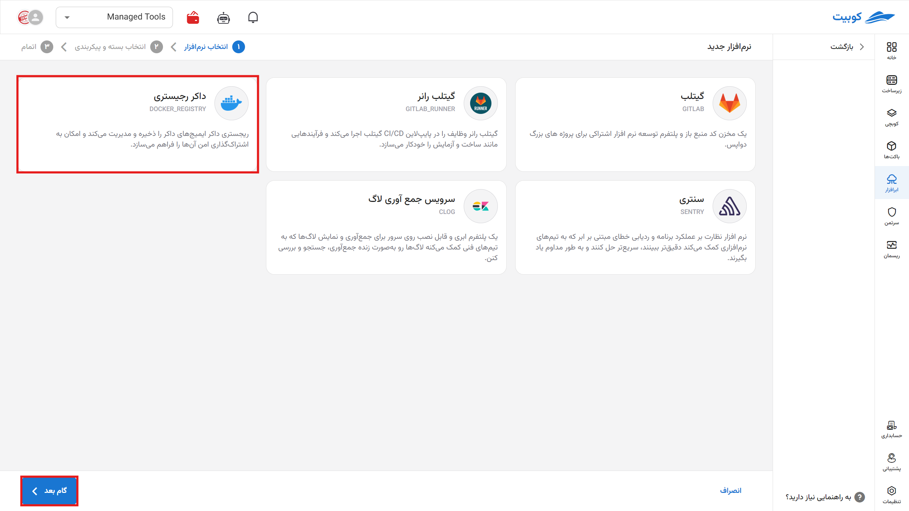
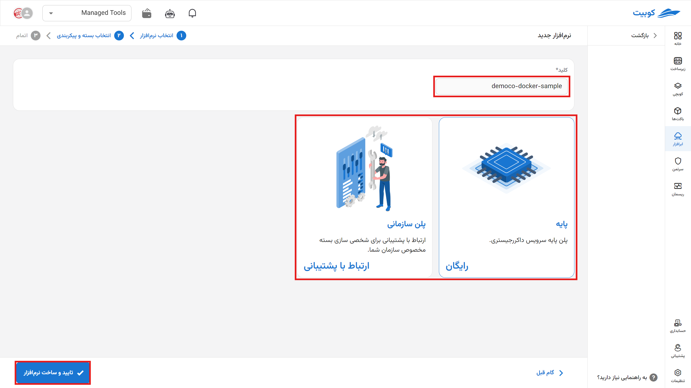
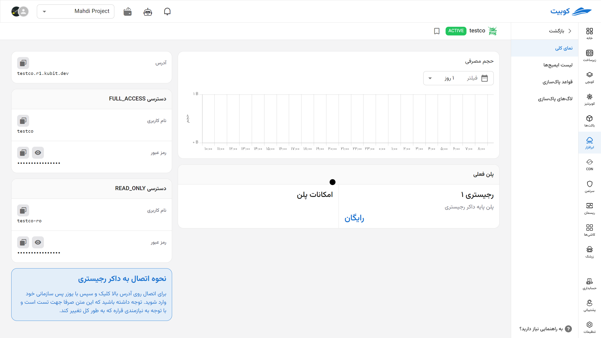
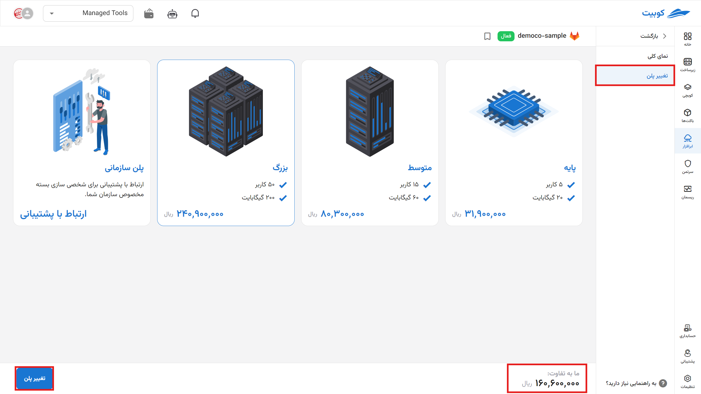
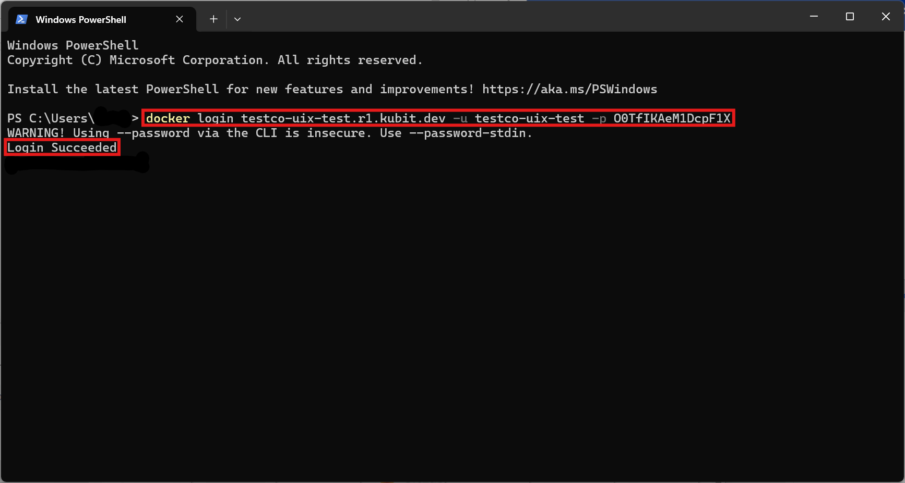
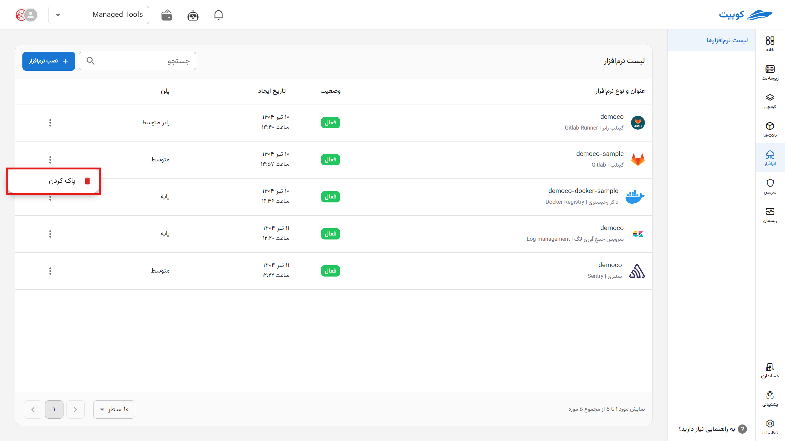
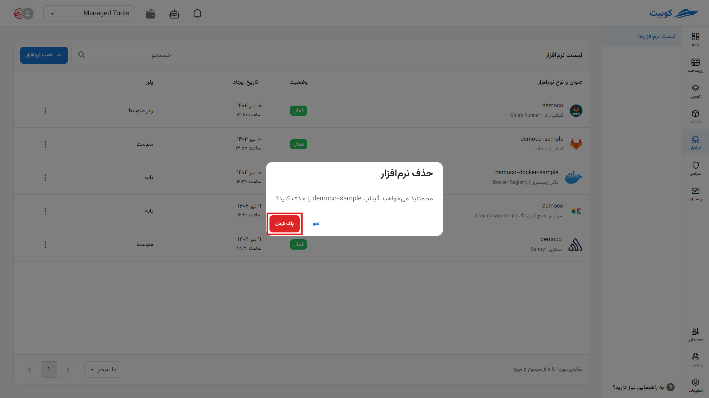
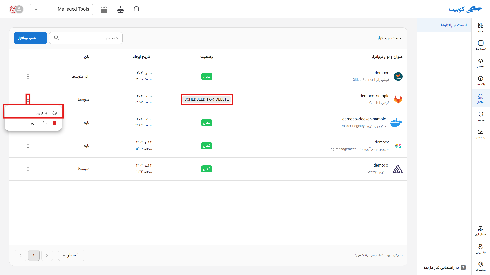
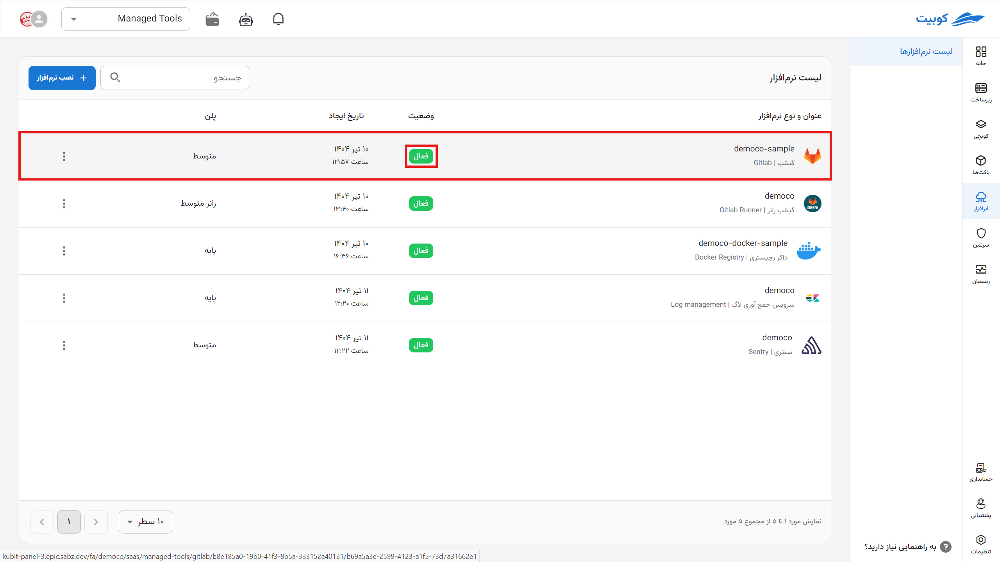

# شروع کار با داکر

برای شروع کار با ابرافزارِ داکر رجیستری روی نصب نرم‌افزار کلیک کنید.

برای ادامه **نام** (slug) داکر رجیستری و پلن مورد نیاز را انتخاب کنید.
:::info[پلن پایه]

سیاست محاسبه هزینه در این پلن به صورت Pay As You Go می‌باشد و براسای میزان استفاده شما از سرویس هزینه نهایی مشخص
می‌گردد.

:::

حال در صفحه نمای کلی هستید.

این صفحه شامل کد ها و لینک برای نحوه اتصال به رجیستری و حجم مصرفی شما همچنین اطلاعاتی از پلن فعلی شما و امکانات آن می‌باشد.

:::info[تغییر پلن]
با انتخاب تغییر پلن دوباره به صفحه پلن‌ها می‌روید و با انتخاب پلن جدید و پرداخت مابه‌تفاوت پلن شما تغییر خواهد کرد.

:::

## اتصال به داکر

روش های مختلفی برای اتصال به یک رجیستریِ داکر وجود دارد. در اینجا با استفاده از **docker-cli** به آن متصل می‌شویم.

ابتدا وارد صفحه نمای کلی شده:

1. **آدرس**: از این فیلد آدرس رجیستری خود را بردارید.
2. دسترسی **FULL_ACCESS**: از این بخش **نام کاربری** username و **توکن** (token) را برای اتصال با دسترسی کامل بردارید.
3. دسترسی **READ_ONLY**: از این بخش می‌توانید دسترسی محدودی به کاربران بدهید.

دستور زیر را در ترمینال وارد کنید: ( می‌توانید از ترمینال **Docker Desktop** نیز استفاده کنید)

`echo YOUR_USERNAME | docker login YOUR_REGISTRY_ADDRESS --username YOUR_PASSWORD --password-stdin`

پس از موفقیت اتصال می‌توانید از رجیستری خود **push** و **pull** انجام دهید.

:::info[حذف ابرافزار]
برای حذف نرم‌افزار اَبری از طریق پنل، روی آیکون گزینه ها کلیک کرده سپس حذف را بزنید.

:::

:::warning[حذف دائم از سرورها]

\*پس از حذف، هر برنامه بین یک تا سه روز در صف حذف برای همیشه از سرور قرار می‌گیرد و شما می‌توانید طی این مدت اقدام به بازگردانی آن کنید.

:::
