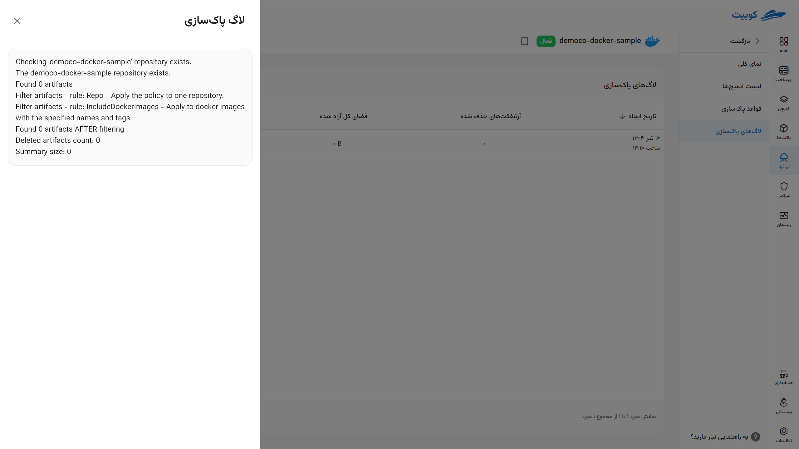
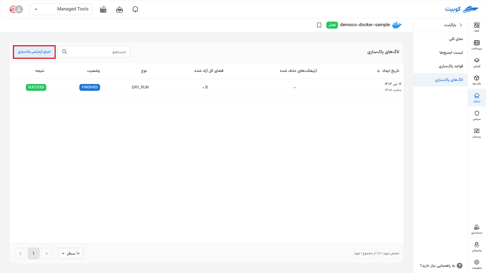

# تاریخچه اجرای قوانین چرخه عمر

تاریخچه اجرای قوانین چرخه عمر و دوره ای پاکسازی ایمیج‌ها شامل **وضعیت** اجرای قانون در دو حالت درحال اجرا و تمام‌شده و **نتیجه** اجرای قانون و خطاهای احتمالی آن در این قسمت به صورت منظم به نمایش درمی‌آید.

با انتخاب هر گزینه می‌توان جزئیات اجرا را هم مشاهده کرد.

با کلیک روی **اجرای آزمایشی پاک‌سازی** یک شبیه سازی از اجرای قانون **بدون ایجاد تغییر** روی فایل‌های شما اجرا می‌شود.

