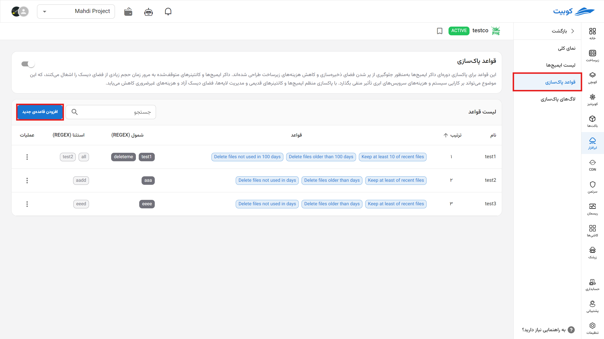
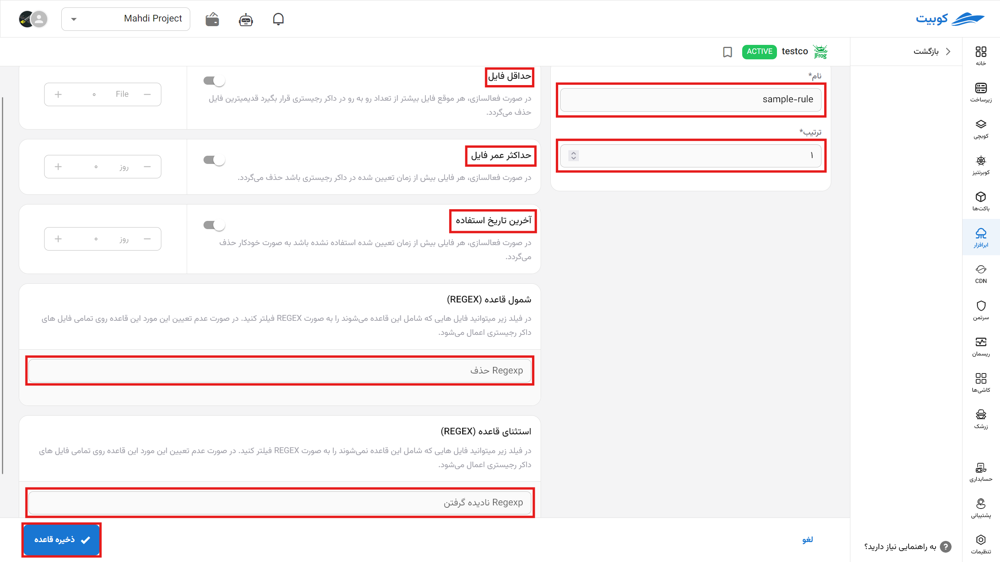
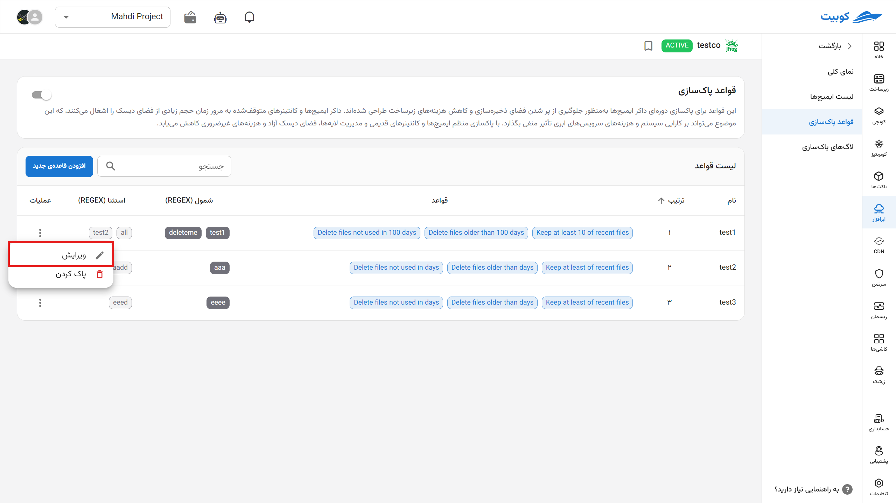
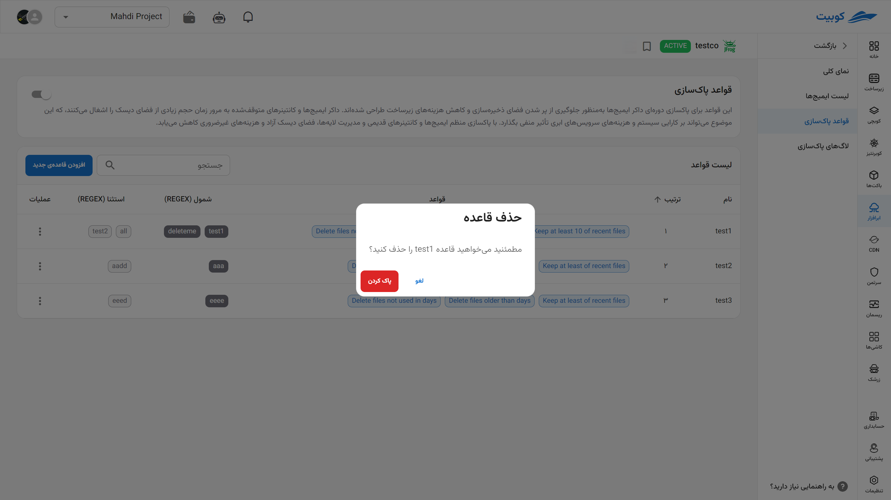

# تنظیم چرخه عمر فایل

به‌منظور جلوگیری از پر شدن فضای ذخیره‌سازی و کاهش هزینه‌های زیرساخت، می‌توان این قواعد را برای پاکسازی دوره‌ای داکر ایمیج‌ها فعال نمود. داکر ایمیج‌ها و کانتینرهای متوقف‌شده به مرور زمان حجم زیادی از فضای دیسک را اشغال می‌کنند، که این موضوع می‌تواند بر کارایی سیستم و هزینه‌های سرویس‌های ابری تأثیر منفی بگذارد. با پاکسازی منظم ایمیج‌ها و کانتینرهای قدیمی و مدیریت لایه‌ها، فضای دیسک آزاد و هزینه‌های غیرضروری کاهش می‌یابد.

## اضافه کردن قاعده جدید

برای افزودن یک قاعده جدید برروی دکمه آن کلیک می‌کنیم.

صفحه بازشده شامل:

1. **نام**: انتخاب یک نام برای قانون
2. **ترتیب**: اولویت‌بندی ترتیب اجرای قانون ها در لیست قوانین
3. **حداقل فایل**: محدودیت تعداد فایل های حاضر در رجیستری که در صورت عبورر از این محدودیت آخرین فایل حذف می‌شود.
4. **حداکثر عمر فایل**: این محدودیت باعث می‌شود پس از سپری شدن این زمان _از تاریخ ایجاد فایل_ فایل از رجیستری پاک شود.
5. **آخرین تاریخ استفاده**: حذف فایل ها براساس سپری شدن این زمان از _تاریخ آخرین استفاده از فایل._
6. **شمول قاعده(REGEX)**: با پرکردن این فیلد، قانون روی فایل هایی با این عبارت در نامشان اعمال می‌شوند و در غیر این صورت روی کل فایل ها اعمال خواهد شد.
7. **استثنای قاعده (REGEX)**: با پرکردن این فیلد می‌توانید برای قانون استثنائاتی درنظر بگیرید. قانون روی فایل هایی با این عبارت در نامشان اعمال نمی‌شوند و در غیر این صورت روی کل فایل ها اعمال خواهد شد.

می‌توان قواعد جدید را **وایرایش** نمود. (گزینه ها همانند ایجاد قواعدِ بالا هستند)

یا آن ها را حذف کرد.

