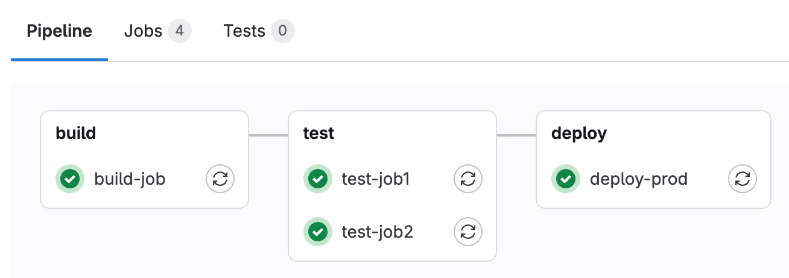
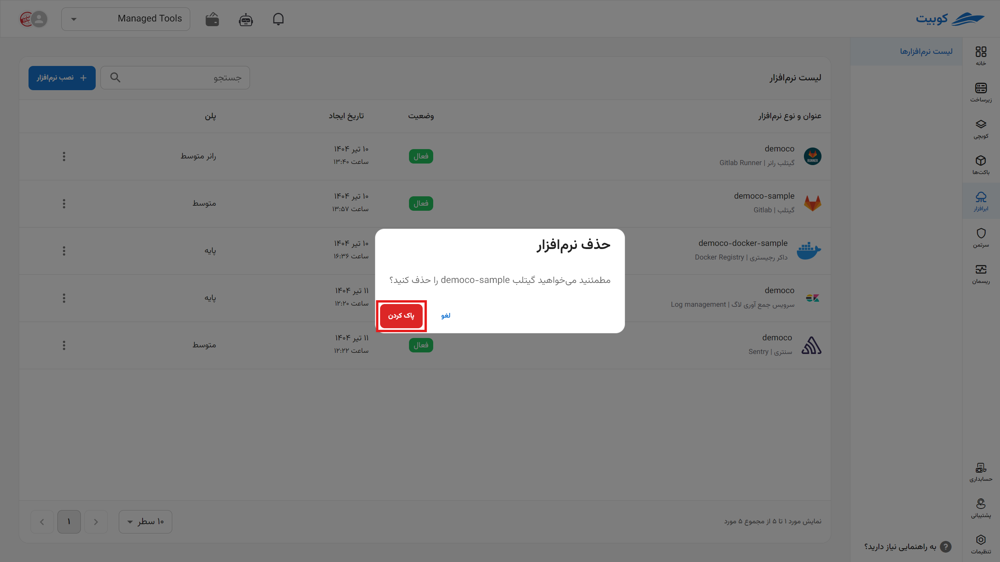

# شروع کار با گیتلب‌رانر

برای **ایجاد** و **اتصال** **رانر** جدید به مخزن خود پس از ایجاد یک مخزن [گیتلب](../../gitlab/getting-started) از طریق صفحه نصب ابرافزار اقدام کنید. (می‌توانید از این ابرافزار برای خودکارسازی فرایندهای CI\CD در مخزن‌های دیگر نیز استفاده کنید.)

پیش از شروع **آدرس مخزن**، **گروه** و همچنین **توکن** مخزنی که می‌خواهید رانر روی آن فعال باشد را بردارید.

### آدرس مخزن یا گروه

وارد [پنل گیتلب](../../gitlab/getting-started) شده و از مروگر خود این آدرس را پیدا کنید یا به صورت دستی آن را وارد کنید. فرمت آن به این صورت است:

`gitlab.example.com/YourRepoName/YourProjectOrGroupName`

### توکن

از طریق بخش **Build** و روی گزینه **Runners** کلیک و یک راننر جدید بسازید.

مشخصات رانر خود را مطابق نیاز وارد کنید.

پس از ایجاد رانر، از این قسمت توکن را بردارید.

### نصب ابرافزار

در صفحه شروع نصب نرم‌افزار جدید را انتخاب کنید.

سپس **نام** (slug) رانر خود را وارد کنید.
اگر می‌خواهید مقدار حجم را خود انتخاب کنید، از قسمت مشخص شده، حجمی از مضرب پنج و بیشتر از پلن فعلی خود مقدار دهید.

آدرس **مخزن** متصل به رانر را در صفحه نمای کلی می‌بینید.

:::info[تغییر پلن]
با انتخاب تغییر پلن دوباره به صفحه پلن‌ها می‌روید و با انتخاب پلن جدید و پرداخت مابه‌تفاوت پلن شما تغییر خواهد کرد.

:::

در پنل خود می‌توانید لیست رانرهای موجود را ببینید و آن‌ها را متوقف کرده، ویرایش و یا حذف کنید.

همچنین برای ساخت رانر جدید می‌توانید از بخش `Settings > CI/CD` هم اقدام کنید.

### اجرای یک نمونه جاب

پس از ایجاد رانر برای اجرای یک جاب CI در مخزن خود یک فایل با نام `yml` ایجاد کنید.

اسکریپت خود را در آن کپی کنید.

حال از بخش Build میتوانید **پایپ‌لاین** خود و **استیجی** (مرحله) که در آن است و نحوه اجرای آن را ببینید.

گراف **پایپ‌لاین**:

وضعیت (Status) هر **رانر**:

:::info[حذف ابرافزار]
برای حذف نرم‌افزار اَبری از طریق پنل، روی آیکون گزینه ها کلیک کرده سپس حذف را بزنید.

:::

:::warning[حذف دائم از سرورها]

\*پس از حذف، هر برنامه بین یک تا سه روز در صف حذف برای همیشه از سرور قرار می‌گیرد و شما می‌توانید طی این مدت اقدام به بازگردانی آن کنید.

:::
