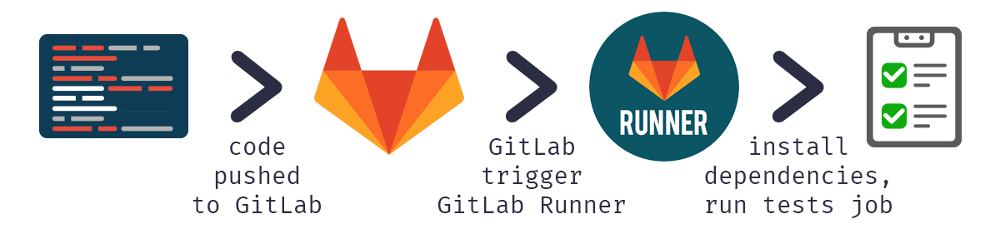

---
subDocuments:
  - concepts
  - getting-started
---

# ابرافزار GitLab runner (خودکار سازی و اجرای وظایف CI/CD)

با استفاده از این ابرفزار، توسعه‌دهندگان می‌توانند فرآیندهای **بیلد**، **تست** و **استقرار** (Deploy) نرم‌افزار را در هر مرحله‌ و **محیطی** از توسعه (Development ،Staging ،Production و...) به صورت خودکار اجرا کرده و مدیریت کنند. این قابلیت نه‌تنها باعث افزایش سرعت و دقت توسعه می‌شود، بلکه امکان شناسایی سریع باگ‌ها و اطمینان از پایداری نرم‌افزار در **محیط‌های** مختلف را نیز فراهم می‌کند.

