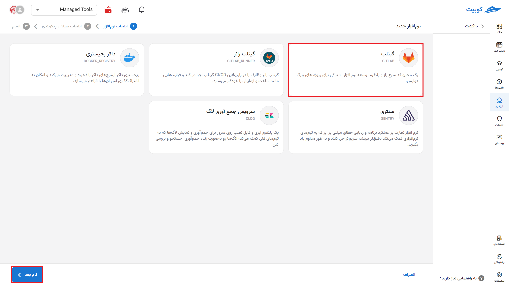
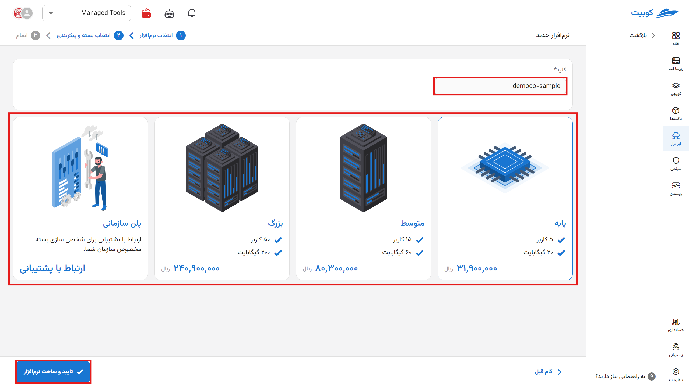
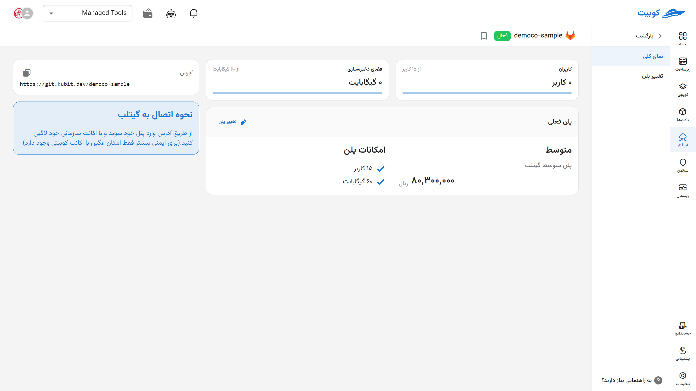
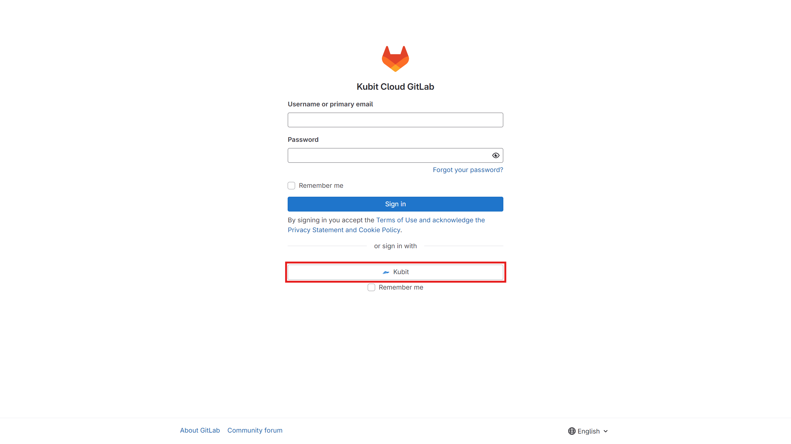
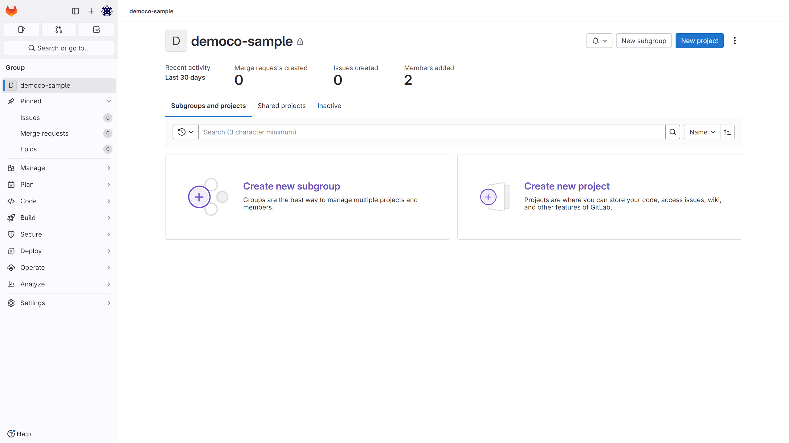
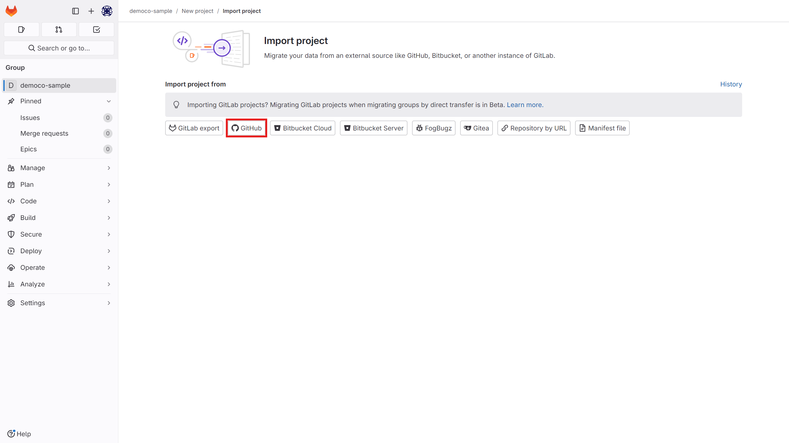
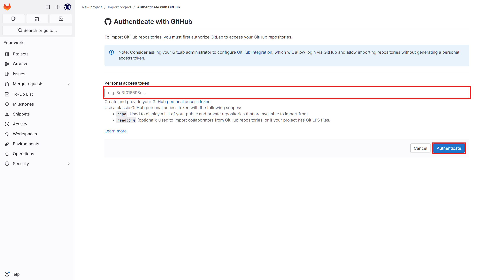

# شروع کار با گیتلب

برای **ایجاد** و **اتصال** به مخزن جدید از طریق صفحه نصب ابرافزار اقدام کنید.

سپس **نام** (slug، این عبارت بخشی از URL مخزن شما خواهد بود) مخزن خود را مشخص کنید.

در این صفحه مشخصات مخزن خود را ببینید. با کلیک روی آدرس به پنل گیتلب خود منتقل می‌شوید. همچنین می‌توانید از طریق git یا ابزار های مشابه به آن دسترسی پیدا کنید.

:::info[تغییر پلن]
با انتخاب تغییر پلن دوباره به صفحه پلن‌ها می‌روید و با انتخاب پلن جدید و پرداخت مابه‌تفاوت پلن شما تغییر خواهد کرد.

:::

سپس از طریق آدرس وارد پنل خود شوید و با [اکانت کوبیت](../../../account/) خود لاگین کنید. (برای دسترسی به سرویس‌های خود در کوبیت برای ایمنی بیشتر فقط امکان لاگین با اکانت کوبیتی وجود دارد)

با صفحه اول گیتلب مواجه می‌شوید. از این قسمت می‌توانید **پروژه** و **گروه** جدید تعریف کنید یا پروژه خود را بارگذاری کنید.

چنانچه می‌خواهید از گیت‌هاب GitHub پروژه خود را **وارد کنید** (import) نیاز به یک **توکن دسترسی** یا Access Token دارید از این [لینک](https://docs.github.com/en/authentication/keeping-your-account-and-data-secure/managing-your-personal-access-tokens) کمک بگیرید.

:::info[حذف ابرافزار]
برای حذف نرم‌افزار اَبری از طریق پنل، روی آیکون گزینه ها کلیک کرده سپس حذف را بزنید.

:::

:::warning[حذف دائم از سرورها]

\*پس از حذف، هر برنامه بین یک تا سه روز در صف حذف برای همیشه از سرور قرار می‌گیرد و شما می‌توانید طی این مدت اقدام به بازگردانی آن کنید.

:::
