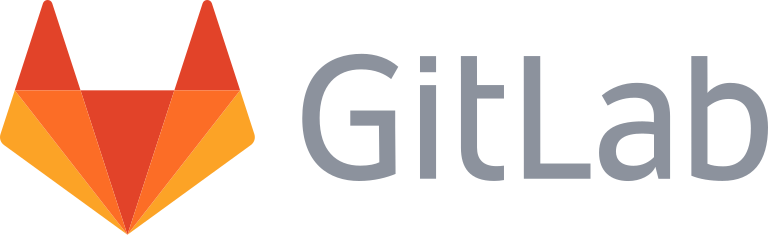

---
subDocuments:
  - concepts
  - getting-started
---

# ابرافزار GitLab (مدیریت نسخه منبع باز)

**گیت‌لب** (GitLab) یک پلتفرم جامع DevOps است که ابزارهایی برای مدیریت کامل چرخه عمر توسعه نرم‌افزار ارائه می‌دهد؛ از مرحله برنامه‌ریزی و مدیریت کد منبع (Source Code) گرفته تا یکپارچه‌سازی و استقرار مستمر (CI/CD)، پایش و امنیت.
این مدیر مخزن Git مبتنی بر وب، امکاناتی نظیر ردگیری مشکلات (Issue Tracking)، ویکی، و قابلیت‌های دیگر را نیز در اختیار کاربران قرار می‌دهد.

