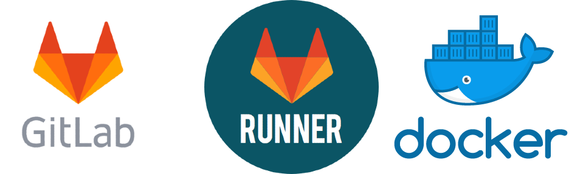

---
subDocuments:
  - gitlab
  - gitlab-runner
  - docker
  - sentry
---

# ابرافزار (نرم‌افزارهای مدیریت شده)

**ابرافزار** (SaaS)، سرویسی ابری است که با هدف تسهیل، تسریع و ایمن‌سازی دسترسی توسعه‌دهندگان به ابزارهای نرم‌افزاری مورد نیاز طراحی شده است. این پلتفرم با ارائه‌ی زیرساختی یکپارچه و بدون نیاز به نصب یا پیکربندی محلی، امکان استفاده‌ی فوری، هم‌زمان و بدون وابستگی به سرویس‌های غیربومی را تنها با چند کلیک فراهم می‌سازد. **ابرافزار** به نحوی طراحی شده تا تجربه‌ای پایدار، امن و سازگار با نیازهای بومی را برای تیم‌های توسعه به ارمغان بیاورد.

پس از ایجاد [حساب کاربری](../account) خود در وبسایت **کوبیت** و [انتخاب پروژه](../organization) مربوطه، در ادامه از راهنمای گام به گام سرویس استفاده کنید.

## دسترسی سریع:

- **[گیت‌لب (gitlab)](gitlab)**: نرم‌افزار مدیریت نسخه سازگار با فرایندهای DevOps

- **[گیتلب رانر (gitlab runner)](gitlab-runner)**: سیستم مدیریت CI/CD یکپارچه و سازگار با گیتلب برای توسعه دواپسی

- **[داکر رجیستری (docker registery)](docker)**: محل ذخیره کانتینر ایمیج‌های داکر

- **[سنتری (sentry)](sentry)**: مدیریت عملکرد و ردیابی مشکلات و ارورهای کد و پلتفرم‌ها
