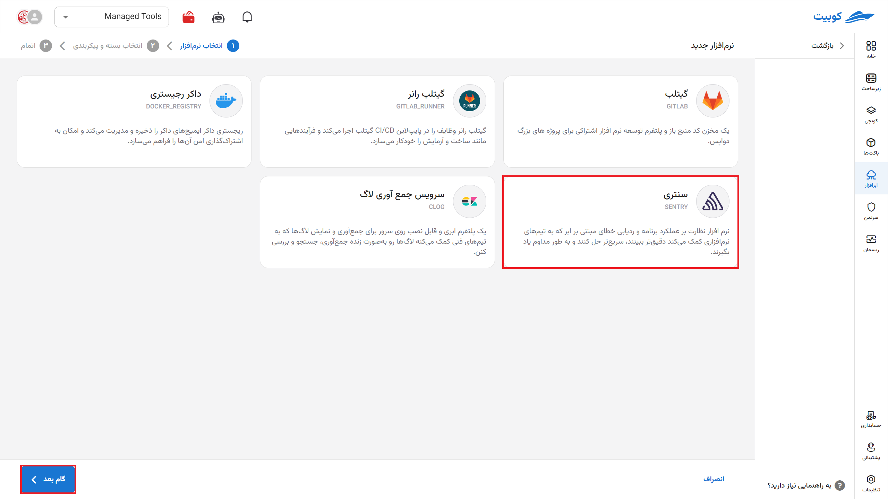
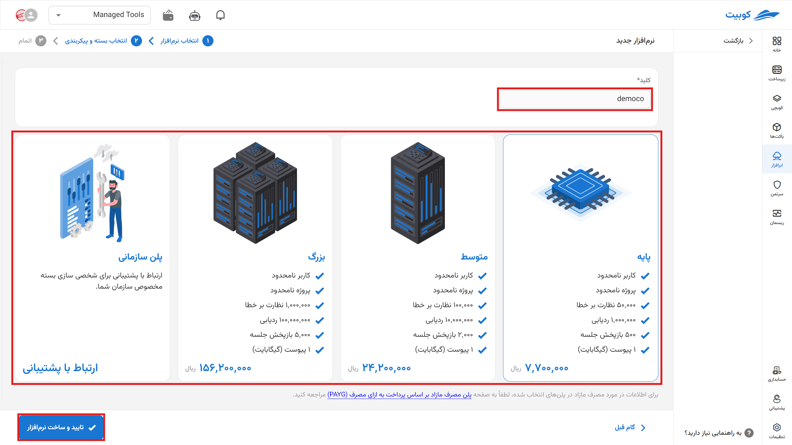
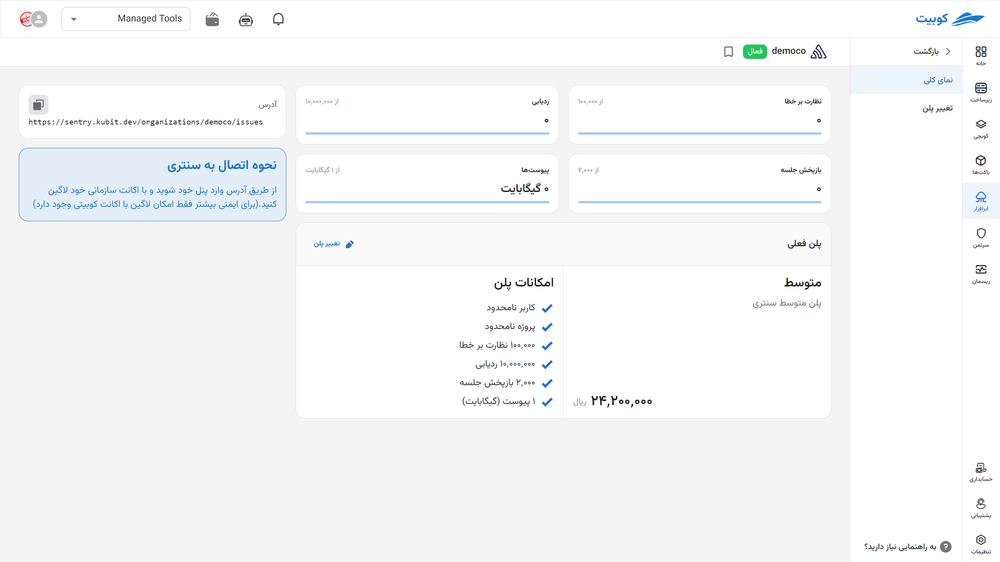
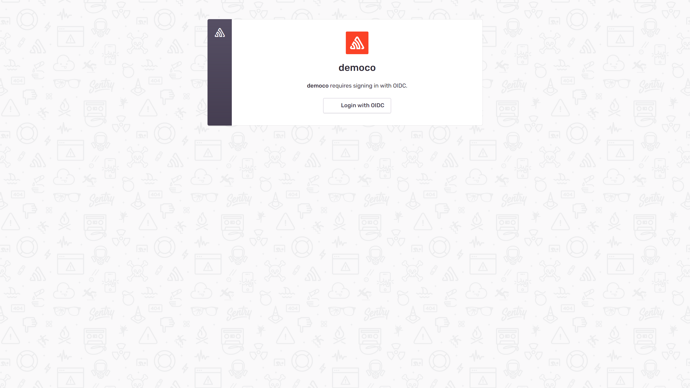
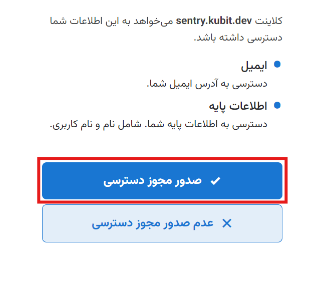
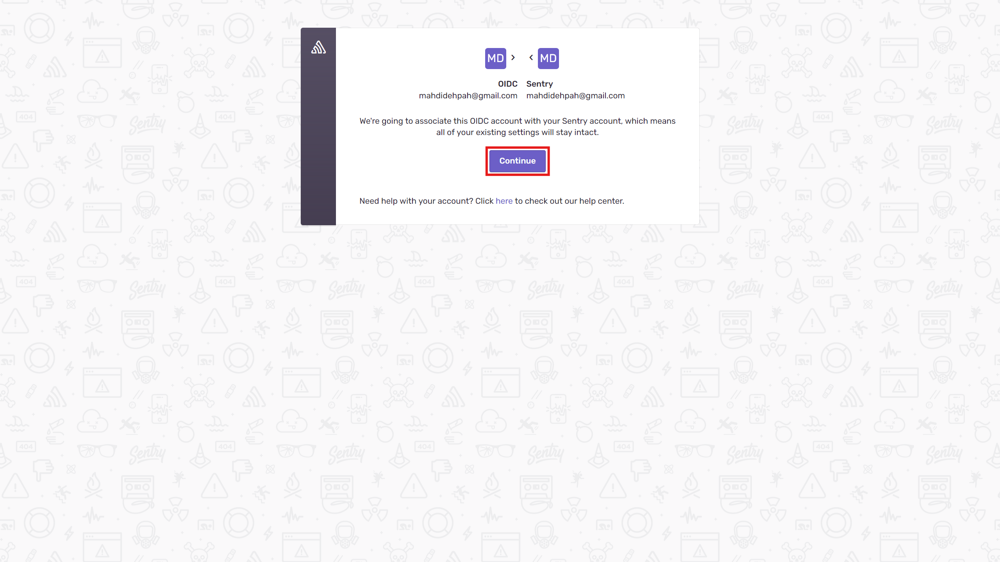
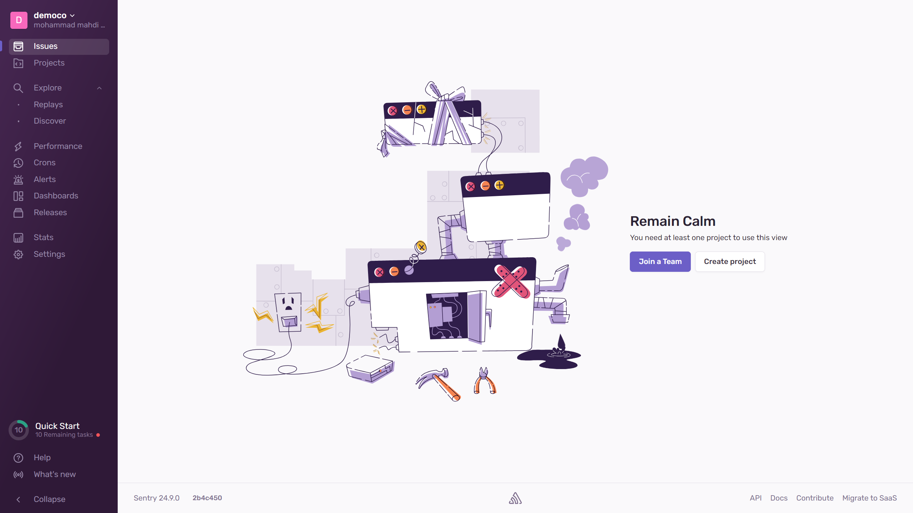
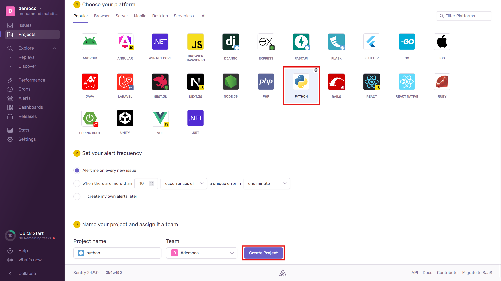
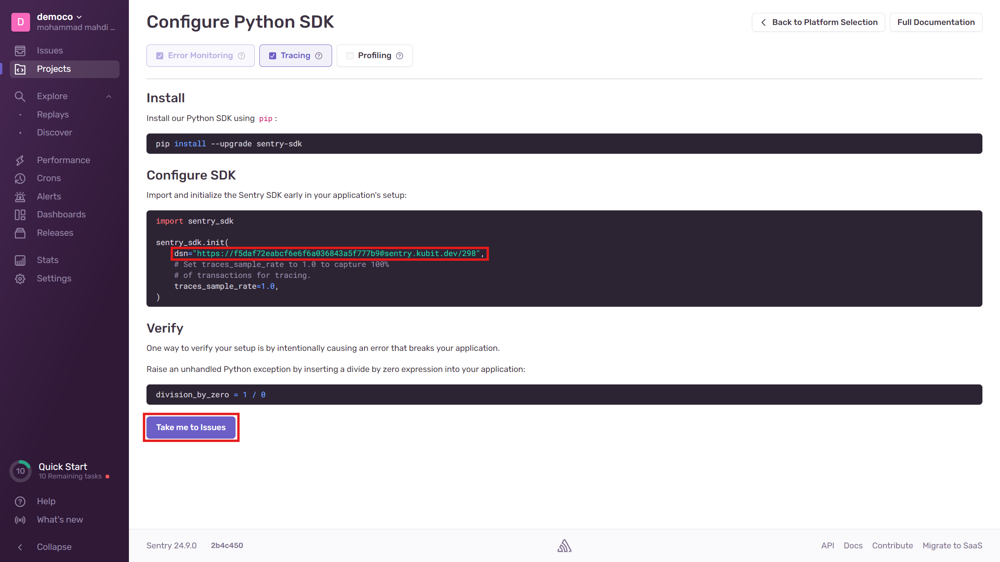
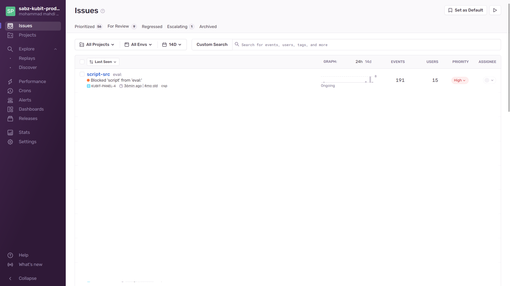

# شروع کار با سنتری

برای شروع کار با ابرافزار سنتری ابتدا آن را از طریق صفحه ابرافزار نصب کنید.

سپس **نام** (slug، این عبارت بخشی از URL پنل شما خواهد بود) پنلِ سنتری خود را مشخص کنید.

در این صفحه مشخصات مخزن خود را ببینید. با کلیک روی آدرس به پنل گیتلب خود منتقل می‌شوید. همچنین می‌توانید از طریق git یا ابزار های مشابه به آن دسترسی پیدا کنید.

:::info[تغییر پلن]
با انتخاب تغییر پلن دوباره به صفحه پلن‌ها می‌روید و با انتخاب پلن جدید و پرداخت مابه‌تفاوت پلن شما تغییر خواهد کرد.

:::

سپس از طریق آدرس وارد پنل خود شوید و با [اکانت کوبیت](../../../account/) خود لاگین کنید. (برای دسترسی به سرویس‌های خود در کوبیت برای ایمنی بیشتر فقط امکان لاگین با اکانت کوبیتی وجود دارد)

مجوز استفاده را بدهید.

این صفحه پنل است که مشکلات را به شما نمایش می‌دهد.

برای اتصال سنتری به پروژه خود روی Create project در این صفحه کلیک کنید. وارد صفحه انتخاب نوع پروژه می‌شوید و می‌توانید مطابق نیاز خود موارد را وارد کنید. به عنوان نمونه برای ایجاد یک پروژه پایتون بدین صورت عمل می‌کنیم.

حال نحوه اتصال SDK به کد را طبق راه‌نمایی ایجاد کنید.

بخش مشخص شده در کد مشخص می‌کند که خطا ها را به آدرس سرویس ارسال کند. سپس سرویس این خطاها را جمع‌آوری کرده و به صورت زیر با اطلاعات مربوطه نمایش می‌دهد.

:::info[حذف ابرافزار]
برای حذف نرم‌افزار اَبری از طریق پنل، روی آیکون گزینه ها کلیک کرده سپس حذف را بزنید.

:::

:::warning[حذف دائم از سرورها]

\*پس از حذف، هر برنامه بین یک تا سه روز در صف حذف برای همیشه از سرور قرار می‌گیرد و شما می‌توانید طی این مدت اقدام به بازگردانی آن کنید.

:::
