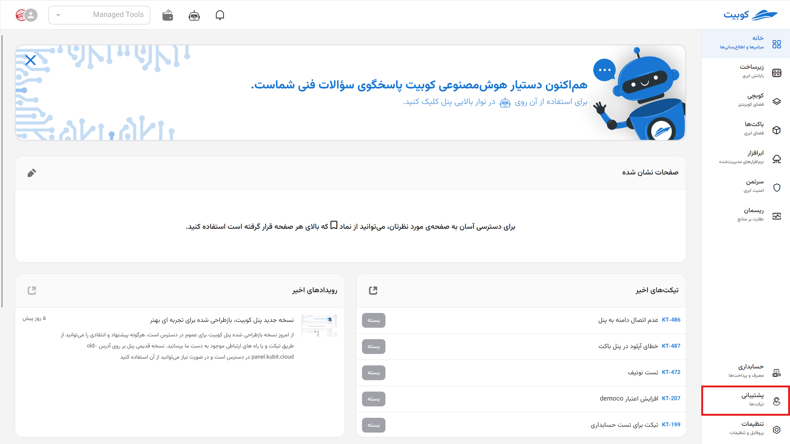
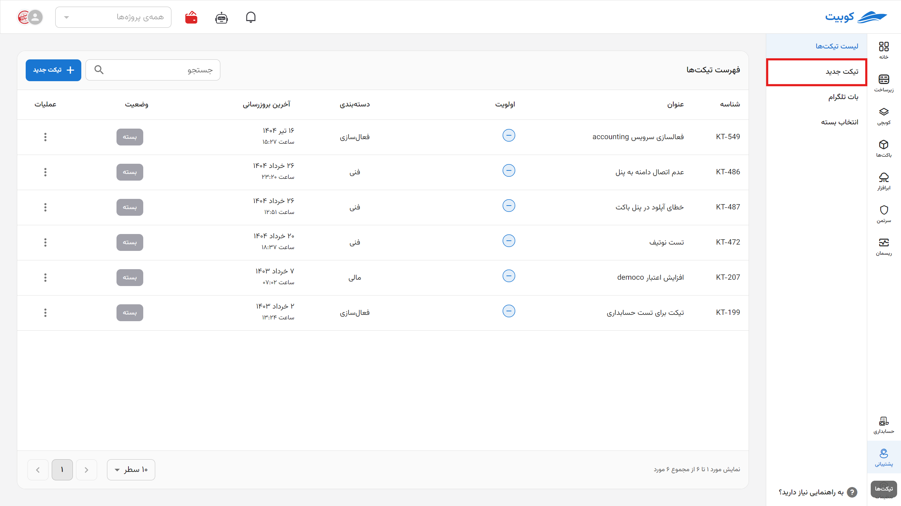
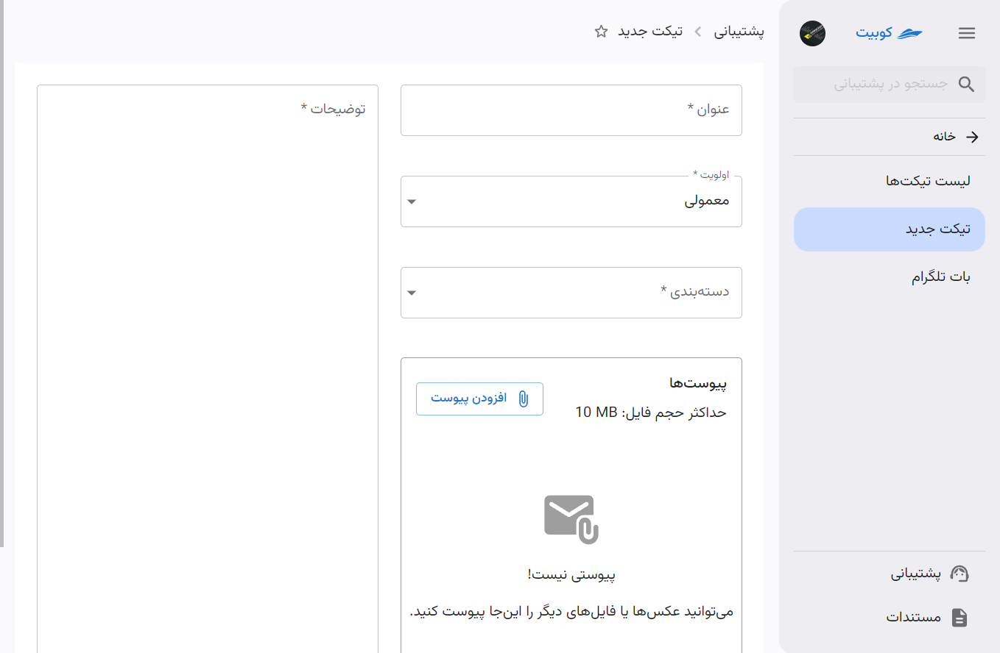
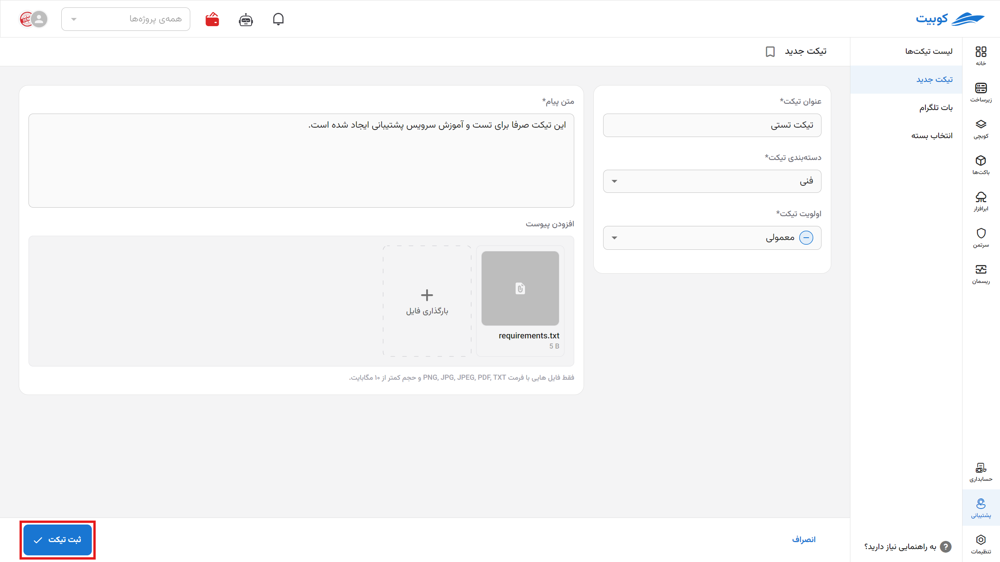

# ساخت تیکت جدید

برای دسترسی به ساخت تیکت، دو دسترسی ایجاد شده است:

- بخش **تیکت‌های اخیر** در صفحه اصلی پنل
- بخش **تیکت جدید** در صفحه سرویس پشتیبانی

:::tip[فرم ساخت تیکت]
تنها دسترسی اولیه به گزینه **ساخت تیکت** متفاوت می‌باشد و در صورت استفاده از هر کدام از مسیرها، مستقیما به فرم ساخت تیکت هدایت می‌شوید.
:::

## مسیر اول: صفحه اصلی پنل

از صفحه اصلی پنل، روی دکمه **میانبر** کلیک کنید تا به صفحه پشتیبانی هدایت شوید:

## مسیر دوم: صفحه سرویس پشتیبانی

از صفحه سرویس پشتیبانی، ابتدا از پنل کوبیت وارد سرویس **پشتیبانی** شوید:

سپس روی گزینه **تیکت جدید** کلیک کنید تا به فرم ساخت تیکت هدایت شوید:

## فرم ساخت تیکت

در صورت استفاده از هر کدام از مسیرهای ذکرشده، به فرم ساخت تیکت هدایت می‌شوید. در این فرم اطلاعاتی چون **عنوان**، **اولویت**، **دسته‌بندی**، **توضیحات** و **پیوست‌ها** وارد می‌شود.
:::tip[فیلدهای الزامی]
تمامی فیلدهای تیکت به جز آپلود فایل الزامی خواهند بود. توجه داشته باشید درخواست خود را به صورت جامع و کاملا شفاف در تیکت بیان کنید تا بررسی اولیه توسط پشتیبانی به صورت سریع‌تر و دقیق‌تر انجام شود.
:::

:::info[اولویت پیش‌فرض]
هنگام ساخت تیکت، به صورت پیش‌فرض، اولویت **معمولی** انتخاب می‌شود که می‌توانید آن را تغییر دهید.
:::

در انتها، روی دکمه **ارسال** کلیک کنید تا تیکت شما ارسال شود:

در صورت پاسخگویی از سمت پشتیبانی یا هرگونه تغییری در وضعیت تیکت، از طریق پیامک به شماره همراه مشتری اطلاع‌رسانی خواهد شد.
