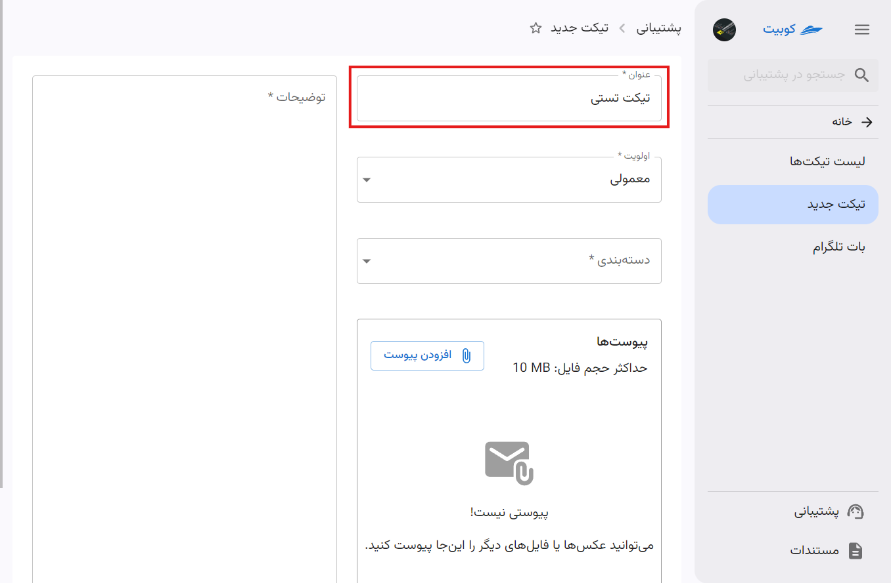
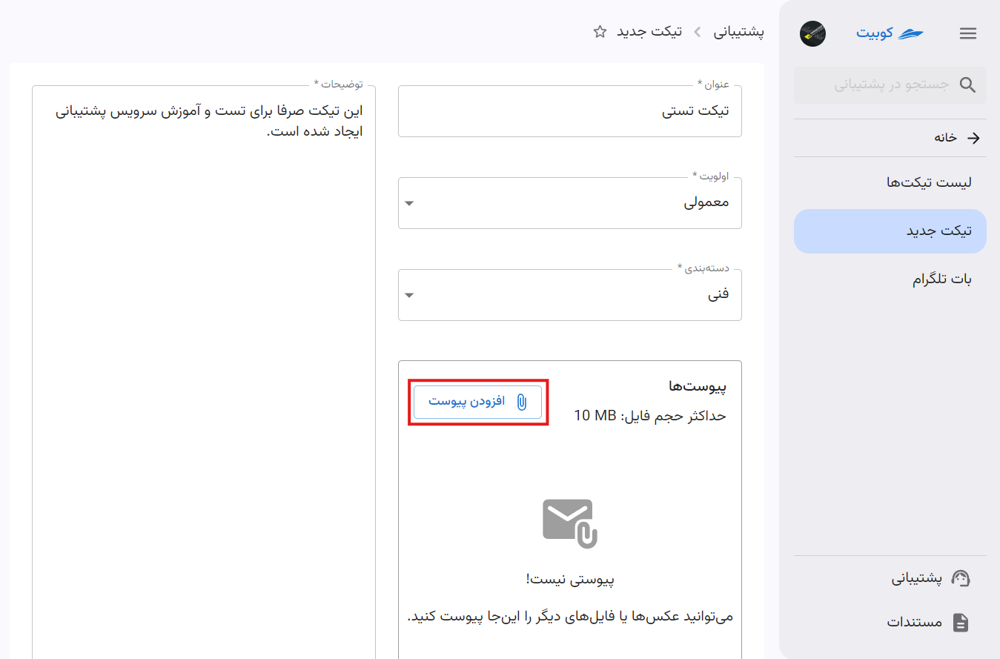

# ساخت تیکت جدید

برای دسترسی به ساخت تیکت، دو دسترسی ایجاد شده است:

- بخش **تیکت‌های اخیر** در صفحه اصلی **پنل**
- بخش **تیکت جدید** در صفحه سرویس **پشتیبانی**

:::tip[فرم ساخت تیکت]
تنها دسترسی اولیه به گزینه **ساخت تیکت** متفاوت می‌باشد و در صورت استفاده از هر کدام از مسیرها، مستقیما به فرم ساخت تیکت هدایت می‌شوید.
:::

## مسیر اول: صفحه اصلی پنل
از صفحه اصلی پنل، روی دکمه **تیکت جدید** کلیک کنید تا به فرم ساخت تیکت هدایت شوید:

## مسیر دوم: صفحه سرویس پشتیبانی

از صفحه سرویس پشتیبانی، ابتدا از پنل کوبیت وارد سرویس **پشتیبانی** شوید:

سپس روی دکمه **ساخت تیکت** کلیک کنید تا به فرم ساخت تیکت هدایت شوید:

## فرم ساخت تیکت
در صورت استفاده از هر کدام از مسیرهای ذکرشده، به فرم ساخت تیکت هدایت می‌شوید:

سپس، عنوان تیکت را وارد کنید:

اولویت و دسته‌بندی را از لیست انتخاب کنید:

:::info[توجه]
هنگام ساخت تیکت، به صورت پیش‌فرض، اولویت **معمولی** انتخاب می‌شود که می‌توانید آن را تغییر دهید.
:::

توضیحات تیکت خود را نیز وارد کنید:

در صورت نیاز به آپلود فایل، از بخش **پیوست‌ها**، روی دکمه **افزودن پیوست** کلیک کرده و فایل مورد نظر خود را انتخاب کنید تا آپلود شود:

در انتها، روی دکمه **ارسال** کلیک کنید تا تیکت شما ارسال شود:

بعد از ساخت تیکت به صفحه **لیست تیکت‌ها** هدایت می‌شوید و می‌توانید تیکت جدید را مشاهده کنید:

