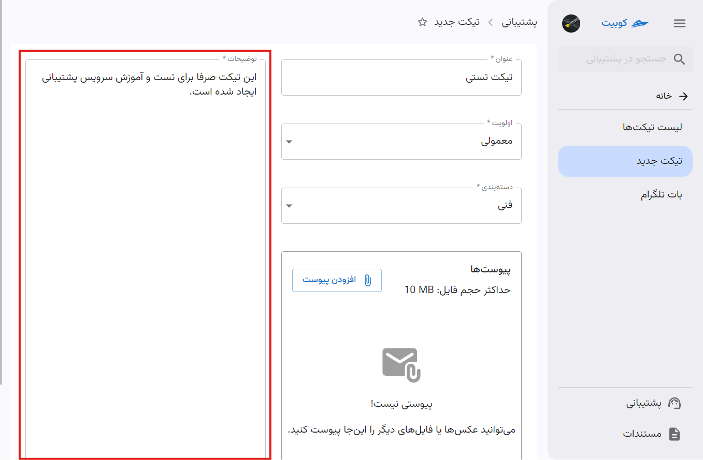

# ساخت تیکت جدید

- روی دکمه **ساخت تیکت** از گزینه‌های سرویس پشتیبانی کلیک کنید:
  

- عنوان تیکت را وارد کنید:
  

- اولویت و دسته‌بندی را از لیست انتخاب کنید:
  
  

:::info[توجه]
هنگام ساخت تیکت، اولویت پیش‌فرض، **معمولی** می‌باشد.
:::

- سپس توضیحات تیکت خود را وارد کنید:
  

- در صورت نیاز به آپلود فایل، از بخش پیوست ها، روی دکمه افزدن پیوست کلیک کنید.
- فایل مورد نظر خود را انتخاب کنید.
- 

- در انتها، روی دکمه **ارسال** کلیک کنید تا تیکت شما ارسال شود:
  
