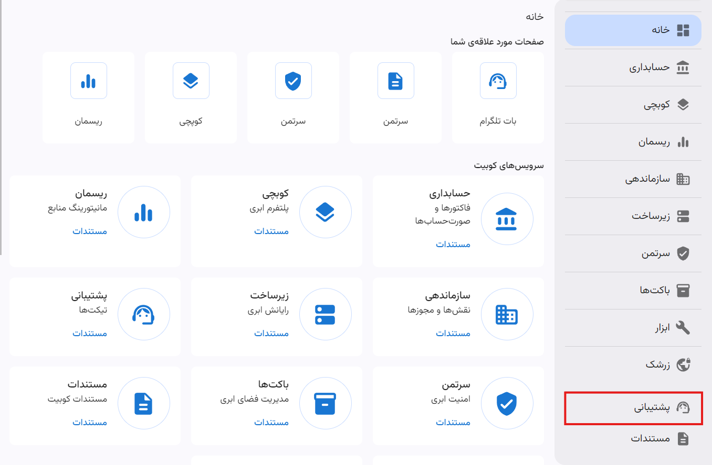

---
subDocuments:
  - ticket
  - create-ticket
---

# پشتیبانی

سرویس پشتیبانی کوبیت، تمام امکانات مورد نیاز برای مدیریت تیکت‌های مشتریان و ارائه خدمات پشتیبانی را فراهم می‌کند.

## مفاهیم پایه

### تیکت

تیکت یک درخواست یا شکایت از سوی مشتری است که به منظور حل یک مشکل یا ارائه یک خدمت ارسال می‌شود.

### سیستم پشتیبانی (Ticketing)

سیستم پشتیبانی، سیستمی است که برای مدیریت تیکت‌ها و ارائه خدمات پشتیبانی به مشتریان استفاده می‌شود.

### وضعیت تیکت

وضعیت تیکت نشان‌دهنده مراحل مختلفی است که یک تیکت در طول چرخه حیات خود طی می‌کند.

#### لیست وضعیت‌ها

- **منتظر پاسخ**: هر تیکتی که توسط مشتری در پنل ساخته می‌شود، در مرحله اول در وضعیت **منتظر پاسخ** تغییر می‌کند.
- **در حال انجام**: زمانی که یکی از پشتیبان‌ها تیکت را برای بررسی می‌پذیرد، وضعیت تیکت به **در حال انجام** تغییر می‌کند.
- **در انتظار مشتری**: در صورت ارسال پاسخ از سوی پشتیبانی به مشتری، وضعیت تیکت به **در انتظار مشتری** تغییر می‌کند.
- **بسته**: زمانی که درخواست کاربر انجام شده و مشکل برطرف شود یا تیکت توسط کاربر بسته شود، وضعیت به **بسته** تغییر می‌کند.

### اولویت تیکت

اولویت، اهمیت یا فوریت بررسی یک تیکت را مشخص می‌کند.

#### لیست اولویت‌ها

- حیاتی
- فوری
- بالا
- معمولی
- پایین

:::info[اولویت پیش‌فرض]
هنگام ساخت تیکت، به صورت پیش‌فرض، اولویت **معمولی** انتخاب می‌شود که می‌توانید آن را تغییر دهید.
:::

### دسته‌بندی تیکت

دسته‌بندی‌هایی که برای تقسیم‌بندی تیکت‌ها بر اساس نوع مشکل یا درخواست استفاده می‌شود.

#### دسته‌بندی‌ها

- فعال سازی
- فنی
- مالی
- فروش

## چرخه عمر یک تیکت

هر تیکتی که توسط مشتری ارسال می‌شود، در مرحله اول در وضعیت **منتظر پاسخ** قرار می‌گیرد. هنگام شروع بررسی تیکت توسط فرد پشتیبان، وضعیت تیکت به **در حال انجام** تغییر می‌کند. پس از بررسی، اگر سوالی از مشتری وجود داشت یا نیاز به اطلاعات بیشتری از سمت مشتری بود، پیامی ذیل همان تیکت برای مشتری ایجاد شده و وضعیت تیکت به **در انتظار مشتری** تغییر می‌کند. این چرخه تا زمان حل مشکل ادامه پیدا می‌کند. پس از حل مشکل و در صورت عدم ارسال پیام دیگری از سمت مشتری تا 48 ساعت بعد از پاسخ پشتیبان، تیکت به صورت خودکار بسته می‌شود.

### SLA (Service Level Agreement)

SLA مخفف توافق‌نامه سطح خدمات است که تعهدات، استانداردها و معیارهای عملکرد بین ارائه‌دهنده خدمات و مشتری را مشخص می‌کند.
هر سازمان متناسب با پلن پشتیبانی خود، SLAهایی برای تیکت‌های با اولویت‌های مختلف دریافت می‌کند.

# پلن‌های پشتیبانی

جدول زیر پلن‌های پشتیبانی ارائه شده توسط کوبیت را نشان می‌دهد:

| اولویت                                  | Enterprise  (سازمانی)                       | SME  (پیشرفته)                                              | Business  (متوسط)         | Developer (پایه) |
| --------------------------------------- | ----------------------------------------------- | --------------------------------------------------------------- | ----------------------------- | ---------------- |
| پایین (راهنمایی عمومی)                  | < 24 ساعت                                       | < 24 ساعت                                                       | < 48 ساعت                     | < 48 ساعت        |
| معمولی (اختلال در سیستم)                | < 12 ساعت                                       | < 12 ساعت                                                       | < 12 ساعت                     | < 24 ساعت        |
| بالا (اختلال در سیستم تولید)            | < 4 ساعت                                        | < 8 ساعت                                                        | < 8 ساعت                      | -                |
| فوری (توقف سیستم تولید)                 | < 1 ساعت                                        | < 2 ساعت                                                        | < 2 ساعت                      | -                |
| بحرانی (توقف سیستم حیاتی برای کسب‌وکار) | < 30 دقیقه - 10                                 | < 30 دقیقه                                                      | -                             | -                |
| پشتیبانی فنی                            | 24/7                                            | 24/7                                                            | 24/7                          | ساعات کاری       |
| راهنمایی معماری                         | بررسی مشورتی و راهنمایی براساس برنامه‌های مشتری | بررسی مشورتی و راهنمایی براساس برنامه‌های مشتری (یک‌بار در سال) | مطابق با موارد موردنیاز مشتری | عمومی            |

:::info[پلن پشتیبانی پیش‌فرض]
به صورت پیش‌فرض، برای سازمان‌های جدید پلن پشتیبانی **Developer** تنظیم می‌شود.
:::
:::tip[پلن پشتیبانی سفارشی]
همچنین امکان تنظیم پلن پشتیبانی سفارشی برای سازمان‌های بزرگ وجود دارد که از طریق ارتباط و مذاکره با تیم پشتیبانی کوبیت امکان‌پذیر است.
:::
