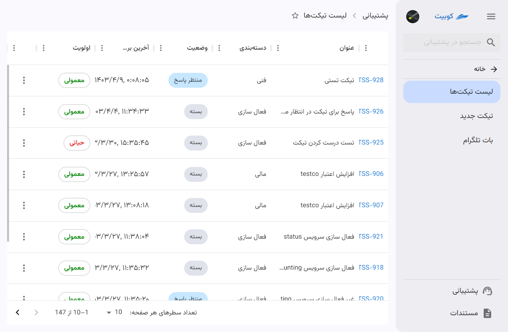
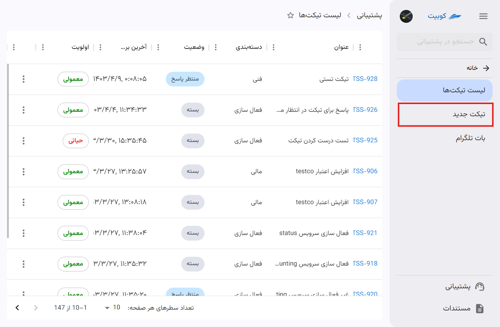
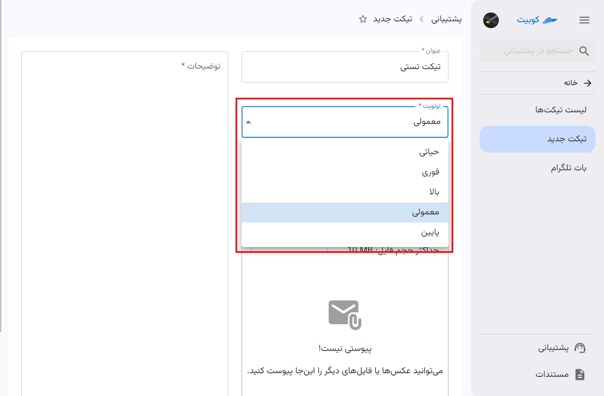
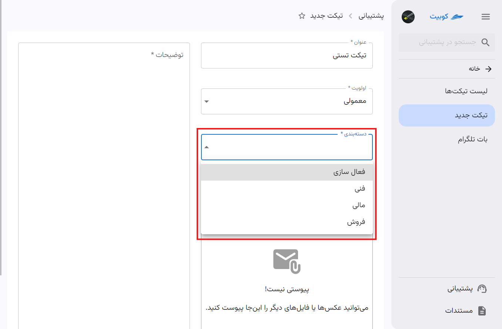
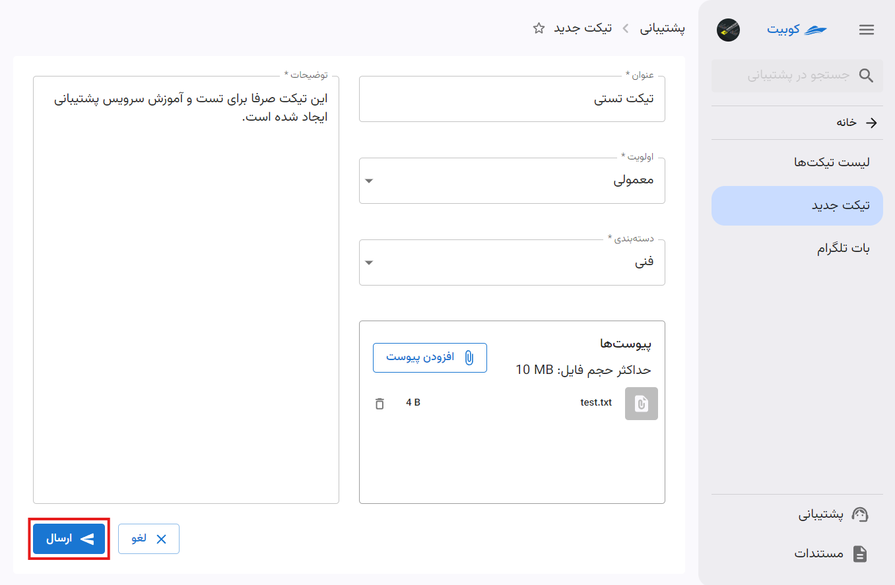
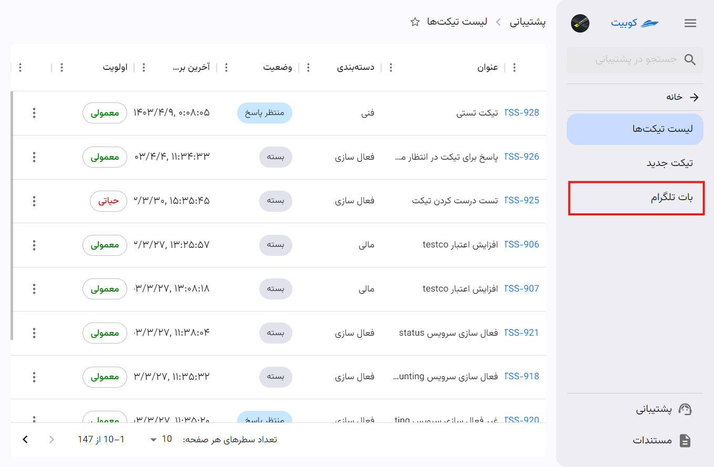
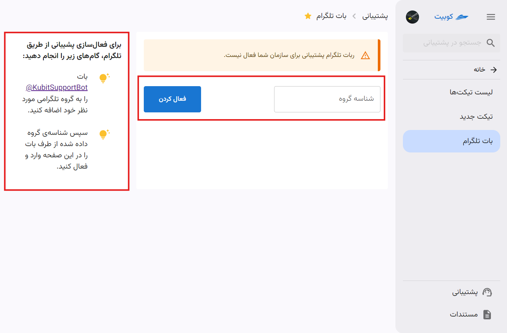

# مدیریت سرویس پشتیبانی

در بخش پشتیبانی پنل کوبیت، دسترسی به **لیست تیکت‌ها**، **ساخت تیکت جدید** و بات تلگرام فراهم شده است.

ابتدا از پنل کوبیت، وارد سرویس پشتیبانی شوید:

در صفحه اول سرویس پشتیبانی، لیست تیکت‌هارا مشاهده می‌کنید:

برای مشاهده جزئیات یک تیکت، روی آن کلیک کنید:

## ساخت تیکت جدید

برای ساخت تیکت جدید، روی دکمه **ساخت تیکت** کلیک کنید:

عنوان و توضیحات تیکت را وارد کنید:

اولویت و دسته‌بندی را از لیست انتخاب کرده و در صورت نیاز، می‌توانید فایل موردنظر را پیوست کنید:

در انتها، روی دکمه **ارسال** کلیک کنید تا تیکت شما ارسال شود:

## چرخه عمر یک تیکت

هر تیکتی که توسط مشتری ارسال می‌شود، در مرحله اول در وضعیت **منتظر پاسخ** قرار می‌گیرد. هنگام شروع بررسی تیکت توسط فرد پشتیبان، وضعیت تیکت به **در حال انجام** تغییر می‌کند. پس از بررسی، اگر سوالی از مشتری وجود داشت یا نیاز به اطلاعات بیشتری از سمت مشتری بود، پیامی ذیل همان تیکت برای مشتری ایجاد شده و وضعیت تیکت به **در انتظار مشتری** تغییر می‌کند. این چرخه تا زمان حل مشکل ادامه پیدا می‌کند. پس از حل مشکل و در صورت عدم ارسال پیام دیگری از سمت مشتری تا 48 ساعت بعد از پاسخ پشتیبان، تیکت به صورت خودکار بسته می‌شود.

## بستن تیکت توسط کاربر

در صورتی که مشکل کاربر حل شده باشد و نیاز به پیگیری توسط پشتببانی نباشد، کاربر می‌تواند وضعیت تیکت خود را به **بسته** تغییر دهد. برای این کار، کافیست روی دکمه سه نقطه تیکت کلیک کرده و گزینه **بستن تیکت** را انتخاب کنید:

:::tip[ارسال وضعیت تیکت از طریق پیامک]
در هر مرحله از تغییرات وضعیت تیکت، پیامی حاوی تغییر ایجاد شده به شماره همراه مشتری (ایجادکننده تیکت) ارسال می‌شود.
:::

## بات تلگرام

با اتصال بات تلگرام به پنل کوبیت، می‌توانید از طریق تلگرام به سرویس پشتیبانی دسترسی داشته باشید و از طریق بات نسبت به ارسال تیکت و پیگیری تیکت‌های خود، اقدام کنید.

برای مشاهده تنظیمات بات تلگرام، از صفحه پشتیبانی، گزینه **بات تلگرام** را انتخاب کنید:

مطابق مراحل گفته شده، بات تلگرامی @KubitSupportBot را به گروه تلگرامی موردنظر خود اضافه کنید، سپس شناسه گروه دریافتی از سمت بات را در بخش **شناسه گروه** وارد کرده و **فعال کردن** را انتخاب کنید:

