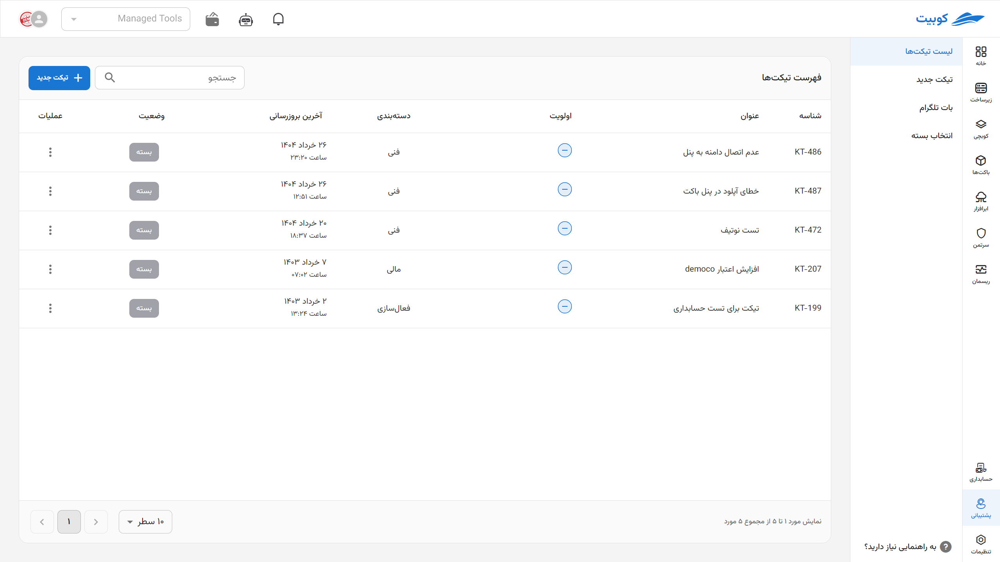
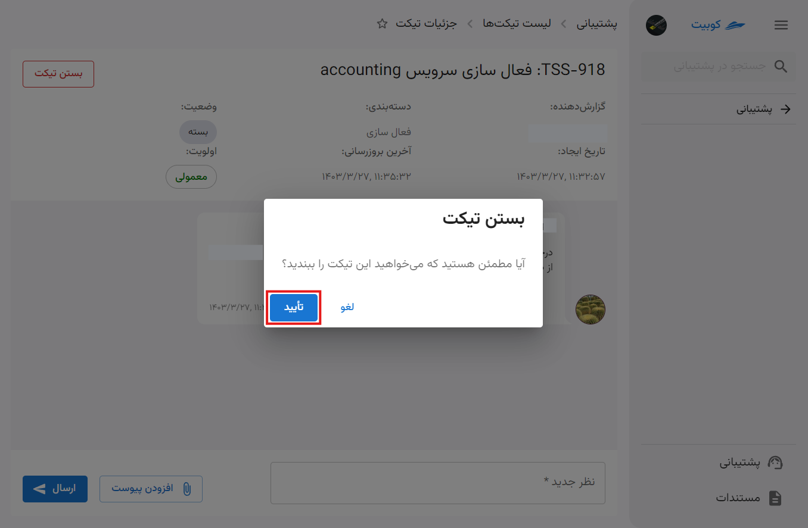

# مدیریت سرویس پشتیبانی

در بخش پشتیبانی پنل کوبیت، دسترسی به **لیست تیکت‌ها**، **ساخت تیکت جدید** و **بات تلگرام** فراهم شده است.

ابتدا از پنل کوبیت، وارد سرویس **پشتیبانی** شوید:

در صفحه اول سرویس پشتیبانی، به لیست تیکت‌ها دسترسی خواهید داشت و با کلیک روی یک تیکت، می‌توانید جزئیات تیکت را مشاهده کنید:

## بستن تیکت توسط کاربر

در صورتی که مشکل کاربر حل شده باشد و نیاز به پیگیری توسط پشتببانی نباشد، کاربر می‌تواند وضعیت تیکت خود را به **بسته** تغییر دهد.
برای این کار، از دو طریق می‌توانید اقدام کنید: گزینه بستن تیکت از **لیست تیکت‌ها** و دکمه بستن تیکت در **صفحه جزئیات تیکت**.

### روش اول: لیست تیکت‌ها

### روش دوم: جزئیات تیکت

:::tip[ارسال وضعیت تیکت از طریق پیامک]
در هر مرحله از تغییرات وضعیت تیکت، پیامی حاوی تغییر ایجاد شده به شماره همراه مشتری (ایجادکننده تیکت) ارسال می‌شود.
:::

## بات تلگرام

با اتصال بات تلگرام به پنل کوبیت، می‌توانید از طریق تلگرام به سرویس پشتیبانی دسترسی داشته باشید و از طریق بات نسبت به ارسال تیکت و پیگیری تیکت‌های خود، اقدام کنید.

برای مشاهده تنظیمات بات تلگرام، از صفحه پشتیبانی، گزینه **بات تلگرام** را انتخاب کنید:

- مطابق مراحل گفته شده، بات تلگرامی [@KubitSupportBot](https://t.me/KubitSupportBot) را به گروه تلگرامی موردنظر خود اضافه کنید و دسترسی ادمین گروه را به بات اختصاص دهید.
- سپس شناسه گروه دریافتی از سمت بات را در بخش **شناسه گروه** وارد کرده و **فعال کردن** را انتخاب کنید:
  

زین پس، از طریق گروه مربوطه می‌توانید عملیت‌هایی چون **ساخت تیکت**، **حذف کردن شناسه تلگرام** و **لغو فرآیند ساخت تیکت** را انجام دهید.
